# HealthDataLab — SYSTEM MAP (read-only audit)

**Date:** 2026-06-08 · **Branch:** `chore/reconcile-stby-0.46.16` · **Scope:** READ-ONLY map of the real build — no code changed, no deploys. · **Method:** 13-agent code-reading sweep (7 subsystem mappers + 6 adversarial known-issue verifiers), every claim cited to `file:line`, conflicts re-read by hand.

> **Two version truths — read this first.**
> 1. **Git HEAD** runs `HDLV2_VERSION = '0.46.16'` / DB `'3.15'` (`hdl-longevity-v2/hdl-longevity-v2.php:25-26`). The plugin **header** still says `Version: 0.46.0` (`:6`) — stale; cache-busting uses the constant.
> 2. **The live STBY server runs AHEAD of git** (~0.46.25). Per project memory its AI was **switched to Opus 4.8 at runtime, temperature removed, timeouts raised 60→120s**. **The git code you are auditing still pins `claude-sonnet-4-6` / `claude-haiku-4-5` everywhere.** Every model/temperature/timeout figure below is the *committed* value and is flagged `⚠ git-lags-live` where the server is known to differ. The brief's "Claude 4.8" matches the **server**, not the repo.

> **The single biggest correction to the working mental model.** The brief says *"a webhook sends data to Make.com, where an AI module (Claude 4.8) generates the report text."* **That is only true for the Stage-2 WHY distillation.** The **draft report, final report, on-screen narrative, milestones, and weekly flight plan are all generated by Claude calls made directly from WordPress** (`HDLV2_AI_Service` → `api.anthropic.com/v1/messages`) **before** any webhook fires. Make.com receives the **already-generated text** and only renders the PDF (PDFMonkey) and sends the email. See [§3 Data flow](#3-data-flow) and [§5 AI-call & cost inventory](#5-ai-call--cost-inventory).

---

## 1. Overview

Two-domain longevity-assessment platform:

- **Marketing + checkout** — static HTML on Netlify (`healthdatalab.com`); Stripe checkout via Netlify Functions.
- **The assessment product** — a WordPress plugin pair on a Vultr VPS (`healthdatalab.net`): **V1** (`health-data-lab-plugin/`, accounts/credits/legacy forms) + **V2** (`hdl-longevity-v2/`, the staged longevity funnel). V2 is where ~95% of this map lives.
- **Make.com** (not in the repo) is a thin **render+deliver** layer: one scenario, routed by a `report_type` field, that turns WP webhook payloads into PDFMonkey PDFs and Brevo emails — **plus one genuine AI step** (the Stage-2 WHY distillation).

**Funnel:** Stage 1 (9-question widget → deterministic pace-of-ageing gauge) → Stage 2 (WHY profiling, free-text + audio → Claude distillation) → practitioner **WHY-release gate** → Stage 3 (6-section deep assessment → Claude **draft** report) → practitioner **consultation** → **finalise** (Claude **final** report) → recurring **weekly Flight Plan** (Claude) + weekly check-ins. Practitioners work from the V1 `/clients/` page, DOM-enhanced by V2.

---

## 2. Stack

| Layer | Tech (committed version) | Evidence |
|------|--------------------------|----------|
| Frontend | Vanilla HTML, **no build step**, served from repo root | `netlify.toml:1-2` (`publish="."`); 9 `*.html` pages |
| CSS | **Tailwind v4 via browser CDN** (`@tailwindcss/browser@4`, compiled in-browser) + `assets/css/styles.css` tokens | `index.html:40` |
| Frontend JS | Vanilla ES, GSAP 3.12.5 (cdnjs) | `assets/js/main.js`; `index.html:873-874` |
| Serverless | **Netlify Functions** (Node/CJS): `create-checkout`, `stripe-webhook`, `send-email`, `seat-count`; deps `stripe@^14.25`, `nodemailer@^8` | `netlify/functions/*`; `package.json:9-12` |
| Edge | **Netlify Edge** (Deno) geo-IP currency | `netlify/edge-functions/geo-currency.js` |
| WP V1 plugin | PHP, `HDL_VERSION='1.0.0'`, custom autoloader; boots `plugins_loaded` pri 10 | `health-data-lab-plugin/health-data-lab.php:27` |
| WP V2 plugin | PHP, `HDLV2_VERSION='0.46.16'`/DB`'3.15'`; boots `plugins_loaded` pri 20 + `init` pri 1 (magic-link autologin) | `hdl-longevity-v2/hdl-longevity-v2.php:25,47,389` |
| In-browser ASR | Transformers.js v3.8.1 **self-hosted** + Whisper-small (WebGPU→WASM) — **dead on the live audio path**, see §5 | `hdl-longevity-v2/assets/js/hdlv2-transcriber.worker.js:14` |

**External services:** Anthropic Claude (`api.anthropic.com`), Deepgram (`nova-3`), PDFMonkey, Make.com, Brevo (SMTP), Stripe, QuickChart (gauge images), Frankfurter (FX), Google Fonts/GSAP CDNs.

**Build/deploy:** No CI for WordPress. Frontend+Functions auto-deploy on `git push main` (Netlify). **WP plugin files deploy by GitHub Gist → `wget` onto the server.** DB migrations are automatic: `maybe_upgrade_db()` runs on every boot and calls `Activator::upgrade()` when the `hdlv2_db_version` option lags the constant (`hdl-longevity-v2.php:389`). **STBY is the only testbed; never push to LIVE without explicit authorization.** STBY has the Anthropic key but **no Make.com**, so on STBY every PDF/email that flows through Make silently no-ops (WP `wp_mail` fallbacks fire instead).

**Data store — 17 `wp_hdlv2_*` tables** (`class-hdlv2-activator.php`): `widget_config`, `widget_leads`, `widget_invites`, `pending_leads`, `form_progress` (core stage state + `token`), `why_profiles`, `reports` (draft+final `report_content` JSON + `pdf_url`), `consultation_notes`, `consultation_addenda`, `checkins`, `timeline`, `flight_plans` (+`pdf_url`), `flight_plan_ticks`, `monthly_summaries`, `jobs` (async queue), `audio_extractions`, `automation_tokens`. Plus ~10 cron hooks.

---

## 3. Data flow

**Legend:** 🟦 in-repo (WordPress) · 🟧 Make.com (out of repo, blackbox) · ☁️ external API · 🧍 client browser. Solid = data; dashed = async/callback.

```mermaid
flowchart TB
    subgraph CB["🧍 Client browser"]
        W["Stage 1 widget<br/>hdl-lead-magnet.js"]
        SF["Stage 2 + 3 staged form<br/>hdlv2-staged-form.js"]
        RV["Report view ON DEMAND<br/>/longevity-draft-report/?t=token"]
    end

    subgraph WP["🟦 WordPress — IN REPO (hdl-longevity-v2)"]
        S1["rest_capture_lead + complete_signup<br/>widget-config.php"]
        RCALC["Rate Calculator — DETERMINISTIC, no AI<br/>rate-calculator.php"]
        S2["rest_save_form stage2<br/>staged-form.php"]
        REL{"Practitioner<br/>WHY-release gate"}
        S3["rest_complete_stage stage3<br/>+ generate_draft_for_progress"]
        CONS["Consultation -> Finalise<br/>consultation.php + final-report.php"]
        FPLAN["Weekly Flight Plan (daily cron)<br/>flight-plan.php"]
        FNOTES["Flight Notes (manual button)<br/>flight-notes-service.php"]
        AISVC["HDLV2_AI_Service<br/>draft / narrative / milestones / final / organise"]
        DB[("wp_hdlv2_* tables<br/>reports.report_content cached")]
    end

    subgraph MK["🟧 Make.com — OUT OF REPO (one scenario, routed by report_type)"]
        Mstage1["stage1 route"]
        Mwhy["stage2_why route<br/>Claude WHY distill (the only Make AI)"]
        Mdraft["draft route"]
        Mfinal["final route"]
        Mfp["weekly_flight_plan route"]
    end

    subgraph EXT["☁️ External APIs"]
        CLA["Anthropic Claude"]
        DGM["Deepgram nova-3"]
        PMK["PDFMonkey"]
        BRV["Brevo SMTP"]
    end

    W -->|"POST /widget/lead"| S1
    S1 --> RCALC
    W -.->|"gauge + commentary shown INSTANTLY (deterministic)"| W
    S1 -->|"webhook HDLV2_MAKE_STAGE1_PDF"| Mstage1
    Mstage1 --> PMK --> BRV

    SF -->|"POST /form/save submitted (stage2)"| S2
    S2 -->|"webhook HDLV2_MAKE_STAGE2_WHY (vision_text only)"| Mwhy
    Mwhy --> CLA
    Mwhy -.->|"POST /form/stage2-callback (Bearer)"| DB
    Mwhy --> PMK --> BRV
    SF -.->|"WHY result shown on screen"| SF
    S2 --> REL
    REL -->|"POST /form/release-why"| S3

    SF -->|"POST /form/complete-stage (stage3)"| S3
    S3 -->|"3 Claude calls: draft + narrative + milestones"| AISVC
    AISVC --> CLA
    AISVC --> DB
    S3 -->|"webhook HDLV2_MAKE_DRAFT_REPORT (text already generated)"| Mdraft
    Mdraft --> PMK --> BRV
    SF -.->|"Stage 3 = THANK-YOU only, no on-screen report"| SF

    CONS -->|"3 Claude calls: final + narrative + milestones"| AISVC
    CONS --> DB
    CONS -->|"webhook HDLV2_MAKE_FINAL_REPORT (text already generated)"| Mfinal
    Mfinal --> PMK --> BRV

    FPLAN -->|"Claude 12k tok / week"| AISVC
    FPLAN --> DB
    FPLAN -->|"webhook HDLV2_MAKE_FLIGHT_PDF"| Mfp
    Mfp --> PMK
    Mfp -.->|"POST /flight-plan/pdf-callback (Bearer, hash_equals)"| DB
    FPLAN --> BRV

    FNOTES -->|"Claude"| AISVC
    FNOTES -->|"DIRECT PDFMonkey API — NO Make"| PMK

    RV -->|"GET /reports/draft (cached SELECT, no AI)"| DB
    SF -.->|"audio fallback POST /audio/transcribe-async"| DGM
```



### Narrative (in-repo vs Make at each step)

- **Stage 1.** Widget posts to `rest_capture_lead` (`widget-config.php:407`). The pace-of-ageing **gauge value is pure arithmetic** (`HDLV2_Rate_Calculator::calculate_quick`, `rate-calculator.php:126`) and the result page (gauge + 3-paragraph "Awaken" copy) renders **client-side, instantly, before the network call returns** (`hdl-lead-magnet.js:1161`). 🟦 WP fires `HDLV2_MAKE_STAGE1_PDF` (non-blocking). 🟧 Make renders the Stage-1 PDF and emails client + practitioner. (STBY: no Make → no Stage-1 PDF.)
- **Stage 2.** Submit calls `POST /form/save {submitted:true}` (not `/complete-stage`) (`hdlv2-staged-form.js:1067`). 🟦 WP stores `vision_text` and fires `HDLV2_MAKE_STAGE2_WHY` carrying **only `vision_text`** + a `callback_url`/`callback_secret`. 🟧 **Make runs the Claude WHY distillation** (the one real Make AI step), POSTs the structured WHY back to `/form/stage2-callback`, renders the Stage-2 PDF, and emails the client. The on-screen "Your Why" card is shown from the extraction/deterministic chain. **Local fallback only:** if Make is down >30 min, a retry cron's 3rd attempt runs `HDLV2_AI_Service::extract_why()` in-repo (`staged-form.php:2226`).
- **WHY-release gate.** Stage 2→3 is **practitioner-gated**: the callback deliberately does **not** advance `current_stage` (`staged-form.php:971`); only `POST /form/release-why` does (`:946`).
- **Stage 3.** `rest_complete_stage` runs the deterministic full calc, then a job runs **three Claude calls in-repo** (`generate_draft_report` + `generate_client_draft_narrative` + `generate_milestones`, `staged-form.php:709-734`), stores them in `wp_hdlv2_reports.report_content`, and fires `HDLV2_MAKE_DRAFT_REPORT` **with the text already generated** (`:1899-1901`). 🟧 Make = PDF + email only. **Client sees a thank-you page, not the report.**
- **Consultation → Finalise.** Practitioner reviews (same renderer the client gets) and finalises. 🟦 `HDLV2_Final_Report::generate()` runs a **second** Claude trio (final + narrative refresh + milestones, `final-report.php:365-462`), **feeding the draft text in as input** and rewriting it. Stored, then `HDLV2_MAKE_FINAL_REPORT` fired with the final text. 🟧 Make = PDF + emails (client + practitioner).
- **Weekly Flight Plan.** A **daily** cron (`hdlv2_weekly_flight_plan`, scheduled `'daily'` despite the name) self-gates to one plan per client per week (`flight-plan.php:1652`), runs the **largest single Claude call (12 000 max tokens)**, stores `plan_data`, fires `HDLV2_MAKE_FLIGHT_PDF`; 🟧 Make renders the landscape PDF and **POSTs `pdf_url` back** to `/flight-plan/pdf-callback`. WP sends the "Flight Plan ready" email itself.
- **Flight Notes** (practitioner 5-page consult aid). 🟦 **100% in-repo:** Claude call + **direct PDFMonkey REST API, no Make** (`flight-notes-service.php:319,493`). Built on STBY, **not on LIVE** per project notes.
- **Report viewing/download.** `/my-report/` redirects to `/longevity-draft-report/?t=token` → `GET /reports/draft` is a **pure cached SELECT** of `report_content` (no AI, no writes) (`client-draft-view.php:118-150`).

---

## 4. Component inventory

All paths relative to repo root. V2 files live under `hdl-longevity-v2/`.

### Forms & submit handlers
| Component | File · symbol | Note |
|---|---|---|
| Stage 1 widget (9 Q) | `hdl-longevity-v2/widget/hdl-lead-magnet.js` (1739 L) | `renderQ1..Q9` + `renderResult`; two submit paths (invite fast-path vs public pending) |
| Stage 1 submit | `…/includes/sprint-1/class-hdlv2-widget-config.php:407` `rest_capture_lead`; `:1239` `complete_signup` | public path → `widget_leads` pending; invite/confirm → `form_progress` |
| Stage 2 + 3 form | `…/assets/js/hdlv2-staged-form.js` | Stage 2 = single free-text + audio; Stage 3 = 6-section wizard |
| Stage 2/3 REST hub | `…/includes/sprint-2/class-hdlv2-staged-form.php` (2333 L) | `rest_save_form:193`, `rest_complete_stage:~290`, `rest_release_why:946`, `rest_stage2_callback:977` |
| Scoring (deterministic) | `…/includes/sprint-2/class-hdlv2-rate-calculator.php` `calculate_quick:126`, `calculate_full` | **no AI** — pure arithmetic gauge |

### On-screen results
| Stage | File · symbol | What client sees |
|---|---|---|
| Stage 1 | `hdl-lead-magnet.js:1151` `renderResult` | Gauge + bio-age + 3-para "Awaken" (deterministic, instant) |
| Stage 2 | `hdlv2-staged-form.js:1079` `renderStage2Result` | Distilled WHY card + theme chips (from extraction/deterministic) |
| Stage 3 | `hdlv2-staged-form.js:1621` `renderThankYou` | **Thank-you only** — report is email/PDF. `renderStage3Result` (`:1707`) is **dead code** (no callers, retired v0.39.0) |
| Report (on demand) | `…/includes/sprint-2c/class-hdlv2-client-draft-view.php` + `assets/js/hdlv2-draft-report.js` | `/longevity-draft-report/` renders `awaken/lift/thrive` + 5-panel `ai_narrative` from cached `report_content` |
| Report resolver | `…/includes/sprint-2c/class-hdlv2-my-report.php:57` | `/my-report/` → redirects to draft view with the client's token |

### Report generation & templates
| Component | File · symbol | Note |
|---|---|---|
| AI service (all direct Claude) | `…/includes/sprint-2/class-hdlv2-ai-service.php` (1823 L) | `call_claude:1537`; draft/final/narrative/milestones/organise/brief/extract_why |
| Draft generation | `class-hdlv2-staged-form.php:609` `generate_draft_for_progress` + `class-hdlv2-draft-report-jobs.php` | async job, idem-key `draftgen:<pid>` |
| Final report | `…/includes/sprint-2c/class-hdlv2-final-report.php` (1883 L) `generate:49` | duplicate guard `:86-118`; `fire_webhook:686`; `send_emails:1156` |
| Report job runner | `…/includes/sprint-2c/class-hdlv2-report-jobs.php` | `JOB_FINAL`/`JOB_REGEN`, `max_attempts=1` |
| PDF templates (mirrors) | `hdl-longevity-v2/docs/pdfmonkey/PDFMONKEY-*.md` | Stage1, Stage2-WHY, Draft, Final, Flight-Notes, V2-FULL (ref), OLD-LAYOUT (archive) |
| Trajectory chart | `…/includes/sprint-2c/class-hdlv2-trajectory-svg.php` | URL-only SVG; the one deliberately cacheable asset |

### Email assembly & sending
| Component | File · symbol | Transport |
|---|---|---|
| V2 email templates | `…/includes/sprint-2/class-hdlv2-email-templates.php` (1095 L) | `wp_mail` → Post SMTP → Brevo |
| Contact form | `netlify/functions/send-email.js` | Netlify Nodemailer → Brevo (honeypot + 3/min) |
| Stripe receipts / provision | `netlify/functions/stripe-webhook.js` | Nodemailer + POST to V1 `/consumer-provision` |
| Red-flag / safety emails | `…/includes/class-hdlv2-flags-store.php:147` (Make) / `:172` (wp_mail fallback) | Make or WP |
| ⚠ Email footer | `class-hdlv2-email-templates.php:466` `email_footer` | **no IRISLAB / "not medical advice" legal line in git** |

### Practitioner & client dashboards
| Component | File · symbol | Note |
|---|---|---|
| Practitioner (canonical) | V1 `/clients/` DOM-enhanced by `…/assets/js/hdlv2-client-list-enhance.js` | badges, expand panels, pending-leads, Flight-Notes button |
| Practitioner (standalone) | `…/includes/sprint-4/class-hdlv2-practitioner-dashboard.php:96` | **302-redirects to `/clients/`** |
| Per-client data | `…/includes/sprint-4/class-hdlv2-client-status.php:292` `GET /dashboard/client-record/{id}` | **does** translate raw answers to prose (`s1_option_label`) |
| Stage/status engine | `class-hdlv2-client-status.php:585` `calculate_status` | single source of truth: not_started → awaiting_why_release → stage3_in_progress → awaiting_consult → progress_normal/needs_attention/inactive |
| Client dashboard | `…/includes/sprint-4/class-hdlv2-client-dashboard.php` (1844 L) | empty states vs 3-tab populated (Today/Progress/My Report) |

### Consultation, Flight Notes, Flight Plan, caching
| Component | File · symbol | Note |
|---|---|---|
| Consultation page | `…/includes/sprint-2c/class-hdlv2-consultation.php` (2127 L) + `assets/js/hdlv2-consultation.js` | left = client report renderer (client-facing); right = "Health Data" editor (**raw codes**, see §6.6) |
| Consultation derived numbers | `class-hdlv2-consultation.php:783-800` `calc_result` | `rate/bio_age/bmi/whr/whtr/scores` returned but **only surfaced via the client renderer** |
| Flight Notes (data) | `…/includes/sprint-2c/class-hdlv2-flight-notes.php` `build_flight_notes_payload:34` | pure read; **uses `s3_label()` → client-facing words** |
| Flight Notes (render) | `…/includes/sprint-2c/class-hdlv2-flight-notes-service.php:319,493` | **direct PDFMonkey, no Make**; `pdf_url` in transient only |
| Weekly Flight Plan | `…/includes/sprint-5/class-hdlv2-flight-plan.php` (1833 L) `generate:609`, `cron_generate_all:1652` | Claude 12k tok; `fire_flight_plan_webhook` → Make; tick adherence |
| Flight Plan renderer | `…/includes/sprint-5/class-hdlv2-flight-plan-renderer.php` | self-contained print HTML (PDFMonkey source) |
| **Caching** | report text+`pdf_url` persisted to `wp_hdlv2_reports`; flight plan `plan_data`+`pdf_url` to `wp_hdlv2_flight_plans`; transient rate-limit/idempotency/dedupe; REST `no-store` headers | **No object cache. No regeneration on view.** ⚠ but **nothing ever writes `reports.pdf_url`** (no report PDF callback) — the report "Download PDF" button stays dark; the report PDF exists only as the Make email attachment |

---

## 5. AI-call & cost inventory

> **THE COST CORE.** All models below are the **committed (git) strings** — `⚠ git-lags-live`: project memory states STBY runtime was switched to **Opus 4.8** (~1.67× cost), temperature removed, timeouts 60→120s. **Do not cost the funnel off these repo strings.** `MODEL_HAIKU` is a **misnomer** — it is set to `claude-sonnet-4-6`, not Haiku (`ai-service.php:24-25`).

### In-repo Claude calls (the report text is generated HERE, not in Make)
| # | Site · method (`ai-service.php` unless noted) | Trigger | Model (git) | max_tok | temp | sync/async | cached/idempotent? | ~calls/client |
|---|---|---|---|---|---|---|---|---|
| A1 | `:1422` `generate_stage3_commentary` | Stage 3 submit (on-screen "What this tells us") | sonnet-4-6 (`MODEL_HAIKU`) | 800 | 1.0 | sync | **yes** (cached in `stage3_data.commentary_html`; refresh free) | 1 |
| A2 | `:213` `generate_draft_report` | Stage 3 draft | sonnet-4-6 | 2000 | 1.0 | async job | yes (`draftgen:<pid>`) | 1 |
| A3 | `:427` `generate_client_draft_narrative` | same draft job | sonnet-4-6 | 2200 | 1.0 | async | yes | 1 |
| A4 | `:848` `generate_milestones` | **draft AND finalise** | sonnet-4-6 | 1200 | 1.0 | async/sync | inherits | **2** |
| A5 | `:1469` `scan_for_flags` | Stage 3, only if FF `redflag_scan` ON | sonnet-4-6 | 2000 | 1.0 | async | job dedup | 0–1 |
| A6 | `:1281` `generate_pre_consultation_summary` | consultation open / refresh-brief | sonnet-4-6 | 3000 | 1.0 | sync | `wrap_ai` | 1+ |
| A7 | `:931` `organise_consultation_notes` (+retry `:966`) | "Organise notes" / post-transcription / finalise fallback | sonnet-4-6 | 4000 | 1.0 | sync+async | `wrap_ai` | 1+ (**+1 auto-retry**) |
| A8 | `:753` `generate_final_report` | finalise | sonnet-4-6 | 2500 | 1.0 | sync | `wrap_ai` | 1 (re-fires on regenerate) |
| A9 | `:427` `generate_client_draft_narrative` (final refresh) | finalise | sonnet-4-6 | 2200 | 1.0 | sync | inherits | 1 |
| A10 | `:1152` `integrate_addenda_into_organised` | post-final addendum | sonnet-4-6 | 4500 | 1.0 | sync | `wrap_ai` | 0–N |
| A11 | `:1745` `generate_flight_consult_notes` | Flight Notes PDF button | sonnet-4-6 | 3000 | 1.0 | sync | **no `wrap_ai`** (GET) | 0–N (**re-burns each PDF pull**) |
| A12 | `:75` `extract_why` | **fallback only** (Make down) | sonnet-4-6 | 2500 | 1.0 | retry cron | counter | ~0 |
| A13 | `flight-plan.php:727` `generate` | **weekly, ongoing** (cron/finalise/manual) | sonnet-4-6 | **12000** | 1.0 | sync/async | `wrap_ai` + week dedup | **1 / week forever** (+1 retry on bad shape) |
| A14 | `context-builder.php:374` `generate_monthly_summaries` | monthly cron (≥4 check-ins) | sonnet-4-6 | 500 | 1.0 | async | none | ~1/month |
| A15 | `auto-consultation.php:460` `generate_ai_inputs` (+retry) | automation-tier funnel (FF OFF) | **haiku-4-5-20251001** | 1500 | **0.4** | sync | `wrap_ai` | 0–1 |
| A16 | `audio-service.php:369` `extract_summary` | "Extract Themes" (opt-in) | sonnet-4-6 | 3000–4000 | 1.0 | sync | `wrap_ai` | 0–N |
| D1 | `deepgram-service.php:100` `transcribe_file` | server audio fallback | **Deepgram nova-3** | — | — | async job | `wrap` | 0–N |

### Make.com Claude call (out of repo, NOT counted above)
| Stage-2 WHY distillation | fired by `staged-form.php:2138` → Make scenario → Claude | model/tokens live in the Make blueprint | **1 / client** |

### Cost rollup
- **One client, full funnel once (in-repo):** ≈ **8–9 Claude calls** (3 draft cluster + 1 commentary + ~2 consultation + 3 finalise) **+ 1 uncounted Make WHY call**.
- **Plus recurring forever:** ≥1 Flight Plan/week (the dominant line item — 12k tokens, A13) + ~1 monthly summary. → **~14+ in-repo calls in month 1**.
- **Temperature is unset on 15 of 16 calls → Anthropic default 1.0** (only A15 sets 0.4). Maximum non-determinism on clinical-adjacent JSON; forces the empty-recs / bad-shape **retries that silently double spend** (A7, A13, A15, A16, A12 each retry once).

### Duplicate / near-duplicate generations (cost + consistency risk)
1. **Web narrative ≠ PDF prose, two separate Claude calls.** `ai_narrative` (the 5 on-screen panels, A3/A9) is generated **separately** from `awaken/lift/thrive` (which feeds the PDF, A2/A8) — *"Same inputs, different output shape — runs alongside the PDF call"* (`ai-service.php:240`). Same client, two generations.
2. **Draft and Final both generate the same three sections.** Stage-3 produces a DRAFT trio (A2+A3+A4); finalise produces a FINAL trio (A8+A9+A4) that is **fed the draft and rewrites it** (`final-report.php:367`). Awaken/lift/thrive + milestones are paid for **twice per client**.
3. **Flight Notes re-burns on every PDF pull.** A11 is wired to `GET /flight-notes/pdf` with **no report-row cache** (only PDFMonkey's external doc cache) — each pull can re-call Claude (`flight-notes-service.php:315`).
4. **Stage-3 commentary overlaps the draft narrative** — A1 ("where you stand / strengths / focus") and A3 cover similar ground over the same scores within seconds.

### Milestone prompt — verbatim (the credibility hot-spot)
Generated by `generate_milestones` (`ai-service.php:801-846`). System prompt **has NO anti-diagnosis / not-medical-advice guardrail** — unlike the final-report prompt (*"Do NOT make medical diagnoses"*, `:750`) and the red-flag prompt (*"DETECT, DO NOT DIAGNOSE… Never name a disease in client-facing text"*, `:1514`). The output is surfaced to clients (`ms_6mo..ms_10yr` in the PDF, `final-report.php:899`).

**User prompt (excerpt, verbatim):**
```
v0.34.0 — MEASURABILITY RULE (Matthew Pass-3 brief — every milestone is testable):
- EVERY milestone MUST contain a measurable target (number + unit).
  GOOD: 'Walk 30 minutes daily without fatigue, tracking 8,000+ steps per day'
  GOOD: 'Hike 8km with 500m total ascent, no stops, maintaining conversation'
  GOOD: 'Maintain RHR <60 bpm and BP <120/80'
  ...
  'At 65: complete 20km hike with 800m ascent · perform 30 grandchild-pickup squats ·
   maintain RHR <60 bpm · sleep 7.5+ hours nightly without alarm'.
```
**System prompt (verbatim):**
```
You are generating personalised health milestones for a longevity client. v0.34.0 RULE:
every milestone — including the 10+ year goal — MUST contain a measurable target with a
number and a unit. No meta-goals. No vague qualifiers. No narrative paragraphs as
milestones. ... If they mention grandchildren, the milestone might be "perform 30
grandchild-pickup squats at 65" ... Always return valid JSON only — no markdown, no fences.
```
The Flight-Plan prompt (`flight-plan.php:1575-1646`) is the **opposite** — it explicitly suppresses prescription (*"Movement is DIRECTIONAL not prescriptive: 'Mobility focus: hips and lower back' not 'Do 3 sets of 10 hip bridges'"*). The inconsistency is the finding: milestones push numeric physiological targets (RHR/BP) with no rail; flight plans deliberately avoid prescription.

---

## 6. Known issues & risks

Each tagged **Simplicity / Consistency / Credibility / Cost** and mapped to a planned change. Verdicts are the result of adversarial verification (and, for #6, a hand re-read after two agents disagreed).

### 6.1 "On-screen results vs PDF use different text/prompts" — **CORRECTED (mostly FALSE)** · Consistency
The awaken/lift/thrive **prose is generated once** and the *same stored string* feeds both the screen and the PDF (`final-report.php:365→488→876`; `client-draft-view.php:118-150`). A genuine prose divergence **cannot originate in this repo**. **Two real nuances remain:** (a) the on-screen **5-panel `ai_narrative` is a separate Claude generation** the PDF barely consumes (draft PDF gets only `ai_opening`; final PDF gets none) — so screen and PDF show *different shapes of content*, not divergent versions of the same text; (b) the on-screen FINAL view **recomputes calc numbers live** (`client-draft-view.php:145-187`) while the PDF uses the calc computed at generation — a numeric-drift risk if the two recompute paths ever diverge. → *Planned change: collapse the web-narrative into the same generation, or accept it as the single source; verify the two calc paths stay identical.*

### 6.2 "Clients are shown results on screen after submit" — **PARTIALLY TRUE** · Simplicity
True for **Stage 1** (full gauge result, instant) and **Stage 2** (WHY card). **False for Stage 3** — the stage that produces the actual report: the client sees a **thank-you confirmation** (`hdlv2-staged-form.js:1621`), and the report is delivered as **email + PDF**. The rich in-browser Stage-3 report renderer exists but is **dead code** (retired v0.39.0, `:1707`). A client *can* view the report on screen, but only via the separate `/my-report/` menu page — not in the post-submit flow. → *Planned change: decide whether Stage-3 should show the report on screen, or make the email/PDF + `/my-report/` path the deliberate, signposted design.*

### 6.3 "Dashboard duplicates the Stage 1 block at the top" — **CORRECTED (not a literal duplicate)** · Simplicity
The client dashboard has **two gauge render sites in mutually-exclusive branches** (`render_empty_state` vs `render_populated`, `client-dashboard.php:201`) — never both on one load. **But two real smells:** (a) the empty-state **`preview_gauge` is a FAKE static SVG** — a hardcoded arc that does **not** vary with the rate (`:1614`); only the printed number changes. Project memory says STBY 0.46.25 replaced the *populated* gauge with the real value-driven QuickChart, but **git HEAD still has the fake SVG in the empty state**. (b) Once Stage 3 lands, the pace-of-ageing gauge reappears in the Progress charts card with the same semantics the client already saw at Stage 1 — conceptual repetition. → *Planned change: replace the fake SVG preview with the real value-driven gauge; reconcile git with the STBY fix.*

### 6.4 "Downloads / final regenerate rather than serve a cached file" — **FALSE (as written)** · Cost
Report **text is generated once and cached** in `wp_hdlv2_reports.report_content`; a duplicate guard returns the stored `ready` row **without re-calling Claude** on any re-finalise/back/refresh (`final-report.php:86-118`). Every view (`GET /reports/draft`) is a **pure SELECT, no AI, no writes**. There is **no `/download` route and no report PDF callback**. Regeneration happens **only on deliberate practitioner actions** (`save-and-regenerate`, `save-and-update-plan` → `::regenerate`). **Two real adjacent issues:** (a) **`reports.pdf_url` is never written by any code** (no report PDF callback exists — only flight-plan has one) — so the WP report "Download PDF" button stays dark and the report PDF lives **only** as the Make email attachment; (b) **Flight Notes** (A11) genuinely re-burns Claude on each PDF pull. → *Planned change: persist the report `pdf_url` via a Make callback (or stop showing the button); cache Flight-Notes output.*

### 6.5 "Milestones read as instructions / strong medical claims" — **PARTIALLY TRUE** · Credibility
"Reads as instructions" is **accurate and by design** — imperative measurable targets incl. numeric physiological ones (RHR <60 bpm, BP <120/80). "Strong medical claims" is **not** borne out — no disease/cure/reverse language. **The real risk is a guardrail OMISSION:** the milestone prompt carries **no anti-diagnosis / not-medical-advice rail** (unlike the final-report and red-flag prompts), `call_claude` adds no global rail, and the output is published to clients in the PDF. Combined with **temperature 1.0**, nothing prevents a strong claim from slipping through. → *Planned change: add the same "do not diagnose / not medical advice" rail to the milestone (and consultation-organise/brief) prompts; soften imperative framing; consider lowering temperature for clinical JSON.*

### 6.6 "Consultation page shows internal numbers rather than client-facing ones" — **PARTIALLY TRUE** · Credibility
The consultation **left panel** mounts the same renderer the client sees → headline metrics are **client-facing** (rate ×, biological age, banded deltas) (`hdlv2-consultation.js:183`). **But the right-panel "Health Data (click to edit)" editor shows raw internal codes:** `renderHealthFields` prints `display = isEmpty ? '—' : val` with **no label mapping** (`:1206`), so the **16 scored fields** (physicalActivity, sit-to-stand, breath-hold, balance, sleep duration/quality, stress, diet, alcohol, smoking, supplements, sunlight, hydration, cognitive, social, skin elasticity) render as a **bare `0`–`5` digit** — not the value the client picked as words. Height/weight/BP/HR/age/sex render fine (they are genuinely raw). The translation map **already exists** (`HDLV2_Flight_Notes::s3_label()`, used by the Flight-Notes PDF) but the consultation panel **never calls it**. → *Planned change: route the right-panel scored fields through `s3_label()` so the practitioner reads the client's actual answer, not the engineering code.*

### Other risks surfaced (not in the brief's list)
- **Timeline always empty** — query keys on `client_user_id` but the column is `client_id` → zero rows (`client-dashboard.php:1297`). *(In-code TODO acknowledges it.)* · Simplicity
- **Email footer missing the IRISLAB / "not medical advice" legal line** in git (`email-templates.php:466`). · Credibility
- **Stale code/comments:** widget renderer header says it's "NOT connected to the pipeline" (false); staged-form JS still describes Stage 2 as "structured key people" (it's free-text); "22 measurements" vs the actual 6-section/21-factor wizard. · Simplicity
- **Client-side Whisper tier is dead code** on the live audio path (`asyncUpload:true` always routes to Deepgram) — a maintained ~75 MB model nobody reaches. · Simplicity/Cost
- **Callback auth inconsistency:** stage2-callback uses plain `!==`; flight-plan callback uses timing-safe `hash_equals` — same secret, two rigours. · (security-adjacent)

---

## 7. In-repo vs Make.com split

| In the repo (visible, auditable) | Delegated to Make.com (blackbox) |
|---|---|
| **All report TEXT generation** (draft/final/narrative/milestones, direct Claude) | **Stage-2 WHY distillation Claude call** (the *only* Make AI step) |
| All webhook trigger logic, dedup (transients, atomic claims), payload assembly | Routing by `report_type` into ~6 sub-routes of **one** scenario |
| PDFMonkey template **mirrors** in `docs/pdfmonkey/` (edit-then-paste source) | The **live PDFMonkey templates** + GenerateDocument field mappings |
| All WP `wp_mail` emails + templates | **Make-side email modules** (subjects, from-address, PDF attach, Final Router client-vs-practitioner branch) |
| Webhook observability (`Webhook_Monitor`) + retry (`Webhook_Retry`) | Make scenario internal error handling |
| Inbound callback handlers (stage2 WHY, flight-plan `pdf_url`) | The Make HTTP module that POSTs back |
| **Flight Notes: 100% in-repo** (direct PDFMonkey, no Make) | — |
| Netlify functions (contact, Stripe checkout/renewal) | — |

**Report PDF artifacts (Stage1/Stage2/Draft/Final/FlightPlan) are produced entirely inside Make+PDFMonkey** — invisible to git, and absent on STBY.

---

## 8. Open questions (for you to resolve)

1. **Is the brief's "Make.com generates the report text" the intended design or a misconception?** Code shows report text is generated in WordPress; Make only renders/sends (except Stage-2 WHY). Confirm so we don't "fix" a non-problem.
2. **Should Stage 3 show the report on screen after submit** (re-wire the dead `renderStage3Result`), or is email+PDF + `/my-report/` the intended UX (§6.2)?
3. **Report "Download PDF" button** — should WP persist `reports.pdf_url` via a Make callback (so re-download serves a file), or be removed (§6.4)?
4. **Milestone medical-safety rail** — approve adding "do not diagnose / not medical advice" to the milestone/consultation prompts and softening imperative numeric targets (§6.5)?
5. **Consultation Health-Data panel** — confirm we should translate the 16 scored fields to client-facing words via `s3_label()` (§6.6).
6. **Web-narrative vs PDF-prose** — is the separate `ai_narrative` generation worth its cost, or should screen+PDF share one generation (§6.1, §5)?

## 9. Top 5 things I need from you to close gaps

1. **The exported Make.com scenario blueprint JSON** (all modules, the Router filter per `report_type`, the GenerateDocument payload mappings, every email module's subject/from/body). *This is the single highest-value artifact* — it's the entire render+deliver layer and the Stage-2 WHY prompt+model.
2. **PDFMonkey template IDs + live template HTML** for Stage1 / Stage2-WHY / Draft / Final / Flight-Plan (only `HDLV2_FLIGHT_NOTES_TEMPLATE_ID` is referenced in code; the rest live in Make).
3. **The Claude prompt + model used inside the Make Stage-2 route** (the WHY distillation) — confirm whether it's been moved to Opus 4.8 like the WP calls.
4. **Confirmation of the live STBY/LIVE model + params** (Opus 4.8? temperature removed? timeouts 120s?) so the cost numbers in §5 can be made authoritative rather than git-based.
5. **Screenshots/field-mapping for the red-flag route's 3 email modules and the Final-Report Router** (client-vs-practitioner branch logic).

## 10. Assumptions

- The **git branch under audit (`chore/reconcile-stby-0.46.16`) is the closest committed mirror of STBY**, but STBY is ~0.46.25 — model/temperature/timeout deltas are taken from project memory, **not re-verified against the live server** this session.
- "Make.com does X" inferences come from WP payload shapes + the `docs/pdfmonkey/` mirrors + project memory — **the live Make scenario was not inspected** (it's out of repo).
- Cost figures count **in-repo Claude calls only**; the Make Stage-2 WHY call and any hidden Make AI are excluded.

## 11. Confidence & gaps

**High confidence (read directly from code, often by ≥2 independent agents + hand re-read):** the funnel flow, the 17-table schema, that report text is generated in-repo (not Make), the AI-call inventory + models/tokens/temperature *as committed*, report-text caching, the milestone prompt (quoted verbatim), and all six known-issue verdicts including the §6.6 hand-resolved conflict.

**Cannot verify from code alone:**
- Everything **inside Make.com** — the Stage-2 WHY prompt/model, PDFMonkey template HTML, email subjects/from-addresses/attachment wiring, Router branch logic. (Needs the blueprint — §9.1–9.3.)
- **The actual running model/params on STBY/LIVE** — git says Sonnet-4.6/Haiku-4.5/temp-1.0/timeout-60; memory says STBY = Opus-4.8/no-temp/120s. Not re-checked against the server. (§9.4.)
- **Whether STBY-Amanda test data is real** and whether the Flight-Notes/metabolic features have reached LIVE (project memory says LIVE = 0.41.34, lacking them) — not server-verified this session.
- **Runtime PDF behaviour** (does `reports.pdf_url` ever get populated in practice?) — code shows no writer, but a manual/admin path outside the audited files can't be ruled out without a DB check.
