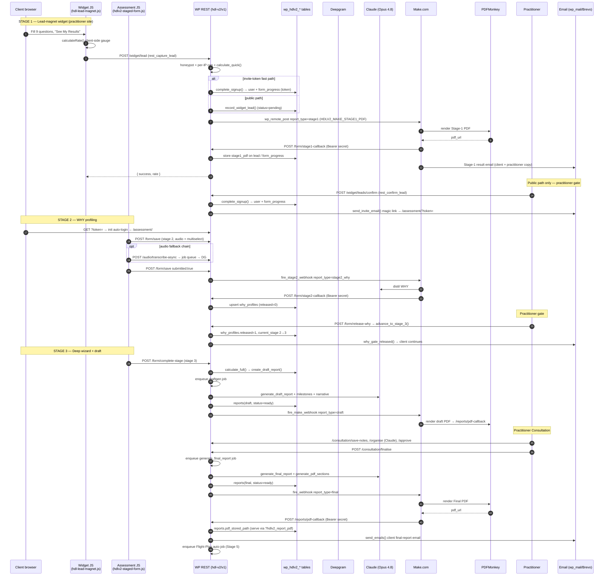

# HDL Longevity V2 — Read-Only Plugin Audit

**Date:** 2026-06-28 · **Plugin:** `hdl-longevity-v2/` (HDL Longevity V2 — Staged Workflow) · **Version:** header & runtime both `0.47.18`, DB schema `3.23` · **Branch:** `chore/reconcile-stby-0.47.9` (HEAD `8cc1a31`) · **Scope:** read-only — no files changed, no deploys, no server mutation.

> **How this audit was produced.** Eight subject investigators read the *current* plugin source (V2 `0.47.18`), each was then re-checked by an independent adversarial verifier against the same code, and a completeness critic diffed the result against a fresh full inventory. Every factual claim is cited to `file:line` (paths relative to the repo root). A previous repo-root `AUDIT.md` exists but is a *different*, older audit pinned to `0.41.18/0.41.35` — it was **not** overwritten; this document is the current, systematic one and lives at the **plugin root** (`hdl-longevity-v2/AUDIT.md`). The verifier corrections are folded into the body and logged in §12.

> **Live-environment caveat.** SSH was **not** used (STBY is unaliased and sits behind fail2ban; LIVE is off-limits per the brief). Everything here is derived from code. The four live version facts in §1.2 (WP / PHP / MariaDB / web-server) are marked **pending live read** — run the read-only command in §11 to fill them.

> **Version-drift caveat (important).** Per project memory: **STBY = `0.47.19/DB3.23`**, **LIVE = `0.41.18/DB3.13`** (LIVE is ~6 minor versions behind and predates most of what this audit documents — Iris, safety-screen, Stage-1 PDF, flight-notes, parity fixes). The local working tree is `0.47.18` with **uncommitted** edits (`hdlv2-form.css`, `class-hdlv2-staged-form.php`, `class-hdlv2-email-templates.php`, `class-hdlv2-flight-notes.php`), and `git` HEAD (`8cc1a31`, "0.47.15") references CSS classes that are not yet committed — the tree is internally **incoherent**. Treat **STBY as the source of truth**; LIVE behaviour will differ materially from this document until the migration runs.

---

## 1. Executive Summary

**In plain language:** `hdl-longevity-v2` is a WordPress plugin that runs a **three-stage longevity ("pace-of-ageing") assessment funnel** for a practitioner-led health service. A prospect completes a 9-question quick widget (Stage 1), a motivational "WHY" profile with optional voice recording (Stage 2), and a deep self-measurement wizard (Stage 3). A deterministic **rate calculator** scores the answers; **Claude (Anthropic) Opus 4.8** writes the narrative reports; a practitioner reviews and finalises in a split-screen **consultation workspace**; and **Make.com → PDFMonkey** (plus three direct WP→PDFMonkey paths) turn the results into branded PDFs delivered by email. After finalisation the client enters a **weekly Flight Plan + check-in** loop. The plugin runs *alongside* the older V1 plugin and hard-depends on it.

**Shape of the thing (all verified against current code):**

| Dimension | Finding |
|-----------|---------|
| Size | 61 PHP files / 39,614 lines (57 files / 37,906 lines under `includes/`); 20 JS (17,689 lines) + 9 CSS + a 1,739-line standalone widget |
| Architecture | Plain OOP **singletons**, **no namespaces, no autoloader, no Composer** — 54 manual `require_once` in `load_dependencies()`. Boots at `plugins_loaded` **priority 20** (after V1 at 10); magic-link auto-login at `init` **priority 1**. Refuses to boot if V1's `HDL_VERSION` is undefined. |
| Data | **19 custom tables** (`wp_hdlv2_*`), **no** CPTs/taxonomies, **no** `uninstall.php` (deactivation never drops data). Lettered migration chain **A→AD** runs on every boot; **6 columns exist only via `ALTER`**, not in their `CREATE TABLE`. |
| HTTP surface | **85** `register_rest_route()` calls (82 `hdl-v2/v1` + 3 `hdl/v1`); **74** active when the two Iris feature flags are off. **11** shortcodes, **12** admin-AJAX handlers (no `nopriv`), **1** WP-CLI command, **12** recurring cron events + 4 single-event families, one async **job queue**. |
| AI | **Claude only.** 5 raw-HTTP transports, **18** distinct task call-sites, model `claude-opus-4-8` everywhere, **no sampling params** (temperature deliberately removed — Opus 4.8 returns HTTP 400 on it), 120 s timeouts. Cost controls: idempotency keys + a dedicated `TIER_AI_BURN` rate tier + an async job queue. |
| Automation/PDF | **6** Make.com webhook constants (incl. the under-documented `HDLV2_MAKE_REDFLAG`); 4 inbound Bearer-authenticated callbacks; PDFMonkey reached **via Make** for 4 PDFs and **directly** by 3 services. Per an in-code comment, all Make constants may point at **one** scenario (SPOF). |
| 5th integration | **IrisMapper Pro** — flag-gated iris-photo analysis with its own HTTP client, HMAC callbacks, fail-closed entitlement, a DB circuit-breaker, and a Stripe-via-IrisMapper paid add-on path. Distinct from Claude/Make/Deepgram/PDFMonkey. |
| Security posture | No hardcoded secrets; tokens HMAC/`hash_equals`-checked; `$wpdb->prepare` used throughout; IDOR ownership helper applied on client routes. Real gaps: audio upload dir lacks web-access protection, client-derived Claude output is `substr`-logged to `debug.log` (PII), an IDOR on `/jobs/{id}/status` (tracked P2), a private-photo streamer to harden, and a destructive admin-AJAX purge. |

**Five things that will bite if you don't know them (detail in §9):**
1. **The webhook-retry subsystem is dead code.** `refire_*` handlers are registered on cron but the functions are never defined; the call is swallowed by a `catch(\Throwable)`. Failed Make fires are *logged* but **not** auto-recovered (the separate Stage-2 extraction retry is the only real retry).
2. **STBY has no Make.com at all.** WHY distillation silently falls back to an in-WordPress Claude call (`extract_why` via the `hdlv2_stage2_local_extract` single-event); LIVE relies on Make. Same code, very different runtime path.
3. **Fresh-install vs migrated divergence.** Six columns are added only by `ALTER` in the Phase chain; a brand-new activation and a long-migrated DB are not guaranteed identical. Migrations run on *every* boot keyed off `hdlv2_db_version`.
4. **Heavy flag-gating, much of it never on LIVE.** Iris (both flags), safety-screen, red-flag scan, milestone preview, automation/paid-report tier — several are STBY-only and three flags have **no admin setter** (toggled by editing the option directly).
5. **LIVE is far behind and the git tree is incoherent.** Don't reason about production from `git HEAD`; reason from STBY.

### 1.1 Plugin identity (from the main file header + runtime constants)

| Field | Value | Source |
|-------|-------|--------|
| Plugin Name | HDL Longevity V2 — Staged Workflow | `hdl-longevity-v2.php:3` |
| Version (header) | `0.47.18` | `hdl-longevity-v2.php:6` |
| Version (runtime) | `HDLV2_VERSION = '0.47.18'` | `hdl-longevity-v2.php:25` |
| DB schema version | `HDLV2_DB_VERSION = '3.23'` | `hdl-longevity-v2.php:26` |
| Author | Health Data Lab (`https://healthdatalab.net`) | `hdl-longevity-v2.php:7-8` |
| Text Domain | `hdl-longevity-v2` | `hdl-longevity-v2.php:10` |
| Hard dependency | V1 plugin `health-data-lab-plugin` (boot aborts if `HDL_VERSION` undefined) | `hdl-longevity-v2.php:381-386` |

Plugin directory on both servers: `/var/www/html/wp-content/plugins/hdl-longevity-v2/`.

### 1.2 Environment (STEP 1)

The platform is documented in the repo `CLAUDE.md`; the four server-version facts could not be read without SSH and are **pending a live read** (see §11 for the exact read-only command).

| Item | LIVE (`healthdatalab.net`) | STBY (`stby.healthdatalab.net`) | Source |
|------|----------------------------|----------------------------------|--------|
| Host / IP | Vultr VPS, `108.61.172.199`, port 8443 (1 vCPU / 1 GB) | `136.244.68.235`, port 8443 | repo `CLAUDE.md` |
| Web server | OpenLiteSpeed (OLS) | OpenLiteSpeed (OLS) | repo `CLAUDE.md`; `lshttpd` path referenced in code |
| WordPress version | **pending live read** | **pending live read** | — |
| PHP version | **pending live read** (code guards PHP ≥ 7.4 in V1) | **pending live read** | — |
| Database | MySQL/MariaDB — **version pending live read** | same | repo `CLAUDE.md` ("MySQL/MariaDB") |
| Active theme | **pending live read** | **pending live read** | — |
| Plugin version installed | `0.41.18` (per memory — far behind) | `0.47.19` (per memory) | project memory |
| Make.com | configured (6 webhook constants) | **NOT configured** (Brevo/email also disabled, keys rotated) | repo `CLAUDE.md` |

The frontend is a separate, static Netlify site (`healthdatalab.com`) with Node serverless functions (Stripe/Brevo) and a geo-currency edge function — outside this plugin's boundary but it originates the consumer-provisioning calls that V1 (not V2) handles.

---

## 2. Architecture Overview & End-to-End Request/Data Flow

### 2.1 Architecture overview

HealthDataLab is a **two-domain platform**. The customer-facing surface is a **static site on Netlify** (`healthdatalab.com` — vanilla HTML/JS, Tailwind CDN, GSAP) plus serverless functions (`netlify/functions/` — Stripe checkout/webhooks, contact email, seat counting) and one geo-IP edge function. All stateful logic lives in **WordPress on a Vultr VPS** (`healthdatalab.net`, `/var/www/html/`), where two plugins run side by side: **V1** (`health-data-lab-plugin/` — accounts, credits, original forms) and **V2** (`hdl-longevity-v2/` — the staged longevity funnel that is the subject of this audit). V2 boots at `plugins_loaded` priority 20 so V1's `HDL_VERSION` is already defined, and registers a second hook at `init` priority 1 for magic-link auto-login (`hdl-longevity-v2/hdl-longevity-v2.php:47`, `:378`). Current version is `HDLV2_VERSION 0.47.18` / `HDLV2_DB_VERSION 3.23` (`hdl-longevity-v2/hdl-longevity-v2.php:25-26`). The funnel orchestrates **four external services**: **Claude** (Anthropic API, model `claude-opus-4-8`, called directly from `class-hdlv2-ai-service.php:18`,`:26`,`:1834`) for all report/WHY/milestone generation; **Deepgram Nova-3** (server-side audio transcription fallback, `sprint-3/`); **Make.com** (a single scenario whose route is selected by a `report_type` field — `stage1`/`stage2_why`/`draft`/`final` — fired from WP via `wp_remote_post`, all four `HDLV2_MAKE_*` constants pointing at one URL per the inline note at `sprint-1/class-hdlv2-widget-config.php:1128-1135`); and **PDFMonkey** (invoked by Make.com to render the PDFs, which are POSTed back to WP self-hosted callback routes). Every V2 REST route is namespaced `hdl-v2/v1/*`, wrapped by a rate-limit middleware, force-`no-store` cached, and (for AI-burning routes) deduped by an idempotency wrapper (`hdl-longevity-v2.php:398-406`, `:833`).

### 2.2 Mermaid sequence diagram



### 2.3 Step-by-step trace (file · function · hook/route)

| # | Stage / action | File (repo-relative) | Function / method | Hook · REST route · AJAX |
|---|----------------|----------------------|-------------------|--------------------------|
| 1 | Embed render — practitioner pastes widget | `hdl-longevity-v2/includes/sprint-1/class-hdlv2-widget-renderer.php:33` | `generate_embed_code()` | builds `<div data-api>` + `<script src=widget/hdl-lead-magnet.js>`; API = `rest_url('hdl-v2/v1/widget/lead')` (`:34`) |
| 2 | FE Stage-1 capture | `hdl-longevity-v2/widget/hdl-lead-magnet.js:1507`,`:1515` | client gauge + `fetch(cfg.apiUrl)` | POST body incl. `rate_of_ageing_result`, `q1_age…q9` |
| 3 | Stage-1 submission handler | `hdl-longevity-v2/includes/sprint-1/class-hdlv2-widget-config.php:410` | `rest_capture_lead()` | `rest_api_init` → `POST hdl-v2/v1/widget/lead` (`:279`, `permission_callback=__return_true`) |
| 4 | Validation / anti-abuse | same `:415` (honeypot `website`), `:432-438` (per-IP transient cap), `:462-468` (email + MX) | inline | — |
| 5 | Server re-score Stage 1 | `hdl-longevity-v2/includes/sprint-2/class-hdlv2-rate-calculator.php:126` | `calculate_quick()` | called at `widget-config.php:487` |
| 6 | Storage — invite fast path | `class-hdlv2-widget-config.php:524`, `:1283` | `complete_signup()` | creates WP user + `wp_hdlv2_form_progress` row (token), links to practitioner |
| 6b | Storage — public path | `class-hdlv2-widget-config.php:573`, `:667` | `record_widget_lead()` | upserts `wp_hdlv2_widget_leads` (status `pending`) — **no** `form_progress` yet |
| 7 | Stage-1 PDF Make fire | `class-hdlv2-widget-config.php:641`,`:1128-1181` | `dispatch_post_signup_artifacts()` | `wp_remote_post(HDLV2_MAKE_STAGE1_PDF, blocking=false)`, payload `report_type=stage1`, `callback_url=…/form/stage1-callback`, `callback_secret` |
| 8 | Stage-1 PDF callback (delivery) | `hdl-longevity-v2/includes/sprint-2c/class-hdlv2-report-pdf.php:112` | `rest_stage1_callback()` | `POST /form/stage1-callback` (Bearer `HDLV2_MAKE_CALLBACK_SECRET`, `hash_equals`); stores PDF on lead/`form_progress`, serve via `?hdlv2_stage1_pdf=` (`:184`) |
| 9 | **Practitioner gate #1** (public path) | `class-hdlv2-widget-config.php:1824` | `rest_confirm_lead()` → `complete_signup()` → `send_invite_email()` | `POST /widget/leads/confirm`; emails magic link `…/assessment/?token=` |
| 10 | Magic-link auto-login | `hdl-longevity-v2/hdl-longevity-v2.php:47`,`:77-216`,`:292-347` | `init` pri-1 closure | handles `?invite=`, `?token=`, `?hdlv2_verify=`; `wp_set_auth_cookie` before main query |
| 11 | Assessment page load | `hdl-longevity-v2/assets/js/hdlv2-staged-form.js:378` | `fetch(api_base + '/load')` | `GET /form/load` (`staged-form.php:41`) |
| 12 | Stage-2 autosave + submit | `hdlv2-staged-form.js:1131` | `fetch(api_base+'/save', submitted:true)` | `POST /form/save` (`staged-form.php:48`, `rest_save_form` `:199`) |
| 13 | Stage-2 audio (3-tier fallback) | `hdl-longevity-v2/includes/sprint-3/class-hdlv2-audio-service.php:86` | `register_rest_routes()` | `POST /audio/transcribe-async` → job queue → Deepgram Nova-3 (`sprint-3/class-hdlv2-deepgram-service.php`) |
| 14 | Stage-2 WHY Make fire | `class-hdlv2-staged-form.php:235-251`,`:2192` | `fire_stage2_webhook()` | `wp_remote_post(HDLV2_MAKE_STAGE2_WHY)`; `report_type=stage2_why`, `callback_url=…/form/stage2-callback` (`:2273`); guarded by `stage2_text_hash` dedupe |
| 15 | WHY distillation (Claude via Make) | external Make scenario → returns to | `class-hdlv2-staged-form.php:1080` `rest_stage2_callback()` | `POST /form/stage2-callback` (Bearer secret `hash_equals` `:1090`); upserts `wp_hdlv2_why_profiles` (`released=0` `:1141`), sets `stage2_completed_at`, **does not** advance stage |
| 16 | **Practitioner gate #2 — Release WHY** | `class-hdlv2-staged-form.php:1049` `rest_release_why()` → `hdl-longevity-v2/includes/class-hdlv2-compatibility.php:486` `advance_to_stage_3()` | `POST /form/release-why` | sets `why_profiles.released=1` (`:514`) and `current_stage 2→3` (`:520`, "the ONLY place current_stage goes 2→3"); emails `why_gate_released()` (`:530`) |
| 17 | Stage-3 wizard submit | `hdlv2-staged-form.js:1391-1392` | `/save` then `/complete-stage` | `POST /form/complete-stage` (`staged-form.php:55`, `rest_complete_stage` `:345`) |
| 18 | Stage-3 full score + draft row | `class-hdlv2-staged-form.php:431-468` | `calculate_full()` (`rate-calculator.php:192`) + `create_draft_report()` (`:1897`) | atomic completion claim (`:383-392`); writes `wp_hdlv2_reports` (draft, `status=generating`) |
| 19 | Draft generation enqueue | `class-hdlv2-staged-form.php:584-594` | `HDLV2_Job_Queue::enqueue(draftgen)` | belt-and-braces; FE also calls `POST /form/generate-report` (`:62`); optional red-flag scan if `hdlv2_ff_redflag_scan` (`:610`) |
| 20 | Draft AI build | `class-hdlv2-staged-form.php:708` `generate_draft_for_progress()` | `HDLV2_AI_Service::generate_draft_report()` (`:808`) + `generate_milestones()` (`:817`) + `generate_client_draft_narrative()` (`:832`) | Claude `claude-opus-4-8`; UPSERT `reports` → `status=ready` (`:882`) |
| 21 | Draft PDF Make fire | `class-hdlv2-staged-form.php:906`,`:1920` `fire_make_webhook()` | `wp_remote_post(HDLV2_MAKE_DRAFT_REPORT)` | `report_type=draft`; `callback_url=…/reports/pdf-callback` (`:2082`) |
| 22 | **Practitioner Consultation** | `hdl-longevity-v2/includes/sprint-2c/class-hdlv2-consultation.php:279` | `rest_save_notes` (`:924`), `rest_organise_notes` (`:984`, Claude via `wrap_ai` `:996`), `rest_approve_notes` (`:1050`), recommendations/milestones edits | `POST /consultation/save-notes`,`/organise`,`/approve`,`/add-recommendation`,`/milestones-generate` |
| 23 | **Finalise trigger** | `class-hdlv2-consultation.php:1853` `rest_finalise()` → `enqueue_report_job(JOB_FINAL)` (`:1885`) | `POST /consultation/finalise` | ownership check (`:1905`), `GET_LOCK` serialise, enqueues `generate_final_report` (idem `genfinal:pid:cid`) |
| 24 | Final-report job worker | `hdl-longevity-v2/includes/sprint-2c/class-hdlv2-report-jobs.php:71` | `handle_final()` → `HDLV2_Final_Report::generate()` | job-queue dispatch (`register_handler` `:58`) |
| 25 | Final-report generation | `hdl-longevity-v2/includes/sprint-2c/class-hdlv2-final-report.php:49` `generate()` | `HDLV2_AI_Service::generate_final_report()` (`:244`) + `generate_pdf_sections()` (`:382`) | ownership (`:71`), duplicate guard (`:86`); INSERT `reports` (final, `status=ready`) (`:429`) |
| 26 | Final PDF Make fire | `class-hdlv2-final-report.php:533` `fire_webhook()` (defined `:893`) | `wp_remote_post(HDLV2_MAKE_FINAL_REPORT)` (`:901`) | `report_type=final`; `callback_url=…/reports/pdf-callback` (`:1370`) |
| 27 | Final PDF callback (delivery) | `class-hdlv2-report-pdf.php:70` `rest_pdf_callback()` | self-host PDF | `POST /reports/pdf-callback` (Bearer secret `:71`); writes `pdf_stored_path` (`:98`), serve via `?hdlv2_report_pdf=` (`:102`) |
| 28 | Client/practitioner email | `class-hdlv2-final-report.php:536` `send_emails()` | `final_report_ready_client()` via `wp_mail` (`:1521-1530`) | link-only email skipped when `HDLV2_MAKE_FINAL_REPORT` set (Make delivers the PDF email) (`:1507`) |
| 29 | Stage-5 Flight Plan kick | `class-hdlv2-final-report.php:563` | `HDLV2_Flight_Plan_Auto_Jobs::enqueue_for()` | enqueues first weekly Flight Plan after finalise |

Notes on cross-cutting auth/dedupe on this path: client-facing routes use `permission_callback=__return_true` and self-authenticate the 64-hex token; the `rest_authentication_errors` filter (`hdl-longevity-v2.php:452-497`) bypasses the WP cookie/nonce check when a valid token is present so cached-nonce 403s don't break the funnel. AI-burn routes wrap their handler in `HDLV2_Idempotency::wrap_ai()` (e.g. `/organise` at `consultation.php:996`). Stage-1 may also fire a flag-gated safety screen (`hdlv2_ff_safety_screen`, `widget-config.php:498`,`:591`).

### 2.4 Where post-consultation automation begins, and the flag-dark alternative

**Primary (practitioner-driven) path.** Post-consultation automation begins the moment the practitioner clicks Finalise: `HDLV2_Consultation::rest_finalise()` (`hdl-longevity-v2/includes/sprint-2c/class-hdlv2-consultation.php:1853`) enqueues the `generate_final_report` job, whose worker `HDLV2_Report_Jobs::handle_final()` (`class-hdlv2-report-jobs.php:71`) invokes **`HDLV2_Final_Report::generate()`** (`class-hdlv2-final-report.php:49`). That single method is the automation entry point — it runs Claude (`generate_final_report` `:244`, `generate_pdf_sections` `:382`), persists the final `reports` row (`:429`), fires Make.com/PDFMonkey (`fire_webhook()` `:533`/`:893`, `report_type=final`), sends the client email (`send_emails()` `:536`), and schedules the first weekly Flight Plan (`:563`). It is gated behind the human consultation: the practitioner must save/organise/approve notes (the consultation REST routes) before Finalise is offered.

**Flag-dark automation tier (auto-consultation).** A parallel path lets a client self-serve the report with **no practitioner consultation at all**, gated by the **`hdlv2_automation_tier_enabled`** option (default off). It lives in `hdl-longevity-v2/includes/sprint-2c/class-hdlv2-auto-consultation.php`: the shortcode and `POST /auto-consultation/submit` route (`rest_submit()` `:189`) return `503`/render nothing while the flag is false (`:61`, `:194`). When enabled, the client's six self-reported answers (plus optional audio transcript) are persisted as an addendum (`:305`), recommendations + milestones are generated by a Claude **Haiku-tier** call with heuristic fallback (`generate_ai_inputs()` `:409`, fallback `:335`), and the report is fired **directly** via **`HDLV2_Final_Report::fire_for_automation_tier()`** (`class-hdlv2-final-report.php:1409`, called at `auto-consultation.php:344`) — which calls `fire_webhook()` (`:1458`) with a `[CLIENT SELF-REPORTED — NO PRACTITIONER CONSULTATION OCCURRED]` marker (`auto-consultation.php:341`) and **bypasses** `HDLV2_Final_Report::generate()` and the practitioner Finalise gate entirely. A second flag, **`hdlv2_automation_hold_for_review`** (`:318`), is a safety valve: when on, the submission is parked for the normal manual consultation editor and no AI/webhook fires. This automation tier is wired but dark in the current build (per the `W8`/`W13` notes and the default-off options).

### ⚠ Needs confirmation
- **Stage-2 WHY Claude call location.** Distillation is performed inside the Make.com scenario (the WP payload `fire_stage2_webhook` ships raw `vision_text`/audio and Make returns `distilled_why` via `/form/stage2-callback`), not by a direct WP Claude call on the release path. `HDLV2_AI_Service::extract_why()` exists (`class-hdlv2-ai-service.php:39`) as a fallback/alternate extractor; I did not trace a live caller on the primary funnel, so whether it ever runs in production vs. Make-only could not be confirmed from code alone.
- **Single Make scenario assumption.** The "all four `HDLV2_MAKE_*` constants share one scenario URL, routed by `report_type`" claim rests on inline code comments (`widget-config.php:1128-1135`) and project memory; the actual constant values live in server `wp-config.php` (not in-repo) and were not read (network/SSH prohibited).
- **`MODEL_HAIKU` value.** Both `MODEL` and `MODEL_HAIKU` are literally `'claude-opus-4-8'` (`class-hdlv2-ai-service.php:26-27`), so the auto-consultation "Haiku 4.5" docblock (`auto-consultation.php:405`) is stale — the tier actually calls Opus 4.8. Worth confirming intended model for that path.

---

## 3. Full File & Directory Map + Load Architecture

All paths are relative to repo root. The plugin lives entirely under `hdl-longevity-v2/`. Verified against the live tree on branch `chore/reconcile-stby-0.47.9`, HEAD `8cc1a31`.

**Totals (verified with `wc -l`):** 61 PHP files / 39,614 lines. Of these, `includes/` = **57 files / 37,906 lines** (matches the brief), the bootstrap `hdl-longevity-v2.php` = 928 lines, and `tests/iris/` = 3 files / 780 lines. Front-end assets: 20 JS files / 17,689 lines, 9 CSS files / 8,083 lines, plus `widget/hdl-lead-magnet.js` (1,739 lines).

### 3.1 Directory tree (folders)

```
hdl-longevity-v2/
├── hdl-longevity-v2.php          ← main loader (boot, magic-link, dep loader)
├── CLAUDE.md, TESTING.md         ← docs (no composer.json / package.json here)
├── includes/
│   ├── api/                      ← EMPTY placeholder (0 files)
│   ├── services/                 ← EMPTY placeholder (0 files)
│   ├── security/                 (8 PHP)
│   ├── sprint-1/                 (3 PHP)  Stage-1 widget + safety screen
│   ├── sprint-2/                 (8 PHP)  staged form, AI, rate calc, email
│   ├── sprint-2c/                (12 PHP) consultation, final report, flight notes
│   ├── sprint-3/                 (3 PHP)  audio / Deepgram
│   ├── sprint-4/                 (7 PHP)  check-in, dashboards, timeline
│   ├── sprint-5/                 (4 PHP)  flight plan
│   └── (10 cross-cutting top-level PHP)
├── assets/
│   ├── js/   (20 .js + CLAUDE.md)
│   ├── css/  (9 .css + CLAUDE.md)
│   ├── images/  (silhouettes/, stage1-icons/, irismapper-*.png)
│   └── vendor/  (3 blobs — Transformers.js/ORT, ~22.5 MB, now ORPHANED)
├── widget/   (hdl-lead-magnet.js, test.html, CLAUDE.md)
├── docs/     (ai-prompts/, meetings/, pdfmonkey/[backups,handoff], phases/, plans/, specs/)
├── mockups/  (12 HTML prototypes + CLAUDE.md)
└── tests/iris/ (3 standalone PHP test scripts — STBY only)
```

`includes/api/` and `includes/services/` are confirmed **empty** (`ls` → `total 0`); per the V2 CLAUDE.md they are placeholders — do not add files there. There is **no `uninstall.php`** (deactivator preserves tables).

### 3.2 `includes/` top-level cross-cutting (10 files)

| File | Lines | Purpose |
|------|------:|---------|
| `class-hdlv2-activator.php` | 2,081 | Table creation, cron registration, all schema migrations (`activate()`/`upgrade()`, `ensure_*_scheduled()`) |
| `class-hdlv2-deactivator.php` | 32 | Cron unschedule only — never drops tables (data preserved) |
| `class-hdlv2-compatibility.php` | 655 | **Only** class that reads V1 tables; owns IDOR helper `practitioner_owns_client()`, `create_practitioner_client_link()` |
| `class-hdlv2-context-builder.php` | 424 | Tiered Claude-prompt context assembly (profile/WHY/milestones/check-ins) + monthly-summary cron |
| `class-hdlv2-job-queue.php` | 636 | Generic async job runner; handlers register via `register_handler()`; `/jobs/{id}/status` REST |
| `class-hdlv2-flags-store.php` | 245 | Single red-flag notification path (Make.com `HDLV2_MAKE_REDFLAG` else `wp_mail`) |
| `class-hdlv2-practitioner.php` | 175 | Single source of truth for practitioner reads (canonical logo URL resolver) |
| `class-hdlv2-iris-addon.php` | 243 | IrisMapper add-on: HTTP client + 3 REST routes (checkout/status/login); flag `hdlv2_ff_iris_addon` |
| `class-hdlv2-iris-consult.php` | 958 | IrisMapper Phase-2 embedded consult (upload/analyse/poll/callback/edit); flag `hdlv2_ff_iris_consult` |
| `class-hdlv2-iris-support.php` | 359 | Pure contract helpers for iris consult (callback HMAC, jobId validation, poll-state map) — no WP deps |
| `class-hdlv2-admin-automation-tier.php` | 565 | W13 top-level admin page (Settings + Tokens tabs) for the automation tier |
| `class-hdlv2-admin-automation-tokens-table.php` | 172 | `WP_List_Table` subclass for the Tokens tab; **lazy-required** (not in `load_dependencies()`) |

(12 rows — the last two are also top-level; the brief's "10" undercounts the two automation-admin files added since 0.41.34.)

### 3.3 `includes/security/` (8 files)

| File | Lines | Purpose |
|------|------:|---------|
| `class-hdlv2-rate-limiter.php` | 121 | Transient-backed sliding-window counter; fail-open by design |
| `class-hdlv2-rate-limit-policy.php` | 200 | Single source of truth route→tier map (`route_patterns()`) |
| `class-hdlv2-rate-limit-middleware.php` | 269 | `rest_pre_dispatch` slot-consume + 429; `rest_post_dispatch` `X-RateLimit-*` headers |
| `class-hdlv2-rate-limit-status.php` | 72 | `GET /rate-limit/status` (uses `peek()`, doesn't burn a slot) |
| `class-hdlv2-idempotency.php` | 125 | Stripe-pattern client key dedupe on AI-burn routes; normalises `WP_Error`→`WP_REST_Response` |
| `class-hdlv2-webhook-monitor.php` | 359 | Logs every Make.com fire + surfaces failures via wp-admin notice |
| `class-hdlv2-webhook-retry.php` | 213 | Auto re-fire of draft/final/flight-pdf webhooks on failure (cron + registered handlers) |
| `class-hdl-paid-report-provisioner.php` | 917 | W4 Altituding-Stripe→HDL automation-tier provisioner (V1 `hdl/v1` namespace; flag `hdlv2_automation_tier_enabled`) |

### 3.4 `includes/sprint-1/` — Stage-1 widget (3)

| File | Lines | Purpose |
|------|------:|---------|
| `class-hdlv2-widget-config.php` | 3,073 | Per-practitioner widget settings, invite tokens, lead capture, verify/reject click handlers; `[hdlv2_widget]` |
| `class-hdlv2-widget-renderer.php` | 100 | Generates the self-contained embeddable widget HTML/JS/CSS |
| `class-hdlv2-safety-screen.php` | 438 | Deterministic front-door red-flag mapper from the two Stage-1 safety questions (no AI) |

### 3.5 `includes/sprint-2/` — staged form + AI + email (8)

| File | Lines | Purpose |
|------|------:|---------|
| `class-hdlv2-staged-form.php` | 2,593 | Controller for the token-based 3-stage form; 13+ REST endpoints; result-page priority chain |
| `class-hdlv2-ai-service.php` | 2,120 | Claude API wrapper (WHY extraction, draft/final report); Stage-1/2 generators removed v0.22.10–11 |
| `class-hdlv2-rate-calculator.php` | 661 | Pace-of-ageing scoring: `calculate_quick()` (Stage 1, 9 Qs) + `calculate_full()` (Stage 3) |
| `class-hdlv2-email-templates.php` | 1,055 | Branded HTML stage emails (Poppins/Inter, teal `#3d8da0`) |
| `class-hdlv2-stage1-commentary.php` | 597 | Deterministic 5-paragraph Stage-1 result builder (replaced Haiku) |
| `class-hdlv2-stage2-insight.php` | 123 | Deterministic 3-paragraph Stage-2 "AWAKEN" fallback (replaced Haiku) |
| `class-hdlv2-draft-report-jobs.php` | 78 | Queue handler: client DRAFT report (3 sequential Claude calls) off the web request |
| `class-hdlv2-redflag-jobs.php` | 124 | Queue handler: scan intake, persist + dedupe flags, message new client-relevant flags |

### 3.6 `includes/sprint-2c/` — consultation + final report (12)

| File | Lines | Purpose |
|------|------:|---------|
| `class-hdlv2-consultation.php` | 2,437 | Practitioner split-screen consultation workspace; `[hdlv2_consultation]` |
| `class-hdlv2-final-report.php` | 2,206 | Final-report pipeline (recalc → Claude → PDF webhook); `build_pdf_payload()`, `refire_final_webhook()` |
| `class-hdlv2-auto-consultation.php` | 665 | W8 automation-tier self-reported consultation shortcode (post-Stage-3 branch) |
| `class-hdlv2-client-draft-view.php` | 448 | Client-facing draft narrative + trajectory + radar; `[hdlv2_draft_report]` |
| `class-hdlv2-my-report.php` | 147 | `/my-report/` resolver → redirects to `/longevity-draft-report/?t=`; `[hdlv2_my_report]` |
| `class-hdlv2-trajectory-svg.php` | 516 | PHP/SVG port of the V1 trajectory chart for PDF embedding |
| `class-hdlv2-flight-notes.php` | 481 | F·L·I·G·H·T notes **data layer** — pure read, builds flat PDFMonkey payload |
| `class-hdlv2-flight-notes-service.php` | 571 | F·L·I·G·H·T notes render service — direct PDFMonkey (no Make) |
| `class-hdlv2-flight-notes-jobs.php` | 72 | Queue handler: Flight-Notes PDF render off the web request |
| `class-hdlv2-final-report-pdf-service.php` | 263 | Direct PDFMonkey re-render of Final Report on milestone edits (no Make/Claude) |
| `class-hdlv2-report-pdf.php` | 343 | D-2: Make→WP PDF callback, self-host file, ownership-checked serve route |
| `class-hdlv2-report-jobs.php` | 133 | Queue handler: practitioner Final Report multi-call Claude work |

### 3.7 `includes/sprint-3/` — audio (3)

| File | Lines | Purpose |
|------|------:|---------|
| `class-hdlv2-audio-service.php` | 768 | Shared record/transcribe/extract; `/audio/transcribe-async`; Claude extraction |
| `class-hdlv2-deepgram-service.php` | 200 | Thin wrapper around Deepgram `/v1/listen` (Nova-3) |
| `class-hdlv2-transcription-jobs.php` | 337 | Queue handlers `transcribe_audio` + downstream extraction |

### 3.8 `includes/sprint-4/` — check-in + dashboards (7)

| File | Lines | Purpose |
|------|------:|---------|
| `class-hdlv2-client-dashboard.php` | 2,051 | `/my-dashboard/` client dashboard + login_redirect + role guards |
| `class-hdlv2-client-status.php` | 1,143 | V2 status-label calculator for the practitioner roster |
| `class-hdlv2-checkin.php` | 894 | Weekly text/audio check-in; `[hdlv2_checkin]` |
| `class-hdlv2-admin-restore.php` | 675 | Tools → V2 Restore admin page for soft-deleted `form_progress` |
| `class-hdlv2-practitioner-dashboard.php` | 459 | `[hdlv2_practitioner_dashboard]` shortcode wrapper (list logic is in JS+REST) |
| `class-hdlv2-timeline.php` | 261 | Unified chronological interaction log; `[hdlv2_timeline]` |
| `class-hdlv2-attention-cron.php` | 140 | Daily digest cron emailing practitioners their `needs_attention` clients |

### 3.9 `includes/sprint-5/` — flight plan (4)

| File | Lines | Purpose |
|------|------:|---------|
| `class-hdlv2-flight-plan.php` | 2,223 | Weekly AI-generated action plans + tick adherence; `[hdlv2_flight_plan]`; `refire_flight_plan_webhook()` |
| `class-hdlv2-flight-plan-pdf-service.php` | 388 | Direct PDFMonkey render + self-host of the weekly plan PDF (no Make) |
| `class-hdlv2-flight-plan-jobs.php` | 173 | Queue handlers: manual regen **and** `HDLV2_Flight_Plan_Auto_Jobs` (auto/check-in/finalise gen) — two classes in one file |
| `class-hdlv2-flight-plan-renderer.php` | 129 | HTML renderer for online display + PDF source |

### 3.10 `assets/js/` (20 files)

| File | Lines | Purpose (paired surface) |
|------|------:|---------|
| `hdlv2-client-list-enhance.js` | 4,079 | Practitioner roster enhancement (deep-links, release flow, sorting/filters) |
| `hdlv2-consultation.js` | 2,655 | Practitioner consultation workspace front-end |
| `hdlv2-dashboard.js` | 2,206 | Practitioner dashboard logic |
| `hdlv2-staged-form.js` | 1,654 | Stage 1/2/3 wizard (chips, gauges, audio component) |
| `hdlv2-audio-component.js` | 1,431 | Audio fallback orchestrator (Web Speech → server Deepgram) |
| `hdlv2-draft-report.js` | 931 | Client draft-report view |
| `hdlv2-flight-plan.js` | 888 | Weekly flight-plan UI + tick adherence |
| `hdl-trajectory-chart-hero.js` | 673 | Trajectory ("health over life") chart (JS source of the SVG port) |
| `hdlv2-checkin.js` | 495 | Weekly check-in front-end |
| `hdlv2-iris-consult.js` | 423 | IrisMapper embedded-consult UI |
| `hdlv2-rate-limit.js` | 350 | Reads `/rate-limit/status`, surfaces limits in UI |
| `hdlv2-practitioner-dashboard.js` | 306 | Practitioner-dashboard shortcode bootstrap |
| `hdlv2-timeline.js` | 298 | Client timeline rendering |
| `hdlv2-loading.js` | 292 | Shared loading primitives (skeletons/progress illusion/optimistic save) |
| `hdlv2-client-dashboard.js` | 238 | `/my-dashboard/` client-side logic |
| `hdlv2-ui-modal.js` | 215 | Themed confirm/UI modal helper |
| `hdlv2-pd-tutorial.js` | 193 | Practitioner-dashboard tutorial walkthrough |
| `hdlv2-auto-consultation.js` | 155 | Automation-tier self-reported consultation UI |
| `hdlv2-client-nav-bar.js` | 129 | Client-side nav bar |
| `hdlv2-speedometer.js` | 78 | SVG pace-of-ageing speedometer gauge |

> Note: `hdlv2-transcriber.js` and `hdlv2-transcriber.worker.js` referenced in the V2 CLAUDE.md are **gone** from `assets/js/` — the in-browser Whisper tier was removed (E4, v0.46.47; see `hdl-longevity-v2.php:543-547`). The audio chain is now **2-tier** (Web Speech → server Deepgram), not the 3-tier the docs still describe.

### 3.11 `assets/css/` (9 files)

| File | Lines | Purpose |
|------|------:|---------|
| `hdlv2-form.css` | 2,326 | Staged-form styling (incl. Section-6 toggles — **modified, uncommitted**) |
| `hdlv2-consultation.css` | 1,988 | Consultation workspace |
| `hdlv2-client-dashboard-populated.css` | 1,068 | Populated client dashboard |
| `hdlv2-flight-plan.css` | 993 | Flight-plan tab |
| `hdlv2-draft-report.css` | 704 | Client draft report |
| `hdlv2-client-dashboard.css` | 503 | Client dashboard (empty/waiting states) |
| `hdlv2-loading.css` | 209 | Shared loading helpers |
| `hdlv2-auto-consultation.css` | 165 | Automation-tier consultation |
| `hdlv2-tutorial-section.css` | 127 | Practitioner tutorial section |

### 3.12 `widget/`, `docs/`, `tests/`, `mockups/`, `assets/vendor`

| Group | Contents |
|------|---------|
| `widget/` | `hdl-lead-magnet.js` (1,739) — externally-embeddable Stage-1 widget; `test.html`; `CLAUDE.md` |
| `assets/vendor/` | `transformers.min.js` (888 KB), `ort-wasm-simd-threaded.jsep.wasm` (21.6 MB), `…jsep.mjs` (44 KB) — **~22.5 MB orphaned**; no longer referenced after the transcriber removal |
| `tests/iris/` | `iris-integration-stby.php` (312), `iris-native-capture-stby.php` (266), `test-iris-support.php` (202) — standalone STBY harnesses, not loaded by the plugin |
| `docs/` | `ai-prompts/` (15 prompt .md), `meetings/`, `pdfmonkey/` (+`backups/`, `handoff-2026-06-04/`), `phases/` (PHASE1–15 + variants), `plans/`, `specs/` — meeting notes, migration checklists, PDFMonkey template mirrors |
| `mockups/` | 12 throwaway HTML design prototypes (draft-report, flight-plan, safety-screen, stage3 gauge, tier1 invites, etc.) |

### 3.13 Bootstrap & load trace (`hdl-longevity-v2.php`, 928 lines)

| Stage | Lines | What happens |
|-------|------:|--------------|
| Constants block (file scope) | 25-29 | `HDLV2_VERSION='0.47.18'`, `HDLV2_DB_VERSION='3.23'`, `HDLV2_PLUGIN_DIR/URL/FILE`. Defined at file scope so activation-hook callbacks can read them. |
| `add_action('init', …, 1)` magic-link autologin | 47-376 | Runs **before** the main query. Skips admin/logged-in (48) and REST (68-71). Branches: `?invite=` (77-216), `?prac_login=` (238-289), `?token=` (292-347), `?hdlv2_verify=` (353-363), `?hdlv2_reject=` (367-374). All tokens gated by `/^[a-f0-9]{64}$/`. |
| `add_action('plugins_loaded', …, 20)` boot | 378-549 | **HDL_VERSION guard** (381-386 — admin notice + `return` if V1 inactive). DB-version check → `Activator::activate()` (389-392). **`HDL_Longevity_V2::get_instance()`** (395). Then REST cache-bust filter (398-406), token-auth bypass `rest_authentication_errors` priority 5 (452-497), `template_redirect` nocache (509-521), rate-limit JS enqueue (524-532), loading-helper register (540-541). |
| `hdlv2_register_loading_helpers()` | 560-578 | Registers (not enqueues) `hdlv2-loading` JS/CSS. |
| `hdlv2_render_link_card()` | 597-619 | Theme-independent 410 card for expired/invalid links. |
| Activator/deactivator require (file scope) | 623-624 | Required outside `plugins_loaded` so activation works even if V1 absent. |
| `register_activation_hook` / `register_deactivation_hook` | 626-627 | → `HDLV2_Activator::activate` / `HDLV2_Deactivator::deactivate`. |
| `add_filter('cron_schedules', …)` | 633-651 | Registers `hdlv2_five_minutes` (300 s) + `hdlv2_one_minute` (60 s) recurrences at file scope. |
| `final class HDL_Longevity_V2` (singleton) | 656-928 | `get_instance()` (660-665); `__construct()` (667-671) calls `load_dependencies()` → `maybe_upgrade_db()` → `init()`. |
| `maybe_upgrade_db()` | 687-709 | Idempotent runtime upgrade: `version_compare` vs `hdlv2_db_version` option → `Activator::upgrade()`; then 5× `ensure_*_scheduled()` cron reconcilers (worker, stuck-release, stage2-retry, weekly-flight-plan, attention-email). This is the **file-only deploy** mechanism. |

**`load_dependencies()` require_once order (711-829, 54 requires):** Compatibility → Flags-Store → Practitioner → Iris-Addon → Iris-Support → Iris-Consult → **security** (rate-limiter, rate-limit-policy, rate-limit-middleware, rate-limit-status, idempotency, webhook-monitor, webhook-retry, paid-report-provisioner) → **sprint-1** (widget-config, widget-renderer, safety-screen) → **sprint-2** (rate-calculator, ai-service, stage1-commentary, stage2-insight, email-templates, staged-form, draft-report-jobs) → **sprint-2c** (consultation, final-report, report-pdf, report-jobs, auto-consultation, client-draft-view, my-report, trajectory-svg, flight-notes, flight-notes-service) → flight-plan-pdf-service, final-report-pdf-service, flight-notes-jobs → **job-queue** (798, loaded *before* sprint-3 so audio routes can reference it) → **sprint-3** (audio-service, deepgram-service, transcription-jobs) → redflag-jobs → **sprint-4** (checkin, timeline, client-status, practitioner-dashboard, client-dashboard, attention-cron, admin-restore) → admin-automation-tier → **sprint-5** (flight-plan, flight-plan-renderer, flight-plan-jobs) → context-builder. (Order is load-bearing: security middleware first so it wraps all downstream routes; job-queue before its handlers.)

**`init()` hook-registration order (831-927):** Rate-Limit-Middleware → Rate-Limit-Status → Webhook-Monitor → Webhook-Retry (cron + 3 handlers) → Paid-Report-Provisioner → Widget-Config → Staged-Form → Consultation → Auto-Consultation → My-Report → **Job-Queue + 9 handler registrations** (Transcription, Redflag, Report, Flight-Notes, Flight-Plan, Flight-Plan-Auto, Flight-Plan-PDF-Service, Final-Report-PDF-Service, Draft-Report) → Audio-Service → Checkin → Timeline → Client-Status → Practitioner-Dashboard → Client-Dashboard → Iris-Addon → Iris-Consult → Attention-Cron → Admin-Restore → Admin-Automation-Tier → Flight-Plan → Flight-Notes-Service → Context-Builder.

### 3.14 Architecture characterisation

| Property | Finding | Evidence |
|----------|---------|----------|
| Paradigm | Fully class-based (one class per feature); no procedural feature code. Only file-scope procedural code is the bootstrap, 3 helper functions, and hook closures. | `hdl-longevity-v2.php:560,597`; one class per `includes/` file |
| Namespaces | **None.** All classes are global with `HDLV2_` prefix (or `HDL_` for the V1-namespace provisioner). `grep "^namespace"` → 0 hits. | confirmed grep |
| Autoloader | **None.** Manual `require_once` (54 in `load_dependencies()` + 2 file-scope + 1 lazy). No `spl_autoload_register`, no `vendor/autoload`, no composer. | `hdl-longevity-v2.php:711-829`; grep |
| Object lifecycle | **Mixed.** Main class + 18 feature classes are singletons (`get_instance()`); 6 are plain `new …->register_hooks()` (Widget-Config, Staged-Form, Consultation, Auto-Consultation, My-Report, Rate-Limit-Status); the rest are static-only utilities/job-handlers (`Activator`, `Compatibility`, `Rate_Calculator`, `*_Jobs::register()`, `Webhook_*`, `Idempotency`, `Stage1/2`, `Safety_Screen`, etc.). | `init()` 831-927; 18 `get_instance` defs |
| Sprint relationship | Loosely coupled by load order + shared services. `Job_Queue` is the async backbone (all `*_Jobs` register handlers against it); `Compatibility` is the sole V1 read gateway; `Context_Builder`/`AI_Service` are shared by sprint-2c + sprint-5; `Audio_Service` shared by sprint-2/2c/4. Cross-sprint requires are explicit (e.g. flight-plan-pdf-service required from the sprint-2c block at 790). | `load_dependencies()` |
| V1 hard dependency | **Yes.** Boots only if `HDL_VERSION` is defined (else admin notice + `return`); also reads V1 tables exclusively through `HDLV2_Compatibility`. Loads at `plugins_loaded` priority 20 (after V1's 10). | `hdl-longevity-v2.php:381-386` |

### 3.15 Dependencies & build tooling

| Item | Finding |
|------|---------|
| `composer.json` / `vendor/` (PHP) | **Absent** in the plugin and at repo root. No PHP package manager. |
| `package.json` (plugin) | **Absent.** The only `package.json` is at repo root (`/package.json`) for the **Netlify Functions** (`nodemailer ^8.0.1`, `stripe ^14.25.0`) — unrelated to the plugin. |
| Build step | **None.** No bundler/transpiler; JS/CSS are hand-authored and enqueued raw with `?ver=HDLV2_VERSION` cache-busting. |
| Bundled JS libs in plugin | `assets/vendor/`: `transformers.min.js` (Transformers.js, 888 KB) + ONNX-runtime WASM (`ort-wasm-simd-threaded.jsep.wasm` 21.6 MB + `.mjs` 44 KB). **These are now dead weight** — the in-browser Whisper transcriber that consumed them was removed (E4 v0.46.47; `hdl-longevity-v2.php:543-547`) and `hdlv2-transcriber.js/.worker.js` are deleted. No Chart.js/QuickChart vendored (QuickChart is a remote URL service for the dashboard gauge per memory; the trajectory/radar/speedometer charts are hand-rolled SVG in `hdl-trajectory-chart-hero.js`, `class-hdlv2-trajectory-svg.php`, `hdlv2-speedometer.js`). |
| External runtime services (not bundled) | Claude API, Deepgram, PDFMonkey (via Make.com webhooks), browser Web Speech API. |

### 3.16 Git / version state

| Aspect | Value |
|--------|-------|
| Branch | `chore/reconcile-stby-0.47.9` |
| HEAD | `8cc1a31` `fix(parity): … (0.47.15)` |
| Plugin header version | `0.47.18` (`hdl-longevity-v2.php:6`) |
| Runtime constant | `HDLV2_VERSION = '0.47.18'` (`:25`), `HDLV2_DB_VERSION = '3.23'` (`:26`) |
| Header vs runtime drift | **None** — both say `0.47.18`. |
| HEAD-commit vs working-tree drift | **Yes.** HEAD's last commit message says `0.47.15`, but the working tree is `0.47.18` with **5 uncommitted modified files**: `hdl-longevity-v2.php`, `assets/css/hdlv2-form.css`, `includes/sprint-2/class-hdlv2-staged-form.php`, `includes/sprint-2/class-hdlv2-email-templates.php`, `includes/sprint-2c/class-hdlv2-flight-notes.php`. So the committed JS for Section-6 references CSS classes that exist only in the uncommitted `hdlv2-form.css` (incoherent HEAD, matching the MEMORY.md warning). |

### ⚠ Needs confirmation
- **`HDLV2_Flight_Plan_Auto_Jobs`** is referenced in `init()` (`:887`) but lives inside `class-hdlv2-flight-plan-jobs.php` (two classes in one file) — confirmed by grep. No separate `require_once`; it loads via the flight-plan-jobs require at `:825`. Worth a glance if you audit per-file single-class assumptions.
- **Orphaned `assets/vendor/` blobs (~22.5 MB):** the boot code no longer enqueues them, but I did not exhaustively grep every JS file for a stray dynamic `import()` of `transformers.min.js`. Confirm with `grep -rl transformers assets/js widget` before deleting them as dead weight.
- **Docs drift (informational, not a code fact):** the V2 `CLAUDE.md` still documents a 3-tier audio chain and `hdlv2-transcriber*` files that no longer exist; treat the code (`hdl-longevity-v2.php:543-547`, missing JS files) as authoritative.

---

## 4. Data Model (Tables, Options, Meta, Migrations, Cron)

All schema lives in `hdl-longevity-v2/includes/class-hdlv2-activator.php` (2081 lines). The plugin uses **plain MySQL tables only** — no Custom Post Types, no taxonomies, no `uninstall.php`. Current constants: `HDLV2_VERSION '0.47.18'`, `HDLV2_DB_VERSION '3.23'` (`hdl-longevity-v2/hdl-longevity-v2.php:25-26`).

### 4.1 Table inventory (19 tables, all `wp_hdlv2_*`)

`create_tables()` defines 19 `CREATE TABLE` blocks and runs 19 `dbDelta()` calls (`class-hdlv2-activator.php:1495-2080`). Confirmed suffixes (note the singular/plural exactly as coded):

| # | Constant | Table name | Sprint / purpose | CREATE lines |
|---|----------|-----------|------------------|--------------|
| 1 | `$table_widget` | `wp_hdlv2_widget_config` | S1 — per-practitioner widget settings | 1506-1523 |
| 2 | `$table_leads` | `wp_hdlv2_widget_leads` | S1 — completed widget submissions (canonical Stage-1 answers) | 1532-1552 |
| 3 | `$table_invites` | `wp_hdlv2_widget_invites` | S1 — one-shot assessment invite tokens | 1560-1575 |
| 4 | `$table_progress` | `wp_hdlv2_form_progress` | S2 — core stage progression (one row per client) | 1579-1615 |
| 5 | `$table_why` | `wp_hdlv2_why_profiles` | S2 — AI-extracted WHY profile | 1619-1643 |
| 6 | `$table_reports` | `wp_hdlv2_reports` | S2 — draft/final/quarterly reports | 1647-1666 |
| 7 | `$table_consult` | `wp_hdlv2_consultation_notes` | S2C — practitioner consultation workspace | 1674-1698 |
| 8 | `$table_checkins` | `wp_hdlv2_checkins` | S4 — weekly check-ins | 1702-1727 |
| 9 | `$table_timeline` | `wp_hdlv2_timeline` | S4 — unified client activity log | 1731-1764 |
| 10 | `$table_fp` | `wp_hdlv2_flight_plans` | S5 — weekly Claude-generated plans | 1768-1798 |
| 11 | `$table_ticks` | `wp_hdlv2_flight_plan_ticks` | S5 — per-action adherence ticks | 1802-1819 |
| 12 | `$table_pending` | `wp_hdlv2_pending_leads` | S1 — unverified signups (email-confirm flow) | 1825-1847 |
| 13 | `$table_monthly` | `wp_hdlv2_monthly_summaries` | Phase 6 — rolled-up monthly summaries | 1851-1865 |
| 14 | `$table_jobs` | `wp_hdlv2_jobs` | Async job queue (5-min/1-min worker) | 1873-1893 |
| 15 | `$table_audio_extractions` | `wp_hdlv2_audio_extractions` | S3 — raw transcripts + structured output | 1902-1920 |
| 16 | `$table_addenda` | `wp_hdlv2_consultation_addenda` | S2C — timestamped clinical addenda | 1932-1951 |
| 17 | `$table_tokens` | `wp_hdlv2_automation_tokens` | Automation-tier magic-link tokens | 1962-1982 |
| 18 | `$table_iris_results` | `wp_hdlv2_iris_results` | Iridology Phase 2 clinical record | 2007-2042 |
| 19 | `$table_iris_breaker` | `wp_hdlv2_iris_breaker` | Iris circuit-breaker (single-row CAS) | 2051-2058 |

> ⚠ **The CREATE statements are NOT the full schema** — six columns exist only via migration `ALTER` and never appear in any `CREATE TABLE` (fresh installs get them because the version-gated migrations also fire when `db_version = '0'`): `reports.rate_snapshot` (Phase H), `consultation_addenda.submitter`, `form_progress.source`, `widget_invites.source` (all Phase U), plus `flight_plans.pdf_stored_path` and `flight_plans.pdf_generated_at` (Phase Y). Always read CREATE **plus** `run_migrations()`. Detailed in §4.7.

### 4.2 Per-table column detail

**1. `wp_hdlv2_widget_config`** (1506-1523) — PK `id`; **UNIQUE** `practitioner_user_id`.

| Column | Type | Notes |
|--------|------|-------|
| id | BIGINT UNSIGNED AI | PK |
| practitioner_user_id | BIGINT UNSIGNED | UNIQUE |
| practitioner_name | VARCHAR(200) | '' |
| clinic_name | VARCHAR(200) | '' (added Phase W v3.15) |
| logo_url | VARCHAR(500) | '' |
| logo_shape | ENUM('square','wordmark','tall') | 'square' (Phase P v3.7) |
| cta_text | VARCHAR(300) | 'Book a session' |
| cta_link | VARCHAR(500) | '' |
| webhook_url | VARCHAR(500) | '' |
| notification_email | VARCHAR(200) | '' |
| theme_color | VARCHAR(7) | '#3d8da0' |
| show_book_button_after_widget | TINYINT(1) | 0 (Phase O v3.6) |
| created_at / updated_at | DATETIME | CURRENT_TIMESTAMP / ON UPDATE |

**2. `wp_hdlv2_widget_leads`** (1532-1552) — PK `id`; KEY `practitioner_user_id`, KEY `practitioner_email`(practitioner_user_id,visitor_email), KEY `practitioner_status`(practitioner_user_id,status,created_at).

| Column | Type | Notes |
|--------|------|-------|
| id | BIGINT UNSIGNED AI | PK |
| practitioner_user_id | BIGINT UNSIGNED | |
| visitor_name / visitor_email | VARCHAR(200) | '' |
| visitor_age | INT | NULL |
| rate_of_ageing | DECIMAL(4,2) | NULL |
| stage1_data | JSON | NULL (Phase L v3.2) |
| invite_id | BIGINT UNSIGNED | NULL |
| status | ENUM('pending','confirmed','rejected') | 'pending' (Phase O v3.6) |
| confirmed_at / rejected_at | DATETIME | NULL |
| stage1_pdf_stored_path | VARCHAR(255) | NULL (Phase AD v3.23) |
| stage1_pdf_generated_at | DATETIME | NULL (Phase AD v3.23) |
| stage1_cache_token | VARCHAR(64) | NULL (Phase AD v3.23) |
| created_at | DATETIME | CURRENT_TIMESTAMP |

**3. `wp_hdlv2_widget_invites`** (1560-1575) — PK `id`; **UNIQUE** `token`; KEY `practitioner_status`(practitioner_id,status).

| Column | Type | Notes |
|--------|------|-------|
| id | BIGINT UNSIGNED AI | PK |
| practitioner_id | BIGINT UNSIGNED | |
| token | VARCHAR(64) | UNIQUE |
| client_name | VARCHAR(200) | '' |
| client_email | VARCHAR(200) | NOT NULL |
| status | ENUM('pending','opened','completed','expired','revoked') | 'pending' |
| expires_at | DATETIME | NOT NULL |
| opened_at / completed_at | DATETIME | NULL |
| prefill_stage1 | JSON | NULL (Phase L v3.2) |
| created_at | DATETIME | CURRENT_TIMESTAMP |
| *source* | *ENUM('practitioner','automation')* | *'practitioner' — **migration-only**, Phase U v3.13; not in CREATE* |

**4. `wp_hdlv2_form_progress`** (1579-1615) — PK `id`; **UNIQUE** `token`; KEY `client_user_id`, `practitioner_user_id`, `idx_deleted_at`.

| Column | Type | Notes |
|--------|------|-------|
| id | BIGINT UNSIGNED AI | PK |
| client_user_id / practitioner_user_id | BIGINT UNSIGNED | NULL |
| client_name / client_email | VARCHAR(200) | '' |
| widget_invite_id | BIGINT UNSIGNED | NULL |
| token | VARCHAR(64) | NOT NULL, UNIQUE |
| current_stage | TINYINT(1) UNSIGNED | 1 |
| token_expires_at | DATETIME | NULL (Phase Q v3.8) |
| stage1_data / stage2_data / stage3_data | JSON | NULL |
| stage1_completed_at / stage2_completed_at / stage3_completed_at | DATETIME | NULL |
| stage1_pdf_url | VARCHAR(500) | NULL |
| stage1_pdf_stored_path | VARCHAR(255) | NULL (Phase AB v3.21) |
| stage1_pdf_generated_at | DATETIME | NULL (Phase AB v3.21) |
| stage2_webhook_fired_at | DATETIME | NULL |
| stage2_text_hash | VARCHAR(32) | NULL |
| pre_consult_summary | LONGTEXT | NULL |
| pre_consult_summary_at | DATETIME | NULL |
| created_at / updated_at | DATETIME | CURRENT_TIMESTAMP / ON UPDATE |
| deleted_at | DATETIME | NULL (Phase S v3.11) |
| deleted_by | BIGINT UNSIGNED | NULL (Phase S v3.11) |
| has_flags | BOOLEAN | FALSE (Phase V v3.14) |
| flags | JSON | NULL (Phase V) |
| flags_scanned_at | DATETIME | NULL (Phase V) |
| flags_scan_status | VARCHAR(20) | NULL (Phase V) |
| *source* | *ENUM('practitioner','automation')* | *'practitioner' — **migration-only**, Phase U v3.13; not in CREATE* |

**5. `wp_hdlv2_why_profiles`** (1619-1643) — PK `id`; KEY `form_progress_id`.

| Column | Type | Notes |
|--------|------|-------|
| id | BIGINT UNSIGNED AI | PK |
| client_user_id | BIGINT UNSIGNED | NULL |
| form_progress_id | BIGINT UNSIGNED | NOT NULL |
| key_people / motivations / fears | JSON | NULL |
| vision_text / ai_reformulation / raw_input | LONGTEXT | NULL |
| distilled_why | TEXT | NULL |
| audio_id | BIGINT UNSIGNED | NULL |
| released | BOOLEAN | FALSE (practitioner release gate) |
| released_at | DATETIME | NULL |
| released_by_practitioner_id | BIGINT UNSIGNED | NULL |
| last_resent_at | DATETIME | NULL |
| resend_count | INT UNSIGNED | 0 |
| pdf_url | VARCHAR(500) | NULL |
| pdf_stored_path | VARCHAR(255) | NULL (Phase X v3.16) |
| pdf_generated_at | DATETIME | NULL (Phase X v3.16) |
| created_at / updated_at | DATETIME | CURRENT_TIMESTAMP / ON UPDATE |

**6. `wp_hdlv2_reports`** (1647-1666) — PK `id`; **UNIQUE** `uniq_progress_report`(form_progress_id,report_type) (Phase M v3.3); KEY `client_report`(client_user_id,report_type).

| Column | Type | Notes |
|--------|------|-------|
| id | BIGINT UNSIGNED AI | PK |
| client_user_id / practitioner_user_id | BIGINT UNSIGNED | NULL |
| form_progress_id | BIGINT UNSIGNED | NOT NULL |
| report_type | ENUM('draft','final','quarterly') | NOT NULL |
| report_content | LONGTEXT | NULL |
| milestones | JSON | NULL |
| consultation_notes | LONGTEXT | NULL |
| health_data_changes | JSON | NULL |
| pdf_url | VARCHAR(500) | NULL |
| pdf_stored_path | VARCHAR(255) | NULL (Phase X v3.16) |
| pdf_generated_at | DATETIME | NULL (Phase X v3.16) |
| status | ENUM('generating','ready','error') | 'generating' (+`'archived'` added by Phase J v3.0 ALTER) |
| created_at / updated_at | DATETIME | CURRENT_TIMESTAMP / ON UPDATE |
| *rate_snapshot* | *DECIMAL(4,2)* | *NULL — **migration-only**, Phase H v2.8; not in CREATE* |

**7. `wp_hdlv2_consultation_notes`** (1674-1698) — PK `id`; KEY `form_progress_id`, `client_practitioner`(client_user_id,practitioner_user_id). Legacy cols `ai_digest`/`recommendations` kept but no longer written.

| Column | Type | Notes |
|--------|------|-------|
| id | BIGINT UNSIGNED AI | PK |
| client_user_id / practitioner_user_id / form_progress_id | BIGINT UNSIGNED | NOT NULL |
| report_id / audio_id | BIGINT UNSIGNED | NULL |
| typed_notes / ai_digest / raw_notes / ai_organised_notes | LONGTEXT | NULL |
| recommendations / health_data_changes | JSON | NULL |
| raw_audio_url | VARCHAR(500) | NULL |
| staged_milestones | LONGTEXT | NULL (Phase Z v3.18) |
| practitioner_approved | TINYINT(1) | 0 |
| approved_at / started_at / ended_at | DATETIME | NULL |
| status | ENUM('in_progress','completed','report_generated') | 'in_progress' |
| created_at | DATETIME | CURRENT_TIMESTAMP |

**8. `wp_hdlv2_checkins`** (1702-1727) — PK `id`; KEY `idx_client_week`(client_id,week_number), `idx_practitioner`, `idx_flags`(has_flags), `idx_deleted_at`.

| Column | Type | Notes |
|--------|------|-------|
| id | BIGINT UNSIGNED AI | PK |
| client_id / practitioner_id | BIGINT UNSIGNED | NOT NULL |
| week_number | INT UNSIGNED | NOT NULL |
| week_start | DATE | NOT NULL |
| raw_input / raw_transcript | LONGTEXT | NULL |
| audio_id | BIGINT UNSIGNED | NULL |
| input_method | VARCHAR(10) | 'text' |
| summary / adherence_scores / flags | JSON | NULL |
| comfort_zone | VARCHAR(20) | 'about_right' |
| has_flags | BOOLEAN | FALSE |
| status | ENUM('draft','confirmed') | 'draft' |
| created_at / confirmed_at | DATETIME | |
| deleted_at / deleted_by | DATETIME / BIGINT | NULL (Phase T v3.12) |

**9. `wp_hdlv2_timeline`** (1731-1764) — PK `id`; KEY `idx_client_date`(client_id,created_at), `idx_practitioner`, `idx_type`(entry_type), `idx_flags`, `idx_client_category_date`(client_id,category,date), `idx_deleted_at`. (`entry_type` was ENUM→VARCHAR in Phase A v2.0.)

| Column | Type | Notes |
|--------|------|-------|
| id | BIGINT UNSIGNED AI | PK |
| client_id / practitioner_id | BIGINT UNSIGNED | NOT NULL |
| entry_type | VARCHAR(50) | NOT NULL |
| title | VARCHAR(255) | NOT NULL |
| date / end_date | DATETIME | NULL |
| temporal_type | ENUM('instant','interval') | 'instant' |
| summary / subjective_hypothesis | TEXT | NULL |
| category | VARCHAR(50) | 'system' |
| severity | TINYINT | NULL |
| source | VARCHAR(50) | 'system' |
| detail / linked_entries / attachments / metadata / flags | JSON | NULL |
| source_table | VARCHAR(100) | NULL |
| source_id | BIGINT UNSIGNED | NULL |
| has_flags / is_private | BOOLEAN | FALSE (is_private backfilled Phase R v3.9) |
| created_at | DATETIME | CURRENT_TIMESTAMP |
| deleted_at / deleted_by | DATETIME / BIGINT | NULL (Phase T v3.12) |

**10. `wp_hdlv2_flight_plans`** (1768-1798) — PK `id`; KEY `idx_client_week`(client_id,week_number), `idx_practitioner`, `idx_deleted_at`. (Unique-on-(client_id,week_number) added/deduped in Phase I v2.9.)

| Column | Type | Notes |
|--------|------|-------|
| id | BIGINT UNSIGNED AI | PK |
| client_id / practitioner_id | BIGINT UNSIGNED | NOT NULL |
| week_number | INT UNSIGNED | NOT NULL |
| week_start | DATE | NOT NULL |
| date_range_end | DATE | NULL |
| effective_start_day | VARCHAR(10) | 'monday' |
| plan_data | JSON | NOT NULL |
| shopping_list / weekly_targets / adherence_summary / token_usage | JSON | NULL |
| identity_statement / journey_assistance / practitioner_notes | TEXT | NULL |
| priority_notes_used | LONGTEXT | NULL |
| pdf_url | VARCHAR(500) | NULL (self-host cols added Phase Y v3.17) |
| status | ENUM('generated','delivered','active','completed','archived') | 'generated' (`'archived'` extended via Phase J v3.0) |
| generation_trigger | VARCHAR(20) | 'auto' |
| ai_model | VARCHAR(50) | NULL |
| generation_attempts | TINYINT UNSIGNED | 1 |
| created_at / delivered_at | DATETIME | |
| deleted_at / deleted_by | DATETIME / BIGINT | NULL (Phase S/T) |

> Note: the CREATE block does not list `pdf_stored_path`/`pdf_generated_at` columns explicitly here in the lines read; Phase Y (v3.17) adds the flight-plan PDF self-host columns via ALTER. See §4.7.

**11. `wp_hdlv2_flight_plan_ticks`** (1802-1819) — PK `id`; KEY `idx_plan`(flight_plan_id), `idx_client`, `idx_deleted_at`. (`day_of_week` TINYINT→`day` VARCHAR in Phase D v2.0.)

| Column | Type | Notes |
|--------|------|-------|
| id | BIGINT UNSIGNED AI | PK |
| flight_plan_id / client_id | BIGINT UNSIGNED | NOT NULL |
| day | VARCHAR(10) | NOT NULL |
| time_slot | VARCHAR(30) | NOT NULL |
| category | ENUM('movement','nutrition','key_action') | NOT NULL |
| action_text | VARCHAR(500) | '' |
| action_index | INT UNSIGNED | 0 |
| ticked | BOOLEAN | FALSE |
| ticked_at | DATETIME | NULL |
| deleted_at / deleted_by | DATETIME / BIGINT | NULL (Phase T) |

**12. `wp_hdlv2_pending_leads`** (1825-1847) — PK `id`; **UNIQUE** `verify_token`; KEY `practitioner_email`(practitioner_id,visitor_email), `status_expires`(status,expires_at), `created_at`.

| Column | Type | Notes |
|--------|------|-------|
| id | BIGINT UNSIGNED AI | PK |
| practitioner_id | BIGINT UNSIGNED | NOT NULL |
| visitor_name / visitor_phone | VARCHAR(200)/(50) | '' |
| visitor_email | VARCHAR(200) | NOT NULL |
| stage1_data | JSON | NULL |
| rate_of_ageing | DECIMAL(4,2) | NULL |
| verify_token | VARCHAR(64) | NOT NULL, UNIQUE |
| status | VARCHAR(20) | 'pending' |
| ip_address | VARCHAR(45) | '' |
| user_agent | VARCHAR(500) | '' |
| reminder_sent_at / verified_at / rejected_at | DATETIME | NULL |
| expires_at | DATETIME | NOT NULL |
| created_at | DATETIME | CURRENT_TIMESTAMP |

**13. `wp_hdlv2_monthly_summaries`** (1851-1865) — PK `id`; KEY `idx_client`(client_id,month_start), `idx_deleted_at`.

| Column | Type | Notes |
|--------|------|-------|
| id | BIGINT UNSIGNED AI | PK |
| client_id / practitioner_id | BIGINT UNSIGNED | NOT NULL |
| month_start / month_end | DATE | NOT NULL |
| summary | TEXT | NOT NULL |
| checkin_ids | JSON | NULL |
| created_at | DATETIME | CURRENT_TIMESTAMP |
| deleted_at / deleted_by | DATETIME / BIGINT | NULL (Phase T) |

**14. `wp_hdlv2_jobs`** (1873-1893) — PK `id`; KEY `idx_type_idem`(job_type,idem_key), `idx_status_available`(status,available_at), `idx_type_reference`(job_type,reference_id).

| Column | Type | Notes |
|--------|------|-------|
| id | BIGINT UNSIGNED AI | PK |
| job_type | VARCHAR(64) | NOT NULL |
| reference_id | BIGINT UNSIGNED | NULL |
| idem_key | VARCHAR(191) | NOT NULL |
| payload / result | LONGTEXT | payload NOT NULL |
| status | VARCHAR(20) | 'pending' |
| attempts / max_attempts | INT UNSIGNED | 0 / 4 |
| priority | INT | 100 |
| error | TEXT | NULL |
| available_at | DATETIME | CURRENT_TIMESTAMP |
| created_at / started_at / completed_at | DATETIME | |

**15. `wp_hdlv2_audio_extractions`** (1902-1920) — PK `id`; KEY `idx_form_progress`(form_progress_id,context_type), `idx_client_context`(client_user_id,context_type), `idx_created`.

| Column | Type | Notes |
|--------|------|-------|
| id | BIGINT UNSIGNED AI | PK |
| client_user_id / form_progress_id / reference_id | BIGINT UNSIGNED | NULL |
| context_type | VARCHAR(32) | NOT NULL |
| input_method | VARCHAR(16) | 'audio' |
| raw_transcript / structured_json | LONGTEXT | NULL |
| model | VARCHAR(64) | NULL |
| transcript_chars / structured_chars | INT UNSIGNED | 0 |
| confirmed_at / created_at | DATETIME | |

**16. `wp_hdlv2_consultation_addenda`** (1932-1951) — PK `id`; KEY `idx_consult_occurred`(consultation_id,occurred_at), `idx_client_created`(client_user_id,created_at), `idx_progress`(form_progress_id), `idx_superseded`(superseded_by_report_id).

| Column | Type | Notes |
|--------|------|-------|
| id | BIGINT UNSIGNED AI | PK |
| consultation_id / practitioner_user_id / client_user_id / form_progress_id | BIGINT UNSIGNED | NOT NULL |
| note_text | LONGTEXT | NOT NULL |
| occurred_at | DATETIME | NOT NULL |
| priority | ENUM('low','medium','high') | 'medium' |
| source | ENUM('typed','voice') | 'typed' |
| audio_extraction_id | BIGINT UNSIGNED | NULL |
| superseded_by_report_id | BIGINT UNSIGNED | NULL (audit trail) |
| created_at / updated_at | DATETIME | CURRENT_TIMESTAMP / ON UPDATE |
| *submitter* | *ENUM('practitioner','client_automation')* | *'practitioner' — **migration-only**, Phase U v3.13; not in CREATE* |

**17. `wp_hdlv2_automation_tokens`** (1962-1982) — PK `id`; **UNIQUE** `uniq_token`; KEY `idx_client_email`, `idx_stripe_session`, `idx_status`.

| Column | Type | Notes |
|--------|------|-------|
| id | BIGINT UNSIGNED AI | PK |
| token | VARCHAR(64) | NOT NULL, UNIQUE |
| client_email | VARCHAR(255) | NOT NULL |
| client_name / programme | VARCHAR(255)/(64) | NULL |
| tier | ENUM('automation','practitioner') | 'practitioner' |
| stripe_session_id | VARCHAR(128) | NULL (webhook idempotency) |
| status | ENUM('issued','started','completed','revoked') | 'issued' |
| issued_at / started_at / completed_at / revoked_at | DATETIME | issued_at default CURRENT_TIMESTAMP |
| source | VARCHAR(32) | 'altituding_paid' |
| created_at | DATETIME | CURRENT_TIMESTAMP |

**18. `wp_hdlv2_iris_results`** (2007-2042) — PK `id`; **UNIQUE** `uniq_job`(job_id), **UNIQUE** `uniq_capture`(capture_id); KEY `job_status`(job_id,status), `client_status`(client_user_id,status), `progress`(form_progress_id). Dark behind `hdlv2_ff_iris_consult`.

| Column | Type | Notes |
|--------|------|-------|
| id | BIGINT UNSIGNED AI | PK |
| client_user_id / practitioner_user_id / form_progress_id | BIGINT UNSIGNED | NOT NULL |
| job_id | VARCHAR(200) | NOT NULL, UNIQUE |
| capture_id | VARCHAR(200) | NULL, UNIQUE (Phase AA v3.20) |
| idempotency_key | VARCHAR(200) | NOT NULL |
| source | VARCHAR(16) | 'embedded' / 'native' |
| status | ENUM('queued','running','draft','done','error','limit','unavailable','archived') | 'queued' (`draft` added Phase AA) |
| finalized | TINYINT(1) | 0 |
| map_name / eyes_label | VARCHAR(64)/(32) | NULL |
| supabase_key_l / supabase_key_r / image_l_path / image_r_path | VARCHAR(255) | NULL |
| result_json / areas_edited_json / triangulated_overview / _revisions | LONGTEXT | NULL |
| include_in_pdf / refused | TINYINT(1) | 0 |
| error_message | VARCHAR(500) | NULL |
| cost | DECIMAL(10,4) | NULL |
| analysed_at / captured_at | DATETIME | NULL |
| created_at / updated_at | DATETIME | CURRENT_TIMESTAMP / ON UPDATE |

**19. `wp_hdlv2_iris_breaker`** (2051-2058) — PK `id` (single-row CAS store).

| Column | Type | Notes |
|--------|------|-------|
| id | TINYINT(3) UNSIGNED | PK |
| state | VARCHAR(16) | 'closed' |
| failures | INT(10) UNSIGNED | 0 |
| opened_at | BIGINT(20) UNSIGNED | 0 |
| updated_at | DATETIME | ON UPDATE CURRENT_TIMESTAMP |

### 4.3 Custom Post Types / Taxonomies

**None.** `grep -rn "register_post_type\|register_taxonomy"` over the whole plugin returns zero matches. All persistence is via the 19 custom tables, `wp_options`, `wp_usermeta`, and transients. No `wp_postmeta` usage either (`get/update/add/delete_post_meta` count = 0 across the plugin).

### 4.4 User meta keys

Plugin-owned (`hdlv2_*`) and V1-shared (`hdl_*`) keys written/read by V2:

| Meta key | Writer (file:line) | Purpose |
|----------|--------------------|---------|
| `hdlv2_tier` | `security/class-hdl-paid-report-provisioner.php:270` | automation/practitioner tier |
| `hdlv2_purchased_via` | `…provisioner.php:271` | 'altituding' |
| `hdlv2_stripe_session_id` | `…provisioner.php:272` | Stripe idempotency |
| `hdlv2_automation_token_id` | `…provisioner.php:313` | links user → automation_tokens row |
| `hdlv2_attention_last_sent` | `sprint-4/class-hdlv2-attention-cron.php:99` | digest throttle |
| `hdlv2_flight_plan_day` | `sprint-5/class-hdlv2-flight-plan.php:595` | client's plan generation day |
| `hdlv2_next_plan_priorities` | `flight-plan.php:614`, `sprint-2c/class-hdlv2-consultation.php:1793` | carry-forward priorities |
| `hdlv2_flight_plan_gen_failed` / `_at` | `flight-plan.php:1052-1053` | failure markers |
| `hdlv2_plan_repair_at` | `flight-plan.php:288` | self-heal stamp |
| `hdlv2_engagement_skips` / `hdlv2_last_engagement_skip_at` | `flight-plan.php:2143-2144` | engagement counters |
| `practitioner_logo_url` | (read for branding) | per-practitioner logo |
| `hdl_source` | `hdl-longevity-v2.php:137`, `widget-config.php:1411` | 'assessment_link' / 'widget' |
| `hdl_consumer_user` | `hdl-longevity-v2.php:138`, `widget-config.php:1412` | V1 consumer flag |
| `hdl_invited_by_practitioner` | `hdl-longevity-v2.php:139`, `class-hdlv2-compatibility.php:404` | practitioner link |
| `hdl_auto_approved`, `hdl_invite_approval_done`, `hdl_welcome_credits_sent` | `…provisioner.php:749-751` | V1 provisioning flags |
| `account_status`, `um_user_status`, `um_member_directory_data`, `pw_user_status`, `pw_user_status_time`, `pending` | `hdl-longevity-v2.php:134-153` | Ultimate Member / PW approval state set on magic-link auto-login |

Note: the **`is_v2_client` gate is NOT a meta flag** — it is computed live by querying `form_progress.client_user_id` then falling back to a `widget_invites.client_email` lookup (`sprint-4/class-hdlv2-client-dashboard.php:137-166`), with `manage_options`/practitioner short-circuit to `false`.

### 4.5 wp_options, feature flags, webhook logs, transients

**Options written/read** (`add_/get_/update_option`):

| Option | Default | Set in | Purpose |
|--------|---------|--------|---------|
| `hdlv2_db_version` | '0' | `activator.php:34` | schema version — drives `maybe_upgrade_db()` |
| `hdlv2_version` | — | `activator.php:35` | plugin version mirror |
| `hdlv2_automation_tier_enabled` | false | `activator.php:1142` (Phase U) | master automation-tier switch |
| `hdlv2_automation_tier` | array() | `class-hdlv2-admin-automation-tier.php:34` (OPTION_KEY) | tier config |
| `hdlv2_automation_hold_for_review` | false | read `sprint-2c/class-hdlv2-auto-consultation.php:318` | safety valve — hold auto-consults |
| `hdlv2_rate_limit_disabled_tiers` | '' | read `security/class-hdlv2-rate-limit-middleware.php:207` | CSV of tiers to disable RL |
| `hdlv2_webhook_failures` | array() | `security/class-hdlv2-webhook-monitor.php:30` (OPTION_KEY) | last-24h Make.com failures |
| `hdlv2_webhook_log` | array() | `webhook-monitor.php:41` (LOG_OPTION_KEY) | every webhook fire |
| `hdlv2_stuck_pdf_alerted` | array() | `webhook-monitor.php:50` (STUCK_OPTION_KEY) | per-row stuck-PDF dedupe |

**Feature flags** — there is **no central flags-store class**; flags are plain boolean `wp_options` read via `get_option('hdlv2_ff_*', false)`. (`class-hdlv2-flags-store.php` is a *red-flag notifier*, not flag storage — `includes/class-hdlv2-flags-store.php:33` `class HDLV2_Flags_Store` sends emails/Make for safety flags.) The flags:

| Flag option | Default | Seeded in | Gates |
|-------------|---------|-----------|-------|
| `hdlv2_ff_redflag_scan` | false | `activator.php:1176` (Phase V) | AI red-flag intake scan |
| `hdlv2_ff_safety_screen` | false | read `sprint-1/class-hdlv2-widget-config.php:498` | front-door safety screen |
| `hdlv2_ff_stalled_filter` | false | read `sprint-4/class-hdlv2-practitioner-dashboard.php:226` | stalled-leads dashboard filter |
| `hdlv2_ff_milestone_preview` | false | read `sprint-2c/class-hdlv2-consultation.php:844` | pre-send milestone editing |
| `hdlv2_ff_pending_in_list` | false | `activator.php:1427` (Phase AC) | pending leads in client list |
| `hdlv2_ff_iris_addon` | false | read `class-hdlv2-iris-addon.php:54` | iris add-on master |
| `hdlv2_ff_iris_consult` | false | read `class-hdlv2-iris-consult.php:60` (AND'd with addon) | embedded iris consult |

**Transients** (selected; keys are dynamic):

| Transient (prefix/literal) | Defined in | Purpose |
|----------------------------|-----------|---------|
| `hdlv2_rl_` + md5(...) | `security/class-hdlv2-rate-limiter.php:19` (KEY_PREFIX) | sliding-window rate-limit buckets |
| `hdlv2_idem_` + sha256(...) | `security/class-hdlv2-idempotency.php:21,39` | Stripe-style idempotency cache |
| `hdlv2_prac_login_<token>` | `sprint-2/class-hdlv2-staged-form.php:2159` | 30-min one-shot practitioner auto-login |
| `hdlv2_irido_addon_<prac_id>` | iris addon | per-practitioner entitlement cache |
| `hdlv2_fn_pdf_` / `hdlv2_fn_cool_` | flight-notes | Flight-Notes PDF + cooldown |
| `hdlv2_fppdf_cool_` / `hdlv2_fppdf_hash_` | flight-plan PDF | dedupe/cooldown |
| `hdlv2_frpdf_cool_` | report PDF | cooldown |
| `hdlv2_stuck_pdf_scan_lock` | webhook-monitor | scan lock |
| `hdlv2_phase_n_recovered_<pid>` | activator Phase N | recovery-sweep dedupe |

### 4.6 Activation / Deactivation / Uninstall

- **Activation** — `register_activation_hook(__FILE__, ['HDLV2_Activator','activate'])` (`hdl-longevity-v2.php:626`). `activate()` simply calls `upgrade()` (`activator.php:21-23`), which is the same idempotent path used at runtime: `create_tables()` → `run_migrations()` → `schedule_crons()` → write `hdlv2_db_version` + `hdlv2_version` (`activator.php:30-36`). Seeding of options/flags happens inside the version-gated migrations (e.g. `hdlv2_automation_tier_enabled`, `hdlv2_ff_redflag_scan`, `hdlv2_ff_pending_in_list`).
- **Deactivation** — `register_deactivation_hook(…'HDLV2_Deactivator','deactivate')` (`hdl-longevity-v2.php:627`). `deactivate()` only `wp_clear_scheduled_hook()`s crons — **tables and options persist** (`class-hdlv2-deactivator.php:17-31`). It clears **10** of the 12 registered crons; see ⚠ below.
- **Uninstall** — **no `uninstall.php`, no `register_uninstall_hook`, no `DROP TABLE` anywhere** in the plugin. Data is permanent once created. (The deactivator file header even notes "Tables are only removed via uninstall.php (not yet created)".)

### 4.7 Migrations — Phase-letter pattern (A → AD)

`run_migrations()` (`activator.php:174`) reads `get_option('hdlv2_db_version','0')` and runs a **monotonic chain of `version_compare()`-gated blocks**, each lettered. Because every block is gated on the *stored* version, a fresh install (`'0'`) runs **all** of them, and a file-only deploy picks up only the new ones. Each ALTER is guarded by an `INFORMATION_SCHEMA.COLUMNS` existence check (idempotent), wrapped in `try/catch(\Throwable)` so a failed migration logs `[HDLV2] Phase … migration error` and **boot continues**.

| Phase | Target DB v | What it does |
|-------|-------------|--------------|
| A–D | 2.0 | timeline.entry_type ENUM→VARCHAR; backfill timeline date/temporal_type/category/source; backfill checkins.input_method; ticks day_of_week→day |
| E | 2.2 | seed widget_config for existing `um_practitioner`s |
| F | 2.3 | backfill consultation_notes.raw_notes ← typed_notes |
| G | 2.7 | composite indexes for /dashboard MAX-subqueries, tick aggregation, adherence lookups |
| H | 2.8 | **ADD reports.rate_snapshot** DECIMAL(4,2) (migration-only column) |
| I | 2.9 | flight_plans dedupe + unique constraint |
| J | 3.0 | extend `'archived'` into reports.status + flight_plans.status enums |
| L | 3.2 | widget_leads.stage1_data + practitioner_email index; widget_invites.prefill_stage1 |
| M | 3.3 | dedupe reports, add UNIQUE `uniq_progress_report`(form_progress_id,report_type) |
| N | 3.5 | recovery sweep (heals Phase J/M damage); regenerate-strategy switch |
| O | 3.6 | widget_leads.status; widget_config.show_book_button_after_widget |
| P | 3.7 | widget_config.logo_shape + backfill via getimagesize classification |
| Q | 3.8 | form_progress.token_expires_at |
| R | 3.9 | backfill timeline.is_private on adherence/engagement_skip rows |
| S | 3.11 | form_progress soft-delete: deleted_at, deleted_by, idx_deleted_at |
| T | 3.12 | cascade soft-delete columns to client_id-keyed tables (checkins, timeline, flight_plans, ticks, monthly_summaries) |
| U | 3.13 | **ADD addenda.submitter, form_progress.source, widget_invites.source** (migration-only); add_option `hdlv2_automation_tier_enabled=false` |
| V | 3.14 | form_progress red-flag cols (has_flags, flags, flags_scanned_at, flags_scan_status — since also added to CREATE); add_option `hdlv2_ff_redflag_scan=false` |
| W | 3.15 | widget_config.clinic_name |
| X | 3.16 | reports + why_profiles pdf_stored_path / pdf_generated_at (self-host) |
| Y | 3.17 | flight_plans pdf self-host columns |
| Z | 3.18 | consultation_notes.staged_milestones |
| AA | 3.20 | iris native-capture re-key: capture_id/source cols, `draft` enum value, UNIQUE `uniq_capture` |
| AB | 3.21 | form_progress Stage-1 PDF self-host cols (stage1_pdf_stored_path/_generated_at) |
| AC | 3.22 | backfill form_progress.client_user_id; add_option `hdlv2_ff_pending_in_list=false` |
| AD | 3.23 | widget_leads Stage-1 PDF capture cols (stage1_pdf_stored_path, _generated_at, stage1_cache_token) |

**Deploy mechanism:** `maybe_upgrade_db()` runs in the singleton constructor on **every boot** (`hdl-longevity-v2.php:669, 687-709`): if `version_compare(installed, HDLV2_DB_VERSION, '<')` it calls `HDLV2_Activator::upgrade()`. So a file-only `scp`/Gist+wget of new PHP (no deactivate/reactivate) self-migrates on the next request. It also unconditionally calls five cron-reconcile helpers each boot (worker schedule, stuck-release, stage2-retry, weekly-flight-plan, attention-email) so existing installs pick up new crons without a DB bump.

> Phase letter `K` is skipped (jumps E/F/G…I/J→L). DB version numbers are non-contiguous (e.g. 3.4, 3.10, 3.19 unused).

### 4.8 Scheduled events (cron)

Custom recurrences registered at file scope via `cron_schedules` filter (`hdl-longevity-v2.php:633-651`): `hdlv2_five_minutes` (300 s) and `hdlv2_one_minute` (60 s). `schedule_crons()` registers **12 events** (`activator.php:38-76`):

| Hook | Cadence | Handler (file:line) | What it does |
|------|---------|---------------------|--------------|
| `hdlv2_audio_cleanup` | daily | `sprint-3/class-hdlv2-audio-service.php:72-73` (`cleanup_old_audio` + `cleanup_old_extractions`) | purge old audio blobs + extraction rows |
| `hdlv2_checkin_reminder` | daily | `sprint-4/class-hdlv2-checkin.php:22` (`send_reminders`) | weekly check-in reminder emails |
| `hdlv2_weekly_flight_plan` | daily | `sprint-5/class-hdlv2-flight-plan.php:22` (`cron_generate_all`) | auto-generate weekly Flight Plans |
| `hdlv2_monthly_summary` | daily | `class-hdlv2-context-builder.php:25` (`generate_monthly_summaries`) | roll up monthly summaries |
| `hdlv2_quarterly_review` | daily | `sprint-4/class-hdlv2-checkin.php:23` (`check_quarterly_reviews`) | quarterly review nudges |
| `hdlv2_pending_leads_cleanup` | daily | `sprint-1/class-hdlv2-widget-config.php:49` (`cron_cleanup_pending`) | expire unverified pending leads |
| `hdlv2_inactivity_sweep` | daily | `sprint-4/class-hdlv2-checkin.php:24` (`run_inactivity_sweep`) | flag inactive clients |
| `hdlv2_stuck_release_reminder` | daily | `sprint-4/class-hdlv2-checkin.php:26` (`run_stuck_release_reminder`) | nudge Stage-2 clients stuck >3 days |
| `hdlv2_stage2_extraction_retry` | daily | `sprint-2/class-hdlv2-staged-form.php:26` (`run_stage2_extraction_retry`) | retry stuck WHY extractions |
| `hdlv2_attention_email_cron` | daily | `sprint-4/class-hdlv2-attention-cron.php:33` (`run`) | daily needs-attention digest |
| `hdlv2_job_queue_worker` | hdlv2_one_minute (60 s) | `class-hdlv2-job-queue.php:55` (`run_worker_tick`) **+** `security/class-hdlv2-webhook-monitor.php:335` (`maybe_scan_stuck_pdfs`) | drain async job queue; scan stuck PDFs |
| `hdlv2_iris_reconcile` | hdlv2_one_minute (60 s) | `class-hdlv2-iris-consult.php:55` (`cron_reconcile`) | OS-cron backstop pulling lost iris callbacks (self-guards on flag) |

`ensure_worker_schedule_current()` migrates existing installs off the old `hdlv2_five_minutes` worker onto `hdlv2_one_minute` (`activator.php:89-104`).

### ⚠ Needs confirmation

- **Deactivator omits 2 crons.** `schedule_crons()` registers 12 hooks but `HDLV2_Deactivator::deactivate()` only clears 10 — it does **not** clear `hdlv2_attention_email_cron` or `hdlv2_iris_reconcile` (`class-hdlv2-deactivator.php:17-31`). On deactivation these two would be left orphaned in `wp_cron` (harmless — handlers won't be loaded — but they will not be tidied). Confirm whether intentional.
- **`flight_plans` PDF self-host columns.** The CREATE block (1768-1798) lists `pdf_url` but I did not see explicit `pdf_stored_path`/`pdf_generated_at` in those lines; Phase Y (v3.17, `activator.php:1241-1260`) adds flight-plan PDF columns by ALTER to "the table." Worth a direct column-by-column diff of Phase Y's `$cols` array against the flight_plans CREATE to confirm exact column names, since the loop iterates over a `$table`/`$cols` map not shown in full here.
- **Migration-only columns on fresh installs.** Logic indicates fresh installs (`db_version='0'`) run every gated block, so `reports.rate_snapshot`, `consultation_addenda.submitter`, `form_progress.source`, `widget_invites.source` are created via ALTER even on a clean DB. This was reasoned from the `version_compare('0', …, '<')` semantics, not observed on a live fresh install — worth a one-time verification against an actual `DESCRIBE` on STBY.
- **`practitioner_logo_url` user meta** appears in the write-set list but I confirmed it as a key, not its exact writer line in V2 vs V1 — confirm ownership if it matters for the audit.

---

## 5a. Claude (Anthropic) API Integration — Deep Dive

*Audited against V2 `0.47.18` / DB `3.23` (`hdl-longevity-v2/hdl-longevity-v2.php:25-26`). Every claim re-confirmed against current code; the stale repo `AUDIT.md` (pinned to 0.41.35) was not trusted.*

### Summary

Claude is the **sole text-generation provider** for V2 (Deepgram/browser-Whisper do transcription only; no OpenAI/Gemini/etc. anywhere). All calls go to the first-party Anthropic Messages API over raw `wp_remote_post` — **no SDK**. There are **five independent transport implementations** (one canonical `call_claude` plus four bespoke copies) and **18 distinct Claude task call-sites**. Every call-site uses the same model string `claude-opus-4-8` and sends **no `temperature`/`top_p`/`top_k`/`stop`** (Opus 4.8 rejects sampling params with HTTP 400 — memory confirmed in code comments).

| Fact | Value | Evidence |
|------|-------|----------|
| Endpoint | `https://api.anthropic.com/v1/messages` | `sprint-2/class-hdlv2-ai-service.php:18` (const `API_URL`); literal in 4 other files |
| HTTP method | POST via `wp_remote_post` (no SDK, no streaming) | `class-hdlv2-ai-service.php:1844` |
| Auth header | `x-api-key: <key>` (not Bearer) | `class-hdlv2-ai-service.php:1846` |
| Version header | `anthropic-version: 2023-06-01` | `class-hdlv2-ai-service.php:1847` |
| Content type | `application/json` | `class-hdlv2-ai-service.php:1848` |
| Model (all sites) | `claude-opus-4-8` | const `MODEL`/`MODEL_HAIKU` `:26-27` + 4 inline literals |
| Sampling params | **none sent** (no temperature/top_p/stop) | `call_claude` body `:1835-1842` |
| `anthropic-beta` / 1M-context header | **none** — plain first-party model id, no region prefix, no beta flag | all 5 transports |

---

### 1. KEY storage & read — `HDLV2_ANTHROPIC_API_KEY`

Defined in `wp-config.php` (server-side constant, **not in the repo** — confirmed: a literal-key scan `grep -rnE "sk-ant-…|api03-"` over `includes/` and `assets/` returned **nothing**, and there are **no client-side Anthropic references** in `assets/`/`widget/`). The key is **never hardcoded** and never reaches the browser.

| # | Read site | file:line |
|---|-----------|-----------|
| 1 | `HDLV2_AI_Service::get_api_key()` | `sprint-2/class-hdlv2-ai-service.php:1883` |
| 2 | Context builder monthly summary | `class-hdlv2-context-builder.php:341` |
| 3 | Auto-consultation guard | `sprint-2c/class-hdlv2-auto-consultation.php:410-411` |
| 4 | Auto-consultation call arg | `sprint-2c/class-hdlv2-auto-consultation.php:457,460` |
| 5 | Audio service extraction | `sprint-3/class-hdlv2-audio-service.php:432-434` |
| 6 | Flight-plan generate | `sprint-5/class-hdlv2-flight-plan.php:620` |
| 7 | Doc comment (header) | `sprint-2/class-hdlv2-ai-service.php:6` |

Three `WP_Error('no_api_key', …)` guards (`:1174,1397,1499`) plus graceful placeholder fallbacks (`why_placeholder` `:1915`, `milestones_placeholder` `:1922`, `report_placeholder` `:1931`) mean a missing key degrades to safe stubs rather than fatals. Pattern everywhere: `defined( 'HDLV2_ANTHROPIC_API_KEY' ) ? HDLV2_ANTHROPIC_API_KEY : ''`.

---

### 2. Transport implementations (5 copies)

| Transport | file:line | Notes |
|-----------|-----------|-------|
| `call_claude()` (canonical) | `class-hdlv2-ai-service.php:1834-1876` | 12 task methods route through it; 120 s timeout |
| `call_claude_json()` (auto-consult) | `auto-consultation.php:484-527` | self-contained; `$temperature` param kept in signature but **NOT sent** (`:479-482`) |
| Inline (flight plan) | `flight-plan.php:744-755` | own retry loop, captures `usage` tokens |
| Inline (monthly summary) | `context-builder.php:374-383` | 60 s timeout (only one < 120 s) |
| Inline (audio summary) | `audio-service.php:456-464` | model/max_tokens from `MODELS`/`MAX_TOKENS` maps |

All five send the identical header trio and `anthropic-version: 2023-06-01`. DRY violation noted: the four bespoke copies duplicate `call_claude` — a single shared client would reduce drift risk.

---

### 3 & 4. Per-call-site parameters

**Canonical `call_claude` body shape** (`:1835-1842`): `{ model, max_tokens, system, messages:[{role:'user', content}] }` — system prompt is the top-level `system` param (correct), user message is a single user turn. **No** `temperature`, `top_p`, `top_k`, `stop`, `metadata`, or `tools`.

| # | Caller (method) | file:line (def / call) | model | max_tokens | temp | timeout |
|---|------|------|-------|-----------|------|---------|
| 1 | `extract_why` | ai-service:39 / 77 | opus-4-8 | 2500 | none | 120 s |
| 2 | `generate_draft_report` | :122 / 215 | opus-4-8 | 2000 | none | 120 |
| 3 | `generate_client_draft_narrative` | :262 / 438 | opus-4-8 | 2200 | none | 120 |
| 4 | `generate_final_report` | :643 / 764 | opus-4-8 | 2500 | none | 120 |
| 5 | `generate_milestones` | :792 / 883 | opus-4-8 | 1500 | none | 120 |
| 6 | `generate_pdf_sections` (Make [200] port) | :928 / 1127 | opus-4-8 | 3000 | none | 120 |
| 7 | `organise_consultation_notes` | :1171 / 1228 | opus-4-8 | 4000 | none | 120 |
| 7b | ↳ empty-recs retry | :1263 | opus-4-8 | 4000 | none | 120 |
| 8 | `integrate_addenda_into_organised` | :1394 / 1449 | opus-4-8 | 4500 | none | 120 |
| 9 | `generate_pre_consultation_summary` | :1496 / 1578 | opus-4-8 | 3000 | none | 120 |
| 10 | `generate_stage3_commentary` | :1613 / 1719 | `MODEL_HAIKU` **= opus-4-8** | 800 | none | 120 |
| 11 | `scan_for_flags` (red-flag triage) | :1749 / 1766 | opus-4-8 | 2000 | none | 120 |
| 12 | `generate_flight_consult_notes` | :1962 / 2042 | opus-4-8 | 3000 | none | 120 |
| 13 | `generate_ai_inputs` (auto-consult) + retry | auto-consult:457,460 | opus-4-8 (explicit arg) | 1500 | **0.4 passed, not sent** | 120 |
| 14 | `build_prompt`→`generate` (flight plan) + 1 retry | flight-plan:744 | opus-4-8 | **12000** | none | 120 |
| 15 | `generate_monthly_summaries` | context-builder:374 | opus-4-8 | 500 | none | **60** |
| 16 | audio `why_collection` | audio:456 (MODELS:42) | opus-4-8 | 4000 | none | 120 |
| 17 | audio `consultation_notes` | audio:456 (MODELS:43) | opus-4-8 | 4000 | none | 120 |
| 18 | audio `weekly_checkin` | audio:456 (MODELS:44) | opus-4-8 | 3000 | none | 120 |

`MODEL_HAIKU` is a named alias retained for "cheapen later without touching callers" but currently equals Opus (`:26-27`), so call-site #10 runs on Opus despite the Haiku name. Flight plan's 12000-token budget is the largest single cost driver.

**Cost amplifier:** one practitioner *Finalise* click runs **four** Claude calls inside `HDLV2_Final_Report::generate()` — `generate_final_report` (`final-report.php:244`), `generate_client_draft_narrative` (`:307`), `generate_milestones` (`:364`), `generate_pdf_sections` (`:382`).

**Deterministic (NOT Claude) — confirmed:** `HDLV2_Stage1_Commentary` and `HDLV2_Stage2_Insight` (no `anthropic`/`api_key`/`call_claude` refs), and `polish_transcript()` (`ai-service:551-586`, pure regex). `merge_consultation_with_addenda()` (`:1300`) is a pure string transform.

---

### 5. Prompt extraction per task

**System prompts** are constructed inline; **user messages** inject client data via `sprintf`/concatenation. The recurring load-bearing guardrails:

**Data whitelist (anti-hallucination of unmeasured markers)** — appears in draft, client-narrative, final, pdf-sections:
- Draft (`:175-178`): *"DATA WHITELIST … we do NOT measure HRV / heart rate variability, cortisol, VO2max, insulin, microbiome, or any other clinical marker. Referring to them invents data we do not have."*
- Client narrative (`:343-350`): explicit 21-key allow-list (`physicalActivity … heartRateScore`) + *"no HRV … no cortisol, no VO2max, no insulin, no microbiome … we do not measure these."*
- PDF sections system (`:1027-1028`): *"ONLY reference the 20 whitelisted health metrics — no HRV, no cortisol, no VO2max, no microbiome, no telomere length, no skin elasticity."*

**Safety rail (never diagnose / never name a disease)** — milestones (`:864-868`), pdf-sections (`:1031-1035`), red-flag (`:1807,1811`: *"DETECT, DO NOT DIAGNOSE. Never state or imply the person 'has' a condition. Never name a disease in client-facing text."*), flight-consult-notes (`:2033`: the inferred-metabolic / "NO blood" caveat).

**Severity-band calibration** (2/5 = focus area, not emergency; reserve drama for 1/5) — `:179-181`, `:352-358`, `:687-689`, `:1024-1026`.

| Task | System prompt | User message construction (data injected) |
|------|--------------|-------------------------------------------|
| WHY distillation (Stage 2) | "careful and exhaustive archivist … capture EVERYTHING … never compress … return valid JSON only" `:71-75` | `vision_text` wrapped in extract-everything schema (distilled_why, key_people, motivations, fears, verbatim_quotes, life_context) `:47-69` |
| Draft report (Make-PDF awaken/lift/thrive) | "ONLY reference the 21 whitelisted metrics … never invent HRV or cortisol … AWAKEN/LIFT/THRIVE … JSON only" `:210-213` | rate, bio_age, age, gender, WHY, 21 scores, ±factors, optional Stage-3 health-background block `:172-208` |
| Client draft narrative (on-screen panels) | "ONLY reference the 21 whitelisted metrics … ground trajectory in actual rate + chart status … JSON only" `:436` | full whitelist, rate+trajectory status, WHY + key_people/motivations/fears/quotes/life_context, strengths/focus, optional practitioner-addenda block `:337-434` |
| Final report | "FINAL … integrate the practitioner's recommendations as authoritative … Remove all 'draft' language … British English … JSON only" `:758-762` | rate, bio_age, scores, draft awaken/lift/thrive, health-data changes, consultation notes, recs, WHY, fears + strict Page-ownership rules `:681-756` |
| Milestones | "SAFETY RAIL (overrides all): NOT a diagnostic tool … never name a disease … aspirational, conditional … measurable number+unit … JSON only" `:864-879` | age, rate, weak areas, distilled WHY, practitioner priority categories `:812-858` |
| PDF sections (16/17-key, Make [200] port) | "holistic-naturopath … output ONLY a single JSON object … 20 whitelisted metrics … British English … SAFETY RAIL … prioritise single most-impactful insight" `:992-1043` | name/sex/age/bio, BMI/WHR/WHtR, HR, BP, 20 score lines, WHY+key_people+motivations, organised health_summary, 500-char consult summary, Stage-3 background, recs 1-5, milestones `:1046-1098`; then a per-field JSON spec with hard word-caps `:1101-1122` |
| Organise consultation notes | "clinical consultation notes organiser … preserve exact meaning … MANDATORY ≥1 recommendation, empty arrays forbidden … CONCRETE-ACTION RULE (tomorrow-morning test) … JSON only" `:1182-1224` | `"Raw consultation notes to organise:\n\n" . $raw_notes` `:1226`; **empty-recs single retry** with stricter directive `:1254-1263` |
| Integrate addenda | "integrate timestamped Addenda … ADDITIVE (never delete existing wording) … PRIORITISE THE ADDENDUM … SURFACE TO THE CLIENT … timestamp 'Update DD MMM YYYY' … JSON only" `:1426-1440` | existing organised JSON + chronological addenda blocks (date·priority·note) `:1442-1447` |
| Pre-consultation brief | "briefing a practitioner BEFORE consultation … work only from data, do not invent … flag ≤2, praise ≥4 … CONCRETE-ACTION RULE … JSON only" `:1555-1576` | age/sex/rate/bio/WHY + health inputs + derived scores + optional addenda chain `:1509-1553` |
| Stage-3 commentary | "longevity coach … 'What This Tells Us' … brutally honest but encouraging … 2/5 is a focus area … JSON only" `:1675-1678` | Stage-1-vs-Stage-3 rate contrast, bio-age diff, WHY, humanised strengths/focus, 3-paragraph rules `:1680-1717` |
| Red-flag scan | heredoc `:1806-1827`: "clinical-safety triage layer … NOT a diagnostic tool … HARD/AMBER/PATTERN/CONTEXT … is_crisis only for active self-harm … default towards caution … JSON array only" | full intake JSON (stage1 + why_profile + stage3) `:1755-1764` |
| Flight consult notes (practitioner-only) | "PRIVATE consultation-prep sheet … NEVER shown to client … NO blood … metabolic figure is INFERRED … ground only in data … JSON only" `:2028-2040` | facts block: age/sex/rate/bio/WHY + inferred metabolic line + health inputs + scores + addenda `:1976-2026` |
| Auto-consultation recs+milestones | "holistic-naturopath … 5 recommendations + 4 milestones … British English, metric … name behaviour not outcome … JSON only" `:434-455` | Stage-1 JSON + Stage-3 JSON + distilled WHY + 6 self-reported answers `:428-432` |
| Flight plan (weekly) | dynamic system `:1958-1991`: daily_plan time-slots, identity statement, weekly targets, shopping list; "PRACTITIONER NOTES TAKE HIGHEST PRIORITY … Movement is DIRECTIONAL not prescriptive … STRICT JSON, lowercase day keys, ≥3 actions/day" | user `:1993-2029`: week#, practitioner notes (with `*** URGENT PRIORITY … OVERRIDES EVERYTHING ***` clause `:1842`), WHY, report summary, milestones, check-in/adherence/tick history, engagement band, monthly summaries, dates |
| Monthly summary | "Summarise last 4 weekly check-ins … preserve key trends, comfort-zone shifts, obstacles, wins, flags, adherence … 200-300 words" `:379` | 4 check-ins concatenated `:367-370` |
| Audio `why_collection` | "exhaustive archivist … capture EVERYTHING … structured JSON" `:573` | template with `{client_input}` replaced `:574-594` |
| Audio `consultation_notes` | "processing practitioner's consultation notes … structured JSON" `:598` | `:599-613` |
| Audio `weekly_checkin` | "extract structured weekly summary … preserve specifics … flags rules … JSON only" `:617` | `:618-659` |

---

### 6. Response parsing

Uniform across all transports:
1. HTTP-code check `!== 200` → `WP_Error('claude_api_error', $body['error']['message'] ?? "HTTP $code")` (`:1861-1863`).
2. Extract `$body['content'][0]['text'] ?? ''`; empty → `WP_Error('claude_empty', …)` (`:1866-1868`).
3. **Markdown-fence strip** (defensive, because the model occasionally wraps despite "JSON only"): `preg_replace('/^\s*```(?:json)?\s*/i', …)` + trailing-fence strip (`:1871-1873`; duplicated in each method and each transport).
4. `json_decode(..., true)`; shape-validate on a sentinel key (e.g. `empty($parsed['distilled_why'])`, `['awaken_content']`, `['intro_pull_quote']`); on failure → log first 300 chars + return placeholder/`null`/`WP_Error`.

**Shape-specific robustness:** red-flag scan tolerates a single object or `{"flags":[…]}` wrapper so a well-formed-but-wrong-shape reply never silently reads as "all clear" (`:1778-1784`) and treats any `WP_Error` as *scan failed*, not *no flags* (docblock `:1745-1748`). `integrate_addenda` restores prior recommendations if Claude drops them to `[]` (additive principle, `:1481-1484`). Flight-plan has a dedicated `validate_plan_shape()` + `backfill_sparse_days()` so a malformed plan still renders (`:781-812`).

---

### 7. Reliability & cost controls

| Control | Mechanism | Evidence |
|---------|-----------|----------|
| Timeouts | 120 s on all synchronous Claude calls; 60 s on the cron monthly-summary | `:1851`, auto-consult `:501`, flight `:754`, audio `:463`, context-builder `:382` |
| Retries | organise (empty-recs, 1×) `:1252-1272`; auto-consult (transport/parse, 1×) `:458-461`; flight plan (shape, 1×) `:734-803` — all bounded, no unbounded loops |
| Async job queue | Final Report (4 Claude calls) runs in `HDLV2_Report_Jobs::JOB_FINAL` via `enqueue_report_job()` not the HTTP request → no long-held connection; failed jobs re-enqueueable | `consultation.php:1861-1866,1885-1907`; `final-report.php:244,307,364,382` |
| Idempotency (AI-burn TTL 300 s) | `HDLV2_Idempotency::wrap_ai()` on organise (`org:`), milestones-generate (`msgen:`), check-in confirm, finalise (stable `genfinal:` key) | idempotency `:122-124`; consultation `:996,1394`; checkin `:112`; finalise `:1861-1865` |
| Atomic-claim dedup (where wrap_ai isn't used) | `form/generate-report` and `flight-plan/generate` use one-shot DB `UPDATE … WHERE col IS NULL` affected-rows claims to prevent double Claude burn | staged-form `:270-293,368-378`; flight-plan `:659-690` |
| Rate limiting — `TIER_AI_BURN` = **8/token, 30/practitioner per hour** | every Claude/Deepgram-firing route mapped to AI-burn: `audio/transcribe-async`, `audio/extract`, `form/generate-report`, `checkin/confirm`, `consultation/{finalise,organise,milestones-generate,refresh-brief,save-and-regenerate,save-and-update-plan}`, `flight-plan/{id}/generate`, `flight-notes/pdf`, `auto-consultation/submit` | policy `:29-32,73-101` |
| IP backstop | 500/hr/IP on every V2 request regardless of tier | policy `:53-57` |
| Automation hold-for-review safety valve | `get_option('hdlv2_automation_hold_for_review', false) === true` → return `held_for_review`, **no AI, no webhook, no completion mark** (manual practitioner finalise) | auto-consult `:318-326` |
| Token/cost telemetry | Flight plan aggregates `usage.input_tokens`/`output_tokens` per attempt and persists `token_usage` JSON on the plan row | flight-plan `:774-778,848` |
| Audit persistence | Audio extractions store raw+structured+model for 90 days; auto-consult logs every outcome (`ai_generation_succeeded`/`…_failed_fallback_used`/`webhook_*`) | audio `:504-531`; auto-consult `:319,333,337` |
| Graceful degradation | Missing key / API error / bad JSON → placeholder stubs or deterministic heuristic fallback (auto-consult `fallback_ai_inputs`), so a client request never hard-fails on Claude flakiness | `:42,80,125,646`; auto-consult `:335` |

No per-call monetary budget cap exists — cost is bounded only by the AI-burn rate tier + idempotency window + atomic claims. There is **no explicit max spend / circuit breaker** beyond rate limiting.

---

### ⚠ Needs confirmation / discrepancies

| Item | What I see | What's needed |
|------|-----------|---------------|
| Stale model comments | Several code comments name older models that no longer match the literal: `context-builder.php:372` "Sonnet 4.6 (was Haiku 4.5)" but code sends `claude-opus-4-8` (`:377`); `audio-service.php:37-39` "unified to Sonnet 4.6" but `MODELS` = opus-4-8; `consultation.php:993` "Claude (Sonnet 4)"; `flight-plan.php:724` retry comment says "Sonnet honours". **Code is correct (Opus everywhere); comments are drift.** | Confirm with user whether comments should be corrected (doc-only; no behaviour change). |
| `generate_pdf_sections` key count | System prompt says "exactly the 17 keys" (`:997`) and the JSON spec + parser both handle **17** keys (5 HTML + 12 plain, `:1144-1149`), yet the method docblock says "17 [200] keys → 16 here" / "16 sections" (`:907-908,1100,1126`). | Internally consistent at 17 in executable code; only the docblock narrative says 16. Confirm intent of the "16" wording. |
| `claude-opus-4-8` vs harness "[1m]" | Plugin uses the plain first-party model id `claude-opus-4-8` with **no** region prefix (`us.anthropic.*`) and **no** `anthropic-beta`/1M-context header. | If 1M-context or a dated alias is desired in production, that is not currently configured — confirm the intended exact model id with Anthropic's current model list. |
| Sampling determinism | All sites send no `temperature`; comments assert Opus 4.8 returns HTTP 400 on `temperature` (`:24`, auto-consult `:480`). | Behaviour matches comments in code; not independently re-verified against the live API in this read-only audit. |

Primary files cited: `includes/sprint-2/class-hdlv2-ai-service.php`, `includes/class-hdlv2-context-builder.php`, `includes/sprint-2c/class-hdlv2-auto-consultation.php`, `includes/sprint-2c/class-hdlv2-consultation.php`, `includes/sprint-2c/class-hdlv2-final-report.php`, `includes/sprint-5/class-hdlv2-flight-plan.php`, `includes/sprint-3/class-hdlv2-audio-service.php`, `includes/security/class-hdlv2-rate-limit-policy.php`, `includes/security/class-hdlv2-idempotency.php`.

---

## 5b. Make.com Integration — Deep Dive (+ PDFMonkey boundary)

**Scope confirmed against code at V2 0.47.18.** V2 defines **five** Make.com webhook constants and **one** shared callback secret. Two of the five (`HDLV2_MAKE_FLIGHT_PDF`, and `HDLV2_MAKE_FINAL_REPORT` for the post-finalise re-render path) have been **superseded by direct WP→PDFMonkey rendering**; Flight Notes never used Make at all. The constants themselves live in `wp-config.php` (not in the repo), so their *values* cannot be verified here — every claim below is about how the code *reads and uses* them.

### 1. Outbound fires

| # | Webhook | Constant | Fire site (repo-relative) | Wrapper | Blocking / timeout | Context label |
|---|---------|----------|---------------------------|---------|--------------------|---------------|
| 1 | Stage-1 PDF | `HDLV2_MAKE_STAGE1_PDF` | `hdl-longevity-v2/includes/sprint-1/class-hdlv2-widget-config.php:1176` | **raw `wp_remote_post`** (NOT monitored) | **non-blocking**, 5 s | — (none) |
| 2 | Stage-2 WHY | `HDLV2_MAKE_STAGE2_WHY` | `hdl-longevity-v2/includes/sprint-2/class-hdlv2-staged-form.php:2276` | `HDLV2_Webhook_Monitor::fire` | blocking, 10 s | `stage2_why` |
| 3 | Draft Report | `HDLV2_MAKE_DRAFT_REPORT` | `hdl-longevity-v2/includes/sprint-2/class-hdlv2-staged-form.php:2094` | `HDLV2_Webhook_Monitor::fire` | blocking, 10 s | `draft_report` |
| 4 | Final Report | `HDLV2_MAKE_FINAL_REPORT` | `hdl-longevity-v2/includes/sprint-2c/class-hdlv2-final-report.php:912` | `HDLV2_Webhook_Monitor::fire` | blocking, 10 s | `final_report` |
| 5 | Flight-Plan PDF *(legacy fallback only)* | `HDLV2_MAKE_FLIGHT_PDF` | `hdl-longevity-v2/includes/sprint-5/class-hdlv2-flight-plan.php:1179` | `HDLV2_Webhook_Monitor::fire` | blocking, 10 s | `flight_plan_pdf` |
| — | Flight Notes PDF | *(none — direct PDFMonkey)* | n/a | n/a | n/a | n/a |

There is also a **sixth, non-Make outbound POST**: the optional per-widget "config webhook" at `class-hdlv2-widget-config.php:917`, a raw `wp_remote_post` to a practitioner-pasted `$config->webhook_url` carrying sanitised `stage1_data_outbound + {name,email,phone,rate_of_ageing_result}`. It is unrelated to the five Make report/PDF constants and to PDFMonkey. (A **sixth** Make constant, `HDLV2_MAKE_REDFLAG`, also exists — a red-flag *notification* webhook fired by raw `wp_remote_post` from `class-hdlv2-flags-store.php:86`, with a `wp_mail` fallback; covered in §7 and §9.3. It is absent from the repo `CLAUDE.md` env list.)

#### 1.1 Stage-1 PDF (`HDLV2_MAKE_STAGE1_PDF`)

Built and fired inside the Stage-1 dispatch helper. URL read at `:1171`; if empty, an `error_log` is written (`:1173`) but the code **still POSTs to `''`** (`:1176`). This fire is the only one of the five that bypasses `HDLV2_Webhook_Monitor` — **no logging, no failure ledger, no admin notice, no retry**.

Exact payload (`:1128`–`:1169`):

| Key | Type | Source |
|-----|------|--------|
| `report_type` | string `'stage1'` | literal — Make routes on this (`:1135`) |
| `client_name` / `client_email` / `client_phone` | string | visitor inputs |
| `practitioner_id` | int | resolved practitioner |
| `practitioner_name` / `practitioner_email` | string | `$practitioner_data->display_name` / `user_email` |
| `practitioner_logo_url` | string | `HDLV2_Practitioner::get_logo_url(id, true)` — HDL fallback (`:1099`) |
| `practitioner_logo_shape` | string | `get_logo_shape(id, true)` (`:1104`) |
| `rate_of_ageing` | string | `number_format((float)$rate, 2, '.', '')` (`:1147`) |
| `gauge_url` | string | on-domain pre-rendered gauge PNG (`prerender_gauge_png`, `:1110`), QuickChart fallback |
| `report_date` | string | `current_time('Y-m-d')` |
| `stage1_data` | object | `$stage1_data_outbound` — sanitised (no `_safety`/`_safety_flags`/`server_result`, `:913`) |
| `form_token` | string | form token |
| `callback_url` | string | `rest_url('hdl-v2/v1/form/stage1-callback')` (`:1152`) |
| `callback_secret` | string | `HDLV2_MAKE_CALLBACK_SECRET` (`:1158`) |
| `timestamp` | string | `current_time('c')` |
| `headline_text`, `biological_age`, `strongest_topic`, `strongest_text`, `priority_topic`, `priority_text` | string | `HDLV2_Stage1_Commentary::build_structured(...)` (deterministic, `:1120`) |

#### 1.2 Stage-2 WHY (`HDLV2_MAKE_STAGE2_WHY`)

`HDLV2_Staged_Form::fire_stage2_webhook()` (static, `:2192`). URL read `:2193`; skips with `error_log` if unset (`:2194`–`:2196`). Payload (`:2239`–`:2274`): `report_type='stage2_why'`, `event='stage2_submitted'`, `token`, `vision_text`, `client_name`, `client_email`, `client_age`, `client_sex`, `chronological_age`, `biological_age` (string), `rate_of_ageing` (string), `strongest_topic`, `priority_topic`, `practitioner_name`, `practitioner_email`, `practitioner_logo_url`, `practitioner_dashboard_url` (one-shot `?prac_login=` magic link via `mint_prac_login_url`, `:2234`), `report_date`, `submitted_at`, `callback_url` = `rest_url('hdl-v2/v1/form/stage2-callback')` (`:2272`), `callback_secret` (`:2273`). No `maybe_retry` call after the fire.

#### 1.3 Draft Report (`HDLV2_MAKE_DRAFT_REPORT`)

`HDLV2_Staged_Form::fire_make_webhook()` (`:1920`). 60-second dedup transient `hdlv2_draft_fired_<progress_id>` (`:1935`–`:1940`). URL read `:1942`. Payload (`:2005`–`:2071`): client/practitioner identity + `practitioner_initials`/`practitioner_logo_url`; `rate_of_ageing` (`number_format 2dp`), `biological_age` (`number_format 1dp`), `chronological_age`, `bio_chrono_advantage`; `gauge_url`, `radar_chart_url`, `trajectory_chart_url` (QuickChart/SVG); `rate_message`, `ai_opening`; `report_date`, `report_type='draft'`; `awaken_content`/`lift_content`/`thrive_content`; `why_profile`; `health_scores` array + ~25 flat `score_*` keys; `bmi`/`whr`/`whtr`; `generated_at`; `milestones` + `ms_6mo`/`ms_2yr`/`ms_5yr`/`ms_10yr`; `recommendations`; Section-6 `family_history`/`medications`/`existing_conditions`. Then appended (`:2078`–`:2083`): `report_id` (re-queried from `hdlv2_reports`), `callback_url` = `rest_url('hdl-v2/v1/reports/pdf-callback')`, `callback_secret`. A `strtr` pass (`:2087`–`:2092`) replaces `"`→`'`, `\`→`/`, strips `\r`/`\t` on all string fields **except** the html-safe allowlist (`awaken/lift/thrive_content`). No `maybe_retry` call.

#### 1.4 Final Report (`HDLV2_MAKE_FINAL_REPORT`)

`HDLV2_Final_Report::fire_webhook()` (`:893`). URL read `:901`, with a legacy fallback to `get_option(self::MAKE_WEBHOOK_OPTION, self::MAKE_WEBHOOK_DEFAULT)` (`:903`); early-returns with `error_log` if neither resolves (`:905`–`:907`). Two live callers: the normal finalise path `generate()` at `:533`, and the automation-tier path `fire_for_automation_tier()` at `:1458` (which passes `$overrides`). Payload is built by `build_pdf_payload()` (`:932`, also reused verbatim by the direct re-render service). It is the largest payload — client/practitioner identity, gauge/radar/trajectory chart URLs, `bio_age`/`rate`/raw clinical inputs (BP, HR, height/weight/waist/hip), milestones, `score_*`, metabolic-signal chips, AI/pdf-section HTML fields, practitioner consultation summary + follow-ups, `flight_plan_url`. Appended (`:1366`–`:1371`): `report_id` (re-queried, `report_type='final' AND status='ready'`), `callback_url` = `rest_url('hdl-v2/v1/reports/pdf-callback')`, `callback_secret`. `strtr` html-safe pass at `:1356`–`:1360` (8-field allowlist). Automation overrides applied last via `array_replace` (`:1378`). No `maybe_retry`.

#### 1.5 Flight-Plan PDF (`HDLV2_MAKE_FLIGHT_PDF`) — legacy fallback only

`fire_flight_plan_webhook()` (`:1163`) is reached **only when the direct service is unconfigured** — the live decision is at `class-hdlv2-flight-plan.php:880`–`884`:

```php
if ( class_exists('HDLV2_Flight_Plan_PDF_Service') && HDLV2_Flight_Plan_PDF_Service::configured() ) {
    HDLV2_Flight_Plan_PDF_Service::enqueue_render( $plan_id );   // LIVE path (direct)
} else {
    $this->fire_flight_plan_webhook( $plan_id );                 // legacy Make fallback
}
```

The code comment (`:876`) states the Make flight scenario "fired into a scenario with no matching branch — the PDF never rendered." Payload from `build_pdf_payload($plan)` (`:1110`–`:1156`): `report_type='weekly_flight_plan'`, `plan_id`, `client_user_id`, `practitioner_id`, client/practitioner identity + logo, `week_number`/`week_start`/`week_end`/`week_label`, `identity_statement`, `flexibility_note`, `journey_assistance`, `weekly_targets`, `shopping_list`, `review_prompts`, `daily_plan`, `plan_url`, `generated_at`; plus `callback_url` = `rest_url('hdl-v2/v1/flight-plan/pdf-callback')` and `callback_secret` (`:1176`–`:1177`).

### 2. Inbound callbacks (Make/PDFMonkey → WP)

All four routes register `permission_callback => '__return_true'` and validate a **Bearer `HDLV2_MAKE_CALLBACK_SECRET` via `hash_equals`** inside the handler. All four are mapped **`TIER_BYPASS`** in `class-hdlv2-rate-limit-policy.php:111`–`118`.

| Route | File:line (handler) | Auth check | Body fields expected | What it stores |
|-------|--------------------|------------|----------------------|----------------|
| `POST /reports/pdf-callback` | `…/sprint-2c/class-hdlv2-report-pdf.php:49` reg / `:70` handler | `valid_secret()` `hash_equals` (`:61`–`:67`) | `report_id`, `stage` ∈ {`draft`,`final`}, `pdf_url`, `token`, `generated_at` | downloads+self-hosts PDF; writes `hdlv2_reports.pdf_stored_path` / `pdf_url`=`?hdlv2_report_pdf=ID` / `pdf_generated_at` (`:98`–`:107`). Non-clobber on fetch failure. |
| `POST /form/stage1-callback` | same file `:54` reg / `:112` handler | `valid_secret()` (`:113`) | `token` (64-hex, `:119`), `pdf_url` | confirmed client → `hdlv2_form_progress.stage1_pdf_*` (`store_stage1_pdf`, `:247`); **fallback** pre-confirm → `hdlv2_widget_leads.stage1_pdf_*` then forward to form_progress if Confirm landed (`:146`–`:196`) |
| `POST /form/stage2-callback` | `…/sprint-2/class-hdlv2-staged-form.php:83` reg / `:1080` handler | `hash_equals` Bearer (`:1084`–`:1092`) | `token`, `key_people[]`, `key_motivations[]`, `key_fears[]`, `distilled_why`, `ai_reformulation`, `pdf_url` | upserts `hdlv2_why_profiles` row (people/motivations/fears/vision/distilled/reformulation, `released=0`); stores WHY PDF (`store_why_pdf`, `:1154`); stamps `stage2_completed_at` — **does not** advance `current_stage` (`:1158`) |
| `POST /flight-plan/pdf-callback` | `…/sprint-5/class-hdlv2-flight-plan.php:123` reg / `:1198` handler | `hash_equals` Bearer (`:1199`–`:1207`) | `plan_id`, `pdf_url` | `UPDATE hdlv2_flight_plans SET pdf_url, delivered_at WHERE id=… AND deleted_at IS NULL` (`:1223`). Now effectively **orphaned** — the live flight path is direct and self-hosts, so no Make callback arrives. |

`fetch_and_store()` (`report-pdf.php:200`) downloads the presigned PDFMonkey URL (20 s, 3 redirects), validates `Content-Type: pdf` or `%PDF-` magic, writes to a **private dir outside the web root** (`HDLV2_PRIVATE_DIR` or `<wp-parent>/hdlv2-private/`, `:31`–`:36`) with `chmod 0640`. Serving is ownership-checked cookie-auth via `maybe_serve_pdf()` (`:265`) on `?hdlv2_report_pdf=` / `?hdlv2_why_pdf=` / `?hdlv2_fp_pdf=` / `?hdlv2_stage1_pdf=`. Self-hosting exists because PDFMonkey presigned S3 URLs expire ~1 h (`:5`). Stage-2 WHY PDFs are **practitioner-only** (clients explicitly 403'd, `:324`).

### 3. PDF-generation boundary (plugin vs Make vs direct PDFMonkey)

There are **three** distinct rendering paths:

| Surface | Who calls PDFMonkey | Path | Evidence |
|---------|--------------------|------|----------|
| Stage-1 PDF | **Make** | plugin → Make (`report_type='stage1'`) → PDFMonkey → `pdf_url` back to `/form/stage1-callback` | `widget-config.php:1135`, `:1152` |
| Stage-2 WHY | **Make** | plugin → Make (`stage2_why`) → PDFMonkey → `/form/stage2-callback` | `staged-form.php:2240`, `:2272` |
| Draft Report | **Make** | plugin → Make (`draft`) → PDFMonkey → `/reports/pdf-callback` | `staged-form.php:2024`, `:2082` |
| Final Report (normal finalise + automation tier) | **Make** | plugin → Make (`final`) → PDFMonkey → `/reports/pdf-callback` | `final-report.php:533`, `:1458`, `:1370` |
| Final Report **re-render** (post-finalise milestone edit) | **plugin direct** | `HDLV2_Final_Report_PDF_Service::render` → `api.pdfmonkey.io` → self-host | `…/sprint-2c/class-hdlv2-final-report-pdf-service.php:182`, `:217` |
| Weekly Flight Plan (live) | **plugin direct** | `HDLV2_Flight_Plan_PDF_Service::render` → PDFMonkey → self-host (`?hdlv2_fp_pdf=`) | `…/sprint-5/class-hdlv2-flight-plan-pdf-service.php:135`, header `:6`–`:10` |
| Flight Notes (Stage-4 print aid) | **plugin direct** | `HDLV2_Flight_Notes_Service` → PDFMonkey → **presigned URL, NOT self-hosted** | `…/sprint-2c/class-hdlv2-flight-notes-service.php:337`, returns `download_url` `:376` |

**Make-routed PDFs:** the plugin only assembles a flat JSON payload (including `report_type` so the single Make scenario can route — comment at `widget-config.php:1129`–`1134` lists Route 1=final, 2=stage1, 3=draft, 4=stage2_why) and ships it. The **Make scenario** owns: PDFMonkey template selection per route, email delivery (Brevo/Gmail), and — for automation-tier final reports — generating the `awaken/lift/thrive` sections when they arrive empty (`final-report.php:1462` "Make.com Route 1 generates…"). Make then POSTs `pdf_url` back to the plugin callback. The plugin never touches `api.pdfmonkey.io` for these four.

**Direct PDFs:** the three direct services talk to `https://api.pdfmonkey.io/api/v1` (`PDFMONKEY_BASE`) using `HDLV2_PDFMONKEY_API_KEY`, POST `/documents`, poll `/document_cards/<id>`, and read `download_url`. They contain **no `wp_mail` and fire no webhook** (Final-Report-PDF-Service header `:13`–`:15`; Flight-Plan-PDF-Service `:13`). Template IDs come from wp-config (`HDLV2_FINAL_REPORT_TEMPLATE_ID`, default hard-coded `1c9f06c5-ca6d-4264-9993-33f3531f9f89` at `final-report-pdf-service.php:33`–`35`; `HDLV2_FLIGHT_PLAN_TEMPLATE_ID`). Flight Plan + Final-Report-re-render **self-host** via `HDLV2_Report_PDF::fetch_and_store()` (`flight-plan-pdf-service.php` header; `final-report-pdf-service.php:217`); **Flight Notes does not self-host** — it returns the raw PDFMonkey presigned `download_url` and re-fetches a fresh card on each request (`:288`–`:290`, `:370`–`:376`), so its links expire ~1 h (a weakness explicitly contrasted in `flight-plan-pdf-service.php:8`–`:10`).

Important boundary nuance: the **normal** Final Report finalise still goes through Make (`fire_webhook` at `:533`). `HDLV2_Final_Report_PDF_Service` re-renders the *identical* `build_pdf_payload` output directly **only** when a practitioner edits milestones after finalisation (header `:3`–`:11`); it strips `callback_url`/`callback_secret` before sending (`:169`).

### 4. Failure handling

**`HDLV2_Webhook_Monitor`** (`…/security/class-hdlv2-webhook-monitor.php`):
- `fire()` wraps `wp_remote_post`, times it, and on transport error or non-2xx records into the 24 h failure ledger `hdlv2_webhook_failures` + the rolling 100-entry event log `hdlv2_webhook_log` (success too) (`:68`–`:107`, `:119`).
- `render_admin_notice()` shows a dismissible **error notice to `manage_options` users** summarising failures in the last hour (`:338`–`:358`).
- **Blind spot (documented in-code):** Make returns HTTP 200 "Accepted" even when its internal scenario errors, so the monitor cannot see scenario-level failure (`:34`–`:39`).
- **Stuck-PDF watchdog** `scan_stuck_pdfs()` rides the `hdlv2_job_queue_worker` cron, self-throttled to 15 min (`:202`–`:208`). It flags `hdlv2_reports` (`final`/`ready`, `pdf_url` empty 15 min–24 h, `:278`) and `hdlv2_flight_plans` (`:295`) whose callback never landed, deduped per-row, re-alerting at most every 6 h (`:314`). It **self-calibrates**: only checks a surface when the Make pipeline constant is defined **and** that table has ever produced a PDF (`pipeline_has_produced`, `:238`, `:253`–`:256`) — so on a box without Make it is a silent no-op. It is **read-only** and surfaces via the same admin-notice ledger.

**`HDLV2_Webhook_Retry`** (`…/security/class-hdlv2-webhook-retry.php`) — **wired but non-functional (dead code):**
- Cron hooks + handlers are registered at boot: `hdl-longevity-v2.php:843`–`846` registers `draft`→`HDLV2_Staged_Form::refire_draft_webhook`, `final`→`HDLV2_Final_Report::refire_final_webhook`, `flight_pdf`→`HDLV2_Flight_Plan::refire_flight_plan_webhook`.
- **But `maybe_retry()` is never called from any fire site** — a project-wide grep for `maybe_retry(` returns only the definition (`webhook-retry.php:90`); none of the four monitored fires (`stage2_why`, `draft_report`, `final_report`, `flight_plan_pdf`) invoke it. So **no retry is ever scheduled**.
- **And the three registered handler methods do not exist** — a grep for `refire_draft_webhook|refire_final_webhook|refire_flight_plan_webhook` returns only the three `register_handler` lines in the main file; there are no `function refire_*` definitions anywhere. Even if cron fired, `run_scheduled_retry()`'s `call_user_func` would hit an undefined method and be swallowed by its `try/catch (\Throwable)` (`:151`–`:163`).
- **Net effect:** the automatic webhook-retry subsystem provides no actual retries today. (See "Needs confirmation".)

**Functional retry that DOES exist (separate system):** Stage-2 WHY extraction has its own daily cron `HDLV2_Staged_Form::run_stage2_extraction_retry()` (`staged-form.php:2319`) — re-fires the Stage-2 Make webhook on attempts 1–2, then falls back to local `HDLV2_AI_Service::extract_why()` on attempt 3, writing `why_profiles` directly (losing only the Stage-2 PDF). This is independent of `HDLV2_Webhook_Retry`.

**Stage-1 PDF:** raw non-blocking fire with **no monitor, no ledger, no watchdog, no retry** — pure fire-and-forget.

**Direct services (Flight Plan / Flight Notes / Final re-render):** no retry; instead synchronous `WP_Error` returns with cooldowns (content-hash keyed) + per-practitioner daily caps (50/day) and cached Claude output so a render-side failure + manual retry doesn't re-charge Claude (`flight-notes-service.php:297`–`:333`; `flight-plan-pdf-service.php:124`–`:133`). `max_attempts=1` on their job-queue jobs ("a render is a paid side effect", `:76`).

**What the user/practitioner sees:** practitioners with `manage_options` get the wp-admin failure/stuck notices; clients/practitioners see the **web report or plan working normally** ("only the downloadable PDF is missing", watchdog message `:289`). Direct-render failures surface as 429/502/504 messages in the UI (e.g. "PDF is taking longer than expected", `:383`).

### 5. SPOF / config note

The code reads each of the five Make report/PDF constants **independently** (`defined(...) ? CONST : ''`) and never assumes they are equal — so there is no code-level coupling. However, an in-code comment asserts the operational reality: *"All four V2 webhook constants point to the same scenario URL, so this field is required here or the Stage 1 webhook hits no matching route and silently drops"* (`widget-config.php:1129`–`1134`). The shared `HDLV2_MAKE_CALLBACK_SECRET` (one secret across all five callbacks) reinforces a single-scenario design. If those constants do indeed share one Make scenario URL (per that comment and the project memory note `reference_v2_makecom_one_scenario`), then a single Make scenario outage takes down **Stage-1 PDF, Stage-2 WHY, Draft, and Final** simultaneously — while **Flight Plan and Flight Notes are now immune** because they bypass Make entirely (direct PDFMonkey). This is a config-level SPOF, **not verifiable from the repo** (constants live in `wp-config.php`); the code is agnostic to whether the URLs are shared or distinct.

### ⚠ Needs confirmation

- **Retry subsystem is dead:** I could not find any `maybe_retry()` call site, nor any definition of `refire_draft_webhook` / `refire_final_webhook` / `refire_flight_plan_webhook`. Both greps were project-wide across `*.php`. Confirm by full-tree search on the deployed STBY/LIVE bundle in case a definition lives in a file not present locally — but on the current repo HEAD the automatic webhook retry path cannot run.
- **Constant→scenario mapping (SPOF):** whether the five `HDLV2_MAKE_*` URLs are one scenario or several can only be confirmed by reading `wp-config.php` on the server (out of scope for this read-only repo audit).
- **`MAKE_WEBHOOK_OPTION` / `MAKE_WEBHOOK_DEFAULT`:** the Final Report fallback (`final-report.php:903`) reads a legacy option/default constant whose value I did not resolve; confirm it is empty on LIVE/STBY so it doesn't shadow `HDLV2_MAKE_FINAL_REPORT`.
- **Flight-plan `/flight-plan/pdf-callback` is effectively orphaned** now that the live path is direct; confirm whether any Make scenario still posts to it (harmless if not, but the route + secret remain live).

---

## 6. Endpoint & Hook Reference

> Re-confirmed against the working tree at `HDLV2_VERSION 0.47.18` / `HDLV2_DB_VERSION 3.23` (`hdl-longevity-v2/hdl-longevity-v2.php:25-26`). All paths below are relative to repo root.
>
> **Counts (actual, not the stale ~55):** 85 `register_rest_route()` calls in total — **82 under `hdl-v2/v1`** + **3 under `hdl/v1`**. Of the 82, **8 iris routes register only when their feature flag is on** (their `register_routes()`/`register_hooks()` return early otherwise — `class-hdlv2-iris-consult.php:91-93`, `class-hdlv2-iris-addon.php:136-138`), so a flag-off install exposes **74** V2 routes. The widget `/widget/config` route registers GET+POST as one route with two method arrays.

### 6.1 REST routes — namespace `hdl-v2/v1`

Permission shorthand used below:
- **PUBLIC** = `permission_callback => '__return_true'` (no WP auth; handler self-authenticates via 64-hex token, Bearer secret, or HMAC).
- **is_practitioner** = `HDLV2_Compatibility::is_practitioner( get_current_user_id() )`.
- **IDOR-owns** = ownership check via `HDLV2_Compatibility::practitioner_owns_client()` (admin `manage_options` short-circuits).

#### Sprint 1 — Widget config (`includes/sprint-1/class-hdlv2-widget-config.php`)

| Route | Methods | Callback | permission_callback |
|-------|---------|----------|---------------------|
| `/widget/config` (`:265`) | GET, POST | `rest_get_config` / `rest_save_config` | `check_practitioner_permission` → is_practitioner (`:347-349`) |
| `/widget/lead` (`:279`) | POST | `rest_capture_lead` | **PUBLIC** (`:282`) |
| `/widget/invite` (`:286`) | POST | `rest_create_invite` | `check_practitioner_permission` |
| `/widget/verify-invite` (`:293`) | GET | `rest_verify_invite` | **PUBLIC** (`:296`) — "called by widget JS" |
| `/widget/invites` (`:300`) | GET | `rest_list_invites` | `check_practitioner_permission` |
| `/widget/resend` (`:308`) | POST | `rest_resend_verification` | **PUBLIC** (`:311`) — rate-limited TIER_PUBLIC |
| `/widget/leads/pending` (`:316`) | GET | `rest_list_pending_leads` | `check_practitioner_permission` |
| `/widget/leads/confirm` (`:323`) | POST | `rest_confirm_lead` | `check_practitioner_permission` |
| `/widget/leads/reject` (`:330`) | POST | `rest_reject_lead` | `check_practitioner_permission` |
| `/widget/public-config` (`:340`) | GET | `rest_get_public_config` | **PUBLIC** (`:343`) — read-only embed subset |

#### Sprint 2 — Staged form (`includes/sprint-2/class-hdlv2-staged-form.php`)

| Route | Methods | Callback | permission_callback |
|-------|---------|----------|---------------------|
| `/form/load` (`:41`) | GET | `rest_load_form` | **PUBLIC** (`:44`) — token is the auth |
| `/form/save` (`:48`) | POST | `rest_save_form` | **PUBLIC** (`:51`) |
| `/form/complete-stage` (`:55`) | POST | `rest_complete_stage` | **PUBLIC** (`:58`) |
| `/form/generate-report` (`:62`) | POST | `rest_generate_report` | **PUBLIC** (`:65`) |
| `/form/create` (`:69`) | POST | `rest_create_form` | `check_practitioner_permission` (`:111-117`) → user_id + is_practitioner |
| `/form/release-why` (`:76`) | POST | `rest_release_why` | `check_practitioner_permission` |
| `/form/stage2-callback` (`:83`) | POST | `rest_stage2_callback` | **PUBLIC** (`:86`) — Make.com callback |
| `/form/stage1-commentary` (`:90`) | POST | `rest_stage1_commentary` | **PUBLIC** (`:93`) |
| `/form/stage2-insight` (`:97`) | POST | `rest_stage2_insight` | **PUBLIC** (`:100`) |
| `/form/stage3-commentary` (`:104`) | POST | `rest_stage3_commentary` | **PUBLIC** (`:107`) |

#### Sprint 2C — Report PDF callbacks (`includes/sprint-2c/class-hdlv2-report-pdf.php`)

| Route | Methods | Callback | permission_callback |
|-------|---------|----------|---------------------|
| `/reports/pdf-callback` (`:49`) | POST | `rest_pdf_callback` | **PUBLIC** (`:52`) — Bearer `HDLV2_MAKE_CALLBACK_SECRET` checked inside via `hash_equals` (`:61-62`) |
| `/form/stage1-callback` (`:54`) | POST | `rest_stage1_callback` | **PUBLIC** (`:57`) — Bearer secret checked inside |

#### Sprint 2C — Client draft view (`includes/sprint-2c/class-hdlv2-client-draft-view.php`)

| Route | Methods | Callback | permission_callback |
|-------|---------|----------|---------------------|
| `/reports/draft` (`:49`) | GET | `rest_get_draft` | **PUBLIC** (`:52`) — `args.token` required+sanitised; token-gated in handler |

#### Sprint 2C — Auto-consultation (`includes/sprint-2c/class-hdlv2-auto-consultation.php`)

| Route | Methods | Callback | permission_callback |
|-------|---------|----------|---------------------|
| `/auto-consultation/submit` (`:44`) | POST | `rest_submit` | **PUBLIC** (`:52`) — flag check fires first in handler; 503 when flag off |

#### Sprint 2C — Consultation (`includes/sprint-2c/class-hdlv2-consultation.php`, `$ns = 'hdl-v2/v1'`)

All 18 use `check_practitioner_auth` → user_id + is_practitioner (`:594-598`).

| Route | Methods | Callback |
|-------|---------|----------|
| `/consultations/list` (`:287`) | GET | `rest_list_consultations` |
| `/consultation/(?P<progress_id>\d+)` (`:294`) | GET | `rest_load_consultation` |
| `/consultation/save-notes` (`:301`) | POST | `rest_save_notes` |
| `/consultation/add-recommendation` (`:308`) | POST | `rest_add_recommendation` |
| `/consultation/remove-recommendation` (`:315`) | POST | `rest_remove_recommendation` |
| `/consultation/edit-field` (`:322`) | POST | `rest_edit_field` |
| `/consultation/milestones-generate` (`:336`) | POST | `rest_milestones_generate` |
| `/consultation/milestones-stage-edit` (`:341`) | POST | `rest_milestones_stage_edit` |
| `/consultation/save-and-regenerate` (`:351`) | POST | `rest_save_and_regenerate` |
| `/consultation/finalise` (`:357`) | POST | `rest_finalise` |
| `/consultation/organise` (`:367`) | POST | `rest_organise_notes` |
| `/consultation/approve` (`:376`) | POST | `rest_approve_notes` |
| `/consultation/save-organised` (`:385`) | POST | `rest_save_organised_notes` |
| `/consultation/reset-organised` (`:397`) | POST | `rest_reset_organised_notes` |
| `/consultation/refresh-brief` (`:405`) | POST | `rest_refresh_brief` |
| `/consultation/save-brief` (`:415`) | POST | `rest_save_brief` |
| `/consultation/addendum` (`:428`) | POST | `rest_create_addendum` |
| `/consultation/save-and-update-plan` (`:438`) | POST | `rest_save_and_update_plan` |

#### Sprint 2C — Flight Notes PDF (`includes/sprint-2c/class-hdlv2-flight-notes-service.php`)

| Route | Methods | Callback | permission_callback |
|-------|---------|----------|---------------------|
| `/flight-notes/pdf` (`:50`) | GET | `rest_generate_pdf` | `permission_owns_client` (`:` — logged-in + manage_options OR IDOR-owns OR raw `form_progress` fallback with `deleted_at IS NULL`); `args.client_id` required, `progress_id` optional |

#### Sprint 3 — Audio (`includes/sprint-3/class-hdlv2-audio-service.php`)

| Route | Methods | Callback | permission_callback |
|-------|---------|----------|---------------------|
| `/audio/transcribe-async` (`:86`) | POST | `rest_transcribe_async` | `check_audio_permission` → is_practitioner OR valid 64-hex token (`form_progress`, `deleted_at IS NULL`) |
| `/audio/extract` (`:93`) | POST | `rest_extract` | `check_audio_permission` |
| `/audio/client-error` (`:104`) | POST | `rest_client_error` | **PUBLIC** (`:107`) — telemetry; writes `error_log` only |

#### Sprint 4 — Check-in (`includes/sprint-4/class-hdlv2-checkin.php`)

| Route | Methods | Callback | permission_callback |
|-------|---------|----------|---------------------|
| `/checkin/load` (`:31`) | GET | `rest_load` | **PUBLIC** (`:32`) — token auth |
| `/checkin/submit` (`:34`) | POST | `rest_submit` | **PUBLIC** (`:35`) |
| `/checkin/confirm` (`:37`) | POST | `rest_confirm` | **PUBLIC** (`:38`) |
| `/checkin/history` (`:40`) | GET | `rest_history` | **PUBLIC** (`:41`) |

#### Sprint 4 — Timeline (`includes/sprint-4/class-hdlv2-timeline.php`)

| Route | Methods | Callback | permission_callback |
|-------|---------|----------|---------------------|
| `/timeline/(?P<client_id>\d+)` (`:27`) | GET | `rest_load_practitioner` | `check_practitioner` → is_practitioner (`:48-50`) |
| `/timeline/(?P<client_id>\d+)/client` (`:32`) | GET | `rest_load_client` | **PUBLIC** (`:34`) — token auth |
| `/timeline/add-note` (`:37`) | POST | `rest_add_note` | `check_practitioner` |
| `/timeline/(?P<client_id>\d+)/export` (`:42`) | GET | `rest_export` | **PUBLIC** (`:44`) |

#### Sprint 4 — Client status / dashboard (`includes/sprint-4/class-hdlv2-client-status.php`)

| Route | Methods | Callback | permission_callback |
|-------|---------|----------|---------------------|
| `/dashboard/clients` (`:59`) | GET | `rest_get_clients` | inline closure → is_practitioner (`:62`) |
| `/dashboard/version` (`:68`) | GET | `rest_get_version` | inline closure → is_practitioner (`:71`) |
| `/dashboard/client/(?P<client_id>\d+)/effort-outcomes` (`:78`) | GET | `rest_get_effort_outcomes` | inline closure → **IDOR-owns** `practitioner_owns_client` (`:81-84`) |
| `/dashboard/client-record/(?P<progress_id>\d+)` (`:93`) | GET | `rest_get_client_record` | inline closure → progress-owner check, `deleted_at IS NULL`, or `manage_options` (`:96-112`) |
| `/dashboard/client/(?P<client_id>\d+)/delete` (`:126`) | POST | `rest_delete_client` | inline closure → `practitioner_owns_client_including_deleted` (`:129-136`) |
| `/health` (`:143`) | GET | `rest_health` | **PUBLIC** (`:146`) — version/DB/table-count probe, no client data |

#### Sprint 5 — Flight Plan (`includes/sprint-5/class-hdlv2-flight-plan.php`)

| Route | Methods | Callback | permission_callback |
|-------|---------|----------|---------------------|
| `/flight-plan/(?P<client_id>\d+)/current` (`:80`) | GET | `rest_current` | **PUBLIC** (`:81`) — token-or-practitioner auth inside handler |
| `/flight-plan/(?P<client_id>\d+)/history` (`:83`) | GET | `rest_history` | **PUBLIC** (`:84`) |
| `/flight-plan/(?P<client_id>\d+)/generate` (`:86`) | POST | `rest_generate` | inline closure → is_practitioner (`:88`) |
| `/flight-plan/tick` (`:90`) | POST | `rest_tick` | **PUBLIC** (`:91`) |
| `/flight-plan/tick-all` (`:93`) | POST | `rest_tick_all` | **PUBLIC** (`:94`) |
| `/flight-plan/(?P<client_id>\d+)/adherence` (`:96`) | GET | `rest_adherence` | inline closure → is_practitioner |
| `/flight-plan/(?P<client_id>\d+)/settings` (`:100`) | POST | `rest_settings` | inline closure → is_practitioner |
| `/flight-plan/(?P<client_id>\d+)/preview` (`:105`) | GET | `rest_current` | inline closure → is_practitioner |
| `/flight-plan/(?P<client_id>\d+)/priorities` (`:110`) | POST | `rest_priorities` | inline closure → is_practitioner |
| `/flight-plan/(?P<client_id>\d+)/edit` (`:117`) | POST | `rest_edit_plan` | inline closure → is_practitioner |
| `/flight-plan/pdf-callback` (`:123`) | POST | `rest_pdf_callback` | **PUBLIC** (`:125`) — Bearer `HDLV2_MAKE_CALLBACK_SECRET` |

> ⚠ The `client_id` flight-plan closures check only `is_practitioner`, **not** ownership of the requested `client_id` (ownership is enforced later inside the handler per the `:129-132` comment, "Practitioner branch now requires ownership"). The `current`/`history`/`tick`/`tick-all` routes are PUBLIC and rely entirely on token/handler auth.

#### Job queue (`includes/class-hdlv2-job-queue.php`)

| Route | Methods | Callback | permission_callback |
|-------|---------|----------|---------------------|
| `/jobs/(?P<id>\d+)/status` (`:402`) | GET | `rest_status` | `permission_read` → is_practitioner OR valid token. **Known IDOR (tracked P2, `:424`)**: any practitioner/token can poll any `job_id` and read its result |
| `/internal/worker-tick` (`:412`) | POST | `rest_worker_tick` | **PUBLIC** (`:415`) — HMAC-gated via `wp_salt()` inside; loopback worker kick |

#### Security — rate-limit status (`includes/security/class-hdlv2-rate-limit-status.php`)

| Route | Methods | Callback | permission_callback |
|-------|---------|----------|---------------------|
| `/rate-limit/status` (`:26`) | GET | `rest_status` | **PUBLIC** (`:29`) |

#### Iris add-on (`includes/class-hdlv2-iris-addon.php`) — registers only when `hdlv2_ff_iris_addon` flag ON

All use `require_practitioner` → flag `enabled()` + is_practitioner (`:162-167`).

| Route | Methods | Callback |
|-------|---------|----------|
| `/iris/checkout` (`:141`) | POST | `rest_checkout` |
| `/iris/status` (`:146`) | GET | `rest_status` |
| `/iris/login` (`:151`) | POST | `rest_login` |

#### Iris consult (`includes/class-hdlv2-iris-consult.php`) — registers only when `hdlv2_ff_iris_consult` flag ON

| Route | Methods | Callback | permission_callback |
|-------|---------|----------|---------------------|
| `/iris/analyse` (`:97`) | POST | `rest_analyse` | `require_practitioner` → flag + role + fail-closed add-on entitlement re-check |
| `/iris/start` (`:102`) | POST | `rest_start` | `require_practitioner` |
| `/iris/analysis-status` (`:107`) | GET | `rest_status` | `require_practitioner` |
| `/iris/areas-edit` (`:112`) | POST | `rest_areas_edit` | `require_practitioner` |
| `/iris/analyse/callback` (`:120`) | POST | `rest_callback` | **PUBLIC** (`:123`) — callback secret + HMAC checked inside (`hash_equals`) |

### 6.2 REST routes — namespace `hdl/v1` (V1 namespace, paid-report provisioner)

`includes/security/class-hdl-paid-report-provisioner.php` — registered via `register_hooks()` only when `HDL_Paid_Report_Provisioner::get_instance()->register_hooks()` runs (`hdl-longevity-v2.php:851`). All 3 are PUBLIC by design so the flag-check is the first gate (returns 503 when `hdlv2_automation_tier_enabled` is off); HMAC validated in handler.

| Route | Methods | Callback | permission_callback |
|-------|---------|----------|---------------------|
| `/paid-report-provision` (`:91`) | POST | `handle_request` | **PUBLIC** (`:98`) — flag-first, then HMAC |
| `/validate-token` (`:107`) | GET | `handle_validate_token` | **PUBLIC** (`:110`) — `args.t` sanitised, not `required` |
| `/revoke-token` (`:132`) | POST | `handle_revoke_token` | **PUBLIC** (`:135`) — `args.token`/`reason` sanitised |

### 6.3 Shortcodes (11 — all confirmed)

| Shortcode | File:line | Handler | Renders / page |
|-----------|-----------|---------|----------------|
| `[hdlv2_widget]` | `sprint-1/class-hdlv2-widget-config.php:57` | `HDLV2_Widget_Config::render_shortcode` | Stage-1 lead-magnet 9-question widget |
| `[hdlv2_assessment]` | `sprint-2/class-hdlv2-staged-form.php:21` | `HDLV2_Staged_Form::render_shortcode` | 3-stage assessment wizard (`/assessment/`) |
| `[hdlv2_consultation]` | `sprint-2c/class-hdlv2-consultation.php:56` | `HDLV2_Consultation::render_shortcode` | Practitioner consultation interface |
| `[hdlv2_draft_report]` | `sprint-2c/class-hdlv2-client-draft-view.php:31` | `HDLV2_Client_Draft_View::render_shortcode` | Client interactive draft report (`/longevity-draft-report/`) |
| `[hdlv2_my_report]` | `sprint-2c/class-hdlv2-my-report.php:28` | `HDLV2_My_Report::render_shortcode` | `/my-report/` resolver → redirects to draft report |
| `[hdlv2_auto_consultation]` | `sprint-2c/class-hdlv2-auto-consultation.php:38` | `HDLV2_Auto_Consultation::render_shortcode` | Automation-tier self-reported consultation form |
| `[hdlv2_checkin]` | `sprint-4/class-hdlv2-checkin.php:27` | `HDLV2_Checkin::render_shortcode` | Weekly check-in (`/weekly-check-in/`) |
| `[hdlv2_timeline]` | `sprint-4/class-hdlv2-timeline.php:22` | `HDLV2_Timeline::render_shortcode` | Client timeline feed |
| `[hdlv2_practitioner_dashboard]` | `sprint-4/class-hdlv2-practitioner-dashboard.php:39` | `HDLV2_Practitioner_Dashboard::render_shortcode` | Practitioner dashboard |
| `[hdlv2_my_dashboard]` | `sprint-4/class-hdlv2-client-dashboard.php:67` | `HDLV2_Client_Dashboard::render_shortcode` | Client dashboard (`/my-dashboard/`) |
| `[hdlv2_flight_plan]` | `sprint-5/class-hdlv2-flight-plan.php:28` | `HDLV2_Flight_Plan::render_shortcode` | Weekly Flight Plan view |

### 6.4 admin-ajax handlers

All registered as `wp_ajax_*` only (logged-in; **no `wp_ajax_nopriv_*` exists** in V2). Nonce + capability re-confirmed in each handler body.

| Action | File:line | Handler | Nonce | Capability |
|--------|-----------|---------|-------|------------|
| `hdlv2_save_widget_config` | `sprint-1/...widget-config.php:26` | `ajax_save_config` | `check_ajax_referer('hdlv2_widget_config','nonce')` | is_practitioner |
| `hdlv2_get_widget_config` | `:27` | `ajax_get_config` | `hdlv2_widget_config` | is_practitioner |
| `hdlv2_create_invite` | `:30` | `ajax_create_invite` | `hdlv2_widget_config` | is_practitioner |
| `hdlv2_get_invites` | `:31` | `ajax_get_invites` | `hdlv2_widget_config` | is_practitioner |
| `hdlv2_delete_invite` | `:34` | `ajax_delete_invite` | `hdlv2_widget_config` | is_practitioner |
| `hdlv2_widget_lead_lookup` | `:39` | `ajax_lead_lookup` | `hdlv2_widget_config` | is_practitioner |
| `hdlv2_upload_logo` | `:42` | `ajax_upload_logo` | `hdlv2_widget_config` | is_practitioner |
| `hdlv2_get_v2_clients` | `:45` | `ajax_get_v2_clients` | `hdlv2_widget_config` | is_practitioner |
| `hdlv2_release_why` | `:46` | `ajax_release_why` | `hdlv2_widget_config` | is_practitioner |
| `hdlv2_restore_form_progress` | `sprint-4/class-hdlv2-admin-restore.php:41` | `ajax_restore` | `check_ajax_referer('hdlv2_restore_nonce','nonce')` | `manage_options` |
| `hdlv2_purge_form_progress` | `:42` | `ajax_purge` | `hdlv2_restore_nonce` | `manage_options` |
| `hdlv2_automation_revoke_token` | `class-hdlv2-admin-automation-tier.php:58` (const `REVOKE_ACTION` `:38`) | `ajax_revoke_token` | `check_ajax_referer('hdlv2_automation_revoke_token')` | `manage_options` |

### 6.5 Cron

**Custom recurrences** (`hdl-longevity-v2.php:633-651`, `cron_schedules` filter, registered at file scope): `hdlv2_five_minutes` (300 s) and `hdlv2_one_minute` (60 s).

**Recurring events** — registered in `HDLV2_Activator::schedule_crons()` (`includes/class-hdlv2-activator.php:38-72`); several also re-asserted on every boot via `ensure_*` helpers (`hdl-longevity-v2.php:697-708`) so file-only deploys pick them up.

| Hook | Cadence | Handler (file:line) | What it does |
|------|---------|---------------------|--------------|
| `hdlv2_job_queue_worker` | `hdlv2_one_minute` | `HDLV2_Job_Queue::run_worker_tick` (`class-hdlv2-job-queue.php:55`) **+** `HDLV2_Webhook_Monitor::maybe_scan_stuck_pdfs` (`security/class-hdlv2-webhook-monitor.php:335`) | Runs queued async jobs (transcription, report/flight-plan/flight-notes generation); also scans for stuck PDFs |
| `hdlv2_iris_reconcile` | `hdlv2_one_minute` | `HDLV2_Iris_Consult::cron_reconcile` (`class-hdlv2-iris-consult.php:55`) | OS-cron backstop: pulls iris results whose callback was lost (self-guards on flag) |
| `hdlv2_audio_cleanup` | `daily` | `cleanup_old_audio` **+** `cleanup_old_extractions` (`sprint-3/class-hdlv2-audio-service.php:72-73`) | Deletes old audio blobs + extraction rows |
| `hdlv2_checkin_reminder` | `daily` | `HDLV2_Checkin::send_reminders` (`sprint-4/class-hdlv2-checkin.php:22`) | Weekly check-in reminder emails |
| `hdlv2_weekly_flight_plan` | `daily` | `HDLV2_Flight_Plan::cron_generate_all` (`sprint-5/class-hdlv2-flight-plan.php:22`) | Auto-generates Saturday flight plans for all eligible clients |
| `hdlv2_monthly_summary` | `daily` | `HDLV2_Context_Builder::generate_monthly_summaries` (`class-hdlv2-context-builder.php:25`) | Rolls up monthly summaries for context builder |
| `hdlv2_quarterly_review` | `daily` | `HDLV2_Checkin::check_quarterly_reviews` (`sprint-4/class-hdlv2-checkin.php:23`) | Quarterly review reminders |
| `hdlv2_pending_leads_cleanup` | `daily` | `HDLV2_Widget_Config::cron_cleanup_pending` (`sprint-1/...:49`) | Cleans stale pending leads + 24 h re-verify |
| `hdlv2_inactivity_sweep` | `daily` | `HDLV2_Checkin::run_inactivity_sweep` (`sprint-4/class-hdlv2-checkin.php:24`) | Marks inactive clients |
| `hdlv2_stuck_release_reminder` | `daily` | `HDLV2_Checkin::run_stuck_release_reminder` (`sprint-4/class-hdlv2-checkin.php:26`) | Nudges practitioner re: Stage-2 clients stuck > 3 days |
| `hdlv2_stage2_extraction_retry` | `daily` | `HDLV2_Staged_Form::run_stage2_extraction_retry` (`sprint-2/...:26`) | Retries stuck Stage-2 WHY extraction (Make.com → local fallback) |
| `hdlv2_attention_email_cron` | `daily` | `HDLV2_Attention_Cron::run` (`sprint-4/class-hdlv2-attention-cron.php:33`) | Daily digest email of `needs_attention` clients |

**On-demand single events** (`wp_schedule_single_event`):

| Hook | Scheduled by | Handler | Purpose |
|------|--------------|---------|---------|
| `hdlv2_generate_single_flight_plan` | `sprint-4/class-hdlv2-checkin.php:333` (`+30 s`) | `HDLV2_Flight_Plan::generate_for_client` (args 2) (`sprint-5/...:25`) | Generate one client's next-week plan after a check-in |
| `hdlv2_stage2_local_extract` | `sprint-2/class-hdlv2-staged-form.php:318` (`+5 s`) | `HDLV2_Staged_Form::run_single_stage2_extraction` (`:32`) | Out-of-band local WHY extraction when Make.com absent |
| `hdlv2_repair_sparse_flight_plan` | `sprint-5/class-hdlv2-flight-plan.php:306` (`+5 s`) | `HDLV2_Flight_Plan::repair_sparse_plan` (args 3) (`:27`) | Repair a sparsely-populated plan |
| `hdlv2_webhook_retry_{draft\|final\|flight_pdf}` | `security/class-hdlv2-webhook-retry.php:119` (`+5 min`) | `HDLV2_Webhook_Retry::run_scheduled_retry` (registered `:74-77`) | Re-fire failed Make.com webhook (Draft / Final / Flight-PDF), dispatched to handlers registered in `hdl-longevity-v2.php:844-846` |

> **STBY/LIVE WP-Cron caveat (in-code):** `hdlv2_iris_reconcile` comment (`class-hdlv2-activator.php:62-66`) states durability does **not** rely on traffic because `DISABLE_WP_CRON` is set with an OS-level `/etc/cron.d/hdlv2-wp-cron` timer. The job-queue/webhook-retry comments (`class-hdlv2-job-queue.php`, `security/class-hdlv2-webhook-retry.php:15`) note the loopback `/internal/worker-tick` kick exists to bypass `DISABLE_WP_CRON`. `DISABLE_WP_CRON`/`cron.d` references appear in: activator, job-queue, webhook-retry, final-report, checkin, flight-plan-jobs, staged-form, flight-plan.

### 6.6 Significant WP hooks

#### Load-bearing hooks in `hdl-longevity-v2.php`

| Hook | Priority | Line | Purpose |
|------|----------|------|---------|
| `init` (anon closure) | **1** | `:47-376` | Magic-link auto-login. Handles `?invite=`, `?prac_login=`, `?token=`, `?hdlv2_verify=`, `?hdlv2_reject=` BEFORE main query; skips REST requests (`:68-71`); renders 410 link cards on stale tokens |
| `plugins_loaded` (anon closure) | **20** | `:378-549` | Boots `HDL_Longevity_V2::get_instance()` after V1's `HDL_VERSION` is defined; runs DB upgrade; registers the 4 filters below |
| `rest_post_dispatch` (no-cache) | 10 | `:398-406` | Adds `Cache-Control: no-store` + `X-LiteSpeed-Cache-Control: no-cache` + `Pragma` to every `/hdl-v2/v1/` response |
| `rest_authentication_errors` (token bypass) | **5** | `:452-497` | Returns `true` for `/hdl-v2/v1/` requests carrying a valid 64-hex token (query/POST/REQUEST/JSON body), short-circuiting WP's cookie/nonce check at priority 100 |
| `template_redirect` (nocache) | **1** | `:509-521` | Emits `nocache_headers()` + LiteSpeed opt-out on any frontend page with a 64-hex `?token=`/`?invite=` |
| `cron_schedules` (anon closure) | default | `:633-651` | Registers `hdlv2_five_minutes` (300 s) + `hdlv2_one_minute` (60 s) |
| `wp_enqueue_scripts` (rate-limit JS) | 5 | `:524-532` | Enqueues `hdlv2-rate-limit.js` globally |
| `wp_enqueue_scripts` / `admin_enqueue_scripts` (loading helpers) | 5 | `:540-541` | Registers shared loading CSS/JS (`hdlv2_register_loading_helpers`) |
| `register_activation_hook` / `register_deactivation_hook` | — | `:626-627` | `HDLV2_Activator::activate` / `HDLV2_Deactivator::deactivate` (file scope) |

#### wp-admin menu / settings hooks

| Hook | File:line | Adds | Capability |
|------|-----------|------|-----------|
| `admin_menu` | `class-hdlv2-admin-automation-tier.php:56` → `add_menu_page` (`:62`) | Top-level "Automation Tier" menu (slug `self::SLUG`, icon `dashicons-rest-api`, pos 58) | `manage_options` |
| `admin_menu` | `sprint-4/class-hdlv2-admin-restore.php:40` → `add_submenu_page` (`:46`) | Tools → "V2 Restore" (`tools.php`, slug `hdlv2-restore`) | `manage_options` |

> No `register_setting`/Settings-API usage; both admin pages render their own forms. No `admin_init` hooks in V2.

#### Other notable non-REST serve/gate hooks (auth surface beyond REST)

| Hook | File:line | Purpose |
|------|-----------|---------|
| `init` → `maybe_serve_pdf` | `sprint-2c/class-hdlv2-report-pdf.php:45` | Non-REST **cookie-auth** PDF download stream |
| `init` (pri 1) → `maybe_serve_svg` | `sprint-2c/class-hdlv2-trajectory-svg.php:79` | Serves trajectory SVG |
| `init` → `maybe_serve_image` | `class-hdlv2-iris-consult.php:54` | `?hdlv2_iris_img=<id>&eye=L\|R` cookie-auth, ownership-checked iris image stream |
| `template_redirect` → `maybe_redirect` | `sprint-2c/class-hdlv2-my-report.php:30` | `/my-report/` → draft report resolver |
| `template_redirect` (pri 5) → `maybe_404_unauthorised` | `sprint-2c/class-hdlv2-consultation.php:73` | 404s unauthorised consultation page access |
| `template_redirect` (pri 5) → `gate_practitioner_pages` | `sprint-4/class-hdlv2-practitioner-dashboard.php:45` | Role-gates practitioner pages |
| `template_redirect` (pri 6/2) | `sprint-4/class-hdlv2-client-dashboard.php:74,83` | Wrong-role redirect + no-cache for `/my-dashboard/` |
| `rest_pre_serve_request` (pri 15) → `add_lead_cors_headers` | `sprint-1/class-hdlv2-widget-config.php:23` | CORS headers for embedded-widget lead capture |
| `set_user_role` (pri 10) → `on_set_user_role` | `sprint-1/class-hdlv2-widget-config.php:54` | Seeds `widget_config` row when a user becomes `um_practitioner` |
| `rest_pre_dispatch` / `rest_post_dispatch` (middleware) | `security/class-hdlv2-rate-limit-middleware.php:28` | Rate-limit pre-check (429) + `X-RateLimit-*` headers on every V2 response |

### 6.7 WP-CLI commands

Contrary to the "likely none" expectation, **one WP-CLI command exists**:

| Command | File:line | Behaviour |
|---------|-----------|-----------|
| `wp hdlv2 redflag-scan <progress_id> [stage]` | `sprint-2/class-hdlv2-redflag-jobs.php:112` (guarded by `if ( defined('WP_CLI') && WP_CLI )` at `:111`) | Runs `HDLV2_Redflag_Jobs::run_now()`, prints JSON result; errors on missing `progress_id` |

### ⚠ Needs confirmation

- **`/form/regenerate-token` does not exist.** A migration comment (`class-hdlv2-activator.php:870`) promises a "Regenerate Link" REST endpoint at `/form/regenerate-token`, but no such `register_rest_route` exists anywhere in `includes/` — the comment is stale/aspirational. The `token_expires_at` column (Phase Q, DB v3.8) ships, but the practitioner-facing regenerate route was never built. Confirm whether this is an intentional deferral.
- **Iris route visibility is flag-dependent.** The 8 `/iris/*` routes register only when `hdlv2_ff_iris_consult` / `hdlv2_ff_iris_addon` are ON (`enabled()` early-returns). On a default (flags-off) install the live route count is 74 under `hdl-v2/v1`. Verify the flag state on STBY/LIVE before treating these as reachable.
- **`/jobs/{id}/status` known IDOR** is documented in-code as tracked/P2 (`class-hdlv2-job-queue.php:424`) — any authenticated practitioner or any valid client token can poll any `job_id` and read its result. Flagged here for the security section, not resolved.

---

## 7. Configuration & Environment Matrix

All paths are relative to repo root. The V2 plugin lives under `hdl-longevity-v2/`. Verified against current code at `HDLV2_VERSION 0.47.18` / `HDLV2_DB_VERSION 3.23`.

### 7.1 Admin / settings pages

A project-wide grep for `add_menu_page` / `add_submenu_page` / `add_options_page` / `add_management_page` etc. across `hdl-longevity-v2/` returns **exactly two real registrations** (everything else is a comment). The widget-config "admin UI" named in the brief is **not** a wp-admin screen — it is a front-end practitioner surface driven by `admin-ajax`.

| # | Screen | Registration | Type | Capability | Slug / parent | Renders / configures |
|---|--------|--------------|------|------------|---------------|----------------------|
| 1 | **Automation Tier** | `includes/class-hdlv2-admin-automation-tier.php:62` (`add_menu_page`) | Top-level menu, icon `dashicons-rest-api`, position 58 | `manage_options` (re-checked in `render_page` `:79`, `handle_settings_save` `:379`, `ajax_revoke_token` `:470`) | `hdlv2-automation-tier` | Two tabs. **Settings** (`render_settings_tab` `:117`): automation-tier enable, red-flag scan, stalled filter, safety screen, widget origin, entitled price keys, consultation questions, hold-for-review, support email. **Tokens** (`render_tokens_tab` `:279`). Save via `admin-post.php` action `hdlv2_automation_tier_save` (`:57`, handler `:378`, nonce `_hdlv2_nonce`). |
| 2 | **Tokens table** (sub-view of #1) | `includes/class-hdlv2-admin-automation-tokens-table.php` (`WP_List_Table` subclass) | Not its own menu — the *Tokens* tab of #1, lazy-required at `:286-289` | Inherits #1 (`manage_options`) | — | `WP_List_Table` over `wp_hdlv2_automation_tokens` with status/email/date filters (`:295-318`), pagination, per-row **Revoke** (AJAX `hdlv2_automation_revoke_token`, handler `:469`, nonce `wp_create_nonce(REVOKE_ACTION)` `:327`). Revoke is gated on `HDL_PAID_REPORT_PROVISION_KEY` being defined (`:475-479`). |
| 3 | **V2 Restore (Archived Clients)** | `includes/sprint-4/class-hdlv2-admin-restore.php:46` (`add_submenu_page`) | Submenu under **Tools** | `manage_options` (re-checked in `ajax_restore` `:80`) | parent `tools.php`, slug `hdlv2-restore` | Lists soft-deleted `hdlv2_form_progress` rows; AJAX restore (`wp_ajax_hdlv2_restore_form_progress` `:41`) cascades `deleted_at`/`deleted_by` clear across Phase-T tables in a transaction; AJAX purge (`wp_ajax_hdlv2_purge_form_progress` `:42`). Nonce `hdlv2_restore_nonce`. |

**Not wp-admin pages (clarifications):**

| Component | Reality | Evidence |
|-----------|---------|----------|
| **Widget config** (`includes/sprint-1/class-hdlv2-widget-config.php`) | No `add_menu_page`/`add_submenu_page`. It is the `[hdlv2_widget]` shortcode (`:57`) plus ~12 `wp_ajax_*` handlers (e.g. `hdlv2_save_widget_config` `:26`, `hdlv2_get_widget_config` `:27`, `hdlv2_upload_logo` `:42`) surfaced **inside the front-end practitioner dashboard**. Auth is **practitioner**, not admin: `HDLV2_Compatibility::is_practitioner( $user_id )` + nonce `hdlv2_widget_config` (`ajax_save_config` `:2560-2566`). Config persists to **DB table `wp_hdlv2_widget_config`** (per-practitioner), *not* a `wp_option`. | `:2560-2566`, `:57`, `:21-57` |
| **Webhook monitor** (`includes/security/class-hdlv2-webhook-monitor.php`) | No settings page; surfaces failures via `admin_notices` only (`render_admin_notice`, hooked `:332`). State lives in `wp_options` (see 7.2). | `:332`, `:30/41/50` |
| **Flags store** (`includes/class-hdlv2-flags-store.php`) | Despite the brief's framing, this is **not** a feature-flag admin. It is the notification dispatcher (Make.com `HDLV2_MAKE_REDFLAG` vs `wp_mail` fallback) for safety/red-flag flags. Flag *toggles* live on the Automation Tier page (#1). No UI here. | header `:1-23`, `:86-91` |

### 7.2 Configurable `wp_option`s

| Option | Default | Set where | Read where | Effect |
|--------|---------|-----------|------------|--------|
| `hdlv2_automation_tier_enabled` | `false` | `admin-automation-tier.php:436` (admin-post) | `:118` | Master switch for the paid automation tier (W7 routing / W8 shortcode / W9 submit / W11 dashboard chrome). |
| `hdlv2_automation_hold_for_review` | `false` | `:443` | `:122` | Safety valve — skip AI+Make, persist addendum, route to manual consultation editor. |
| `hdlv2_automation_tier` (serialised array) | `array()`; falls back to `default_questions()` `:537` / `default_price_keys()` `:550` at read time | `:444` | `:123-134` | Holds `widget_origin` (CSP `frame-ancestors`), `entitled_price_keys[]` (`/^PRICE_[A-Z0-9_]+$/`), `consultation_questions[]` (W8 shortcode), `support_email`. |
| `hdlv2_ff_redflag_scan` | `false` — `add_option(...,false)` `activator.php:1176`; default arg `false` on every read | `admin-automation-tier.php:438` | `redflag-jobs.php:18`, `staged-form.php:610`, `practitioner-dashboard.php:225` | Enables AI medical red-flag scan of completed Stage-3 intake + dashboard flags + client GP-nudge. |
| `hdlv2_ff_stalled_filter` | `false` (read default) | `admin-automation-tier.php:440` | `practitioner-dashboard.php:226` | Adds read-only Stage+Quiet filter to the client list. |
| `hdlv2_ff_safety_screen` | `false` (read default) | `admin-automation-tier.php:442` | `widget-config.php:498, 591, 1524, 2031, 2514` | Front-door symptom/mental-health screen on the widget; raises flags + emails visitor (GP-nudge or crisis lines). |
| `hdlv2_ff_iris_addon` | `false` (read default) | **No admin UI** — set via `wp option` / CLI only | `compatibility.php:132`, `iris-addon.php:54`, `iris-consult.php:60`, `practitioner-dashboard.php:187` | Master gate for the IrisMapper iridology add-on (purchase/launch routes, card, tab). Fail-closed. |
| `hdlv2_ff_iris_consult` | `false` (read default) | **No admin UI** | `iris-consult.php:60`, `practitioner-dashboard.php:194` | Layers the embedded iris consult (analyse/callback/serve) **on top of** `iris_addon`. |
| `hdlv2_ff_milestone_preview` | `false` (read default); **OR** wp-config constant `HDLV2_FF_MILESTONE_PREVIEW` | **No admin UI** | `final-report.php:346-347`, `consultation.php:843-844` | Pre-send milestone editing; `generate()` consumes `staged_milestones` verbatim. |
| `hdlv2_ff_pending_in_list` | `false` — `add_option(...,false)` `activator.php:1427` | **No setter / no read site** | — | **Orphan flag** — registered at migration Phase AC but no read anywhere in the plugin (see ⚠ 7.6). |
| `hdlv2_webhook_failures` | `array()` | `webhook-monitor.php:179` | `:157, 183` | Make.com failure ledger surfaced in the admin notice. |
| `hdlv2_webhook_log` | `array()` | `webhook-monitor.php:136` | `:120, 147` | Rolling log of every webhook fire. |
| `hdlv2_stuck_pdf_alerted` | `array()` | `webhook-monitor.php:322` | `:262` | Dedupe set for the stuck-PDF watchdog alert. |
| `hdlv2_db_version` | `'0'` | `activator.php:34` (`update_option`) | `hdl-longevity-v2.php:389, 688`; `activator.php:175` | Schema-migration trigger; drives `maybe_upgrade_db()` on every boot. |

Note: every flag-toggle option is written with the 3rd arg `false` (autoload off) — e.g. `update_option( self::REDFLAG_SCAN_KEY, $redflag, false )` (`:438`).

### 7.3 Feature flags (`hdlv2_ff_*`) enumerated

There is no single `class-hdlv2-flags-store.php` flag registry (that class is a notifier, §7.1). Flags are plain `wp_option`s read with a `false` default, plus one wp-config constant override. Authoritative list:

| Flag | Default | ON/OFF | Gates | Set / Read (file:line) |
|------|---------|--------|-------|------------------------|
| `hdlv2_ff_redflag_scan` | `false` | OFF | AI medical red-flag scan after Stage-3 (+ dashboard flags + GP-nudge email) | set `admin-automation-tier.php:438`; read `sprint-2/class-hdlv2-redflag-jobs.php:18`, `sprint-2/class-hdlv2-staged-form.php:610`, `sprint-4/class-hdlv2-practitioner-dashboard.php:225` |
| `hdlv2_ff_stalled_filter` | `false` | OFF | Stalled-leads Stage+Quiet dashboard filter | set `admin-automation-tier.php:440`; read `sprint-4/class-hdlv2-practitioner-dashboard.php:226` |
| `hdlv2_ff_safety_screen` | `false` | OFF | Front-door safety/symptom screen on the widget (clinical wording needs sign-off before LIVE) | set `admin-automation-tier.php:442`; read `sprint-1/class-hdlv2-widget-config.php:498, 591, 1524, 2031, 2514` |
| `hdlv2_ff_iris_addon` | `false` | OFF | IrisMapper add-on (purchase + launch); fail-closed master gate | read `class-hdlv2-compatibility.php:132`, `class-hdlv2-iris-addon.php:54`, `class-hdlv2-iris-consult.php:60`, `sprint-4/class-hdlv2-practitioner-dashboard.php:187`. No setter in code. |
| `hdlv2_ff_iris_consult` | `false` | OFF | Embedded iris consult (analyse/start/callback/serve/areas-edit), layered on `iris_addon` | read `class-hdlv2-iris-consult.php:60`, `sprint-4/class-hdlv2-practitioner-dashboard.php:194`. No setter in code. |
| `hdlv2_ff_milestone_preview` | `false` | OFF | Pre-send milestone editing on consultation; `generate()` uses `staged_milestones` verbatim. **Dual source:** option **OR** constant `HDLV2_FF_MILESTONE_PREVIEW` | read `sprint-2c/class-hdlv2-final-report.php:346-347`, `sprint-2c/class-hdlv2-consultation.php:843-844`. No option setter in code. |
| `hdlv2_ff_pending_in_list` | `false` | OFF | (intended) pending Stage-1 leads in main list — **no read site** | `add_option` only at `class-hdlv2-activator.php:1427` (orphan, see ⚠ 7.6) |

Default posture: **all seven default OFF** (`get_option(...,false)` everywhere; `add_option(...,false)` for the two seeded at migration). Flipping any flag ON is a deliberate `wp option update` or, for the three exposed on the Automation Tier page (`redflag_scan`, `stalled_filter`, `safety_screen`), a UI tick. `iris_addon`, `iris_consult`, `milestone_preview`, `pending_in_list` have **no admin UI** and are CLI/wp-config only.

### 7.4 Environment matrix — wp-config constants (MASKED)

Every secret below is read via `defined( 'X' ) ? X : ''` and **never appears as a literal in the repo** (only as `defined()` guards or doc-comment examples). STBY/LIVE behaviour synthesised from `../CLAUDE.md`, `hdl-longevity-v2/CLAUDE.md`, and memory; treat the STBY/LIVE cells as *expected configuration*, not code-proven (see ⚠ 7.6).

| Constant | Purpose | Read at (file:line) | STBY behaviour | LIVE behaviour |
|----------|---------|---------------------|----------------|----------------|
| `HDLV2_ANTHROPIC_API_KEY` | Claude API key (all AI calls) | `class-hdlv2-context-builder.php:341`; `sprint-2/class-hdlv2-ai-service.php:6,1174,1397,1499,1883,1917`; `sprint-2c/class-hdlv2-auto-consultation.php:410-460`; `sprint-3/class-hdlv2-audio-service.php:432-434` | **Defined** (STBY has Anthropic) | Defined. Value never in repo. |
| `HDLV2_DEEPGRAM_API_KEY` | Deepgram Nova-3 server transcription | `sprint-3/class-hdlv2-deepgram-service.php:12,63,159,184` | **Defined** (STBY has Deepgram) | Defined. Value never in repo. |
| `HDLV2_MAKE_STAGE1_PDF` | Make webhook — Stage-1 PDF | `sprint-1/class-hdlv2-widget-config.php:1171,1173`; `sprint-2/class-hdlv2-staged-form.php:1541-1542` | **Unset** (no Make.com on STBY) → PDF path inert | Defined → fires Make. Value never in repo. |
| `HDLV2_MAKE_STAGE2_WHY` | Make webhook — Stage-2 WHY | `sprint-2/class-hdlv2-staged-form.php:313-314,2193-2195` | Unset | Defined. Value never in repo. |
| `HDLV2_MAKE_DRAFT_REPORT` | Make webhook — draft report | `sprint-2/class-hdlv2-staged-form.php:1631,1639-1640,1942` | Unset | Defined. Value never in repo. |
| `HDLV2_MAKE_FINAL_REPORT` | Make webhook — final report; also watchdog gate | `sprint-2c/class-hdlv2-final-report.php:25,901-906,1494-1538`; `security/class-hdlv2-webhook-monitor.php:253` | Unset → watchdog stays silent | Defined → watchdog active. Value never in repo. |
| `HDLV2_MAKE_FLIGHT_PDF` | Make webhook — flight-plan PDF; watchdog gate | `security/class-hdlv2-webhook-monitor.php:254` | Unset | Defined. Value never in repo. |
| `HDLV2_MAKE_CALLBACK_SECRET` | Bearer for **inbound** PDFMonkey/Make callbacks | `sprint-1/class-hdlv2-widget-config.php:1158`; `sprint-2/class-hdlv2-staged-form.php:1078-1084,2083,2273`; `sprint-2c/class-hdlv2-final-report.php:1371`; `sprint-2c/class-hdlv2-report-pdf.php:8,62` | **Defined** (per memory, STBY has all `HDLV2_MAKE_*` + CALLBACK_SECRET) | Defined. Value never in repo. |
| `HDLV2_MAKE_REDFLAG` | Make webhook — red-flag/safety fan-out (else `wp_mail` fallback). **6th Make constant, NOT in root CLAUDE.md's documented list** | `class-hdlv2-flags-store.php:86` | **Unset** → `wp_mail` fallback (explicitly the STBY path, `:179`) | Optionally defined → Make fan-out. Value never in repo. |
| `HDL_PAID_REPORT_PROVISION_KEY` | HMAC key for Altituding `/paid-report-provision` (W4); gates automation-tier enable + token revoke | `includes/class-hdlv2-admin-automation-tier.php:144,153,475-477`; `includes/security/class-hdl-paid-report-provisioner.php:14,170,343,378,569` | Likely unset (automation tier dark) | Defined when automation tier live. Value never in repo. |
| `HDLV2_SKIP_MX_CHECK` | Bypass email MX/DNS deliverability check (local `.test` dev) | `sprint-1/class-hdlv2-widget-config.php:759,763` | Should be **unset** (real MX check) | Unset. Local dev only. Value never in repo. |
| `HDLV2_INVITE_VIDEO_URL` | Optional invite-email video card URL | `sprint-1/class-hdlv2-widget-config.php:2280,2324` | Optional/unset → no card | Optional. Value never in repo. |
| `HDLV2_INVITE_VIDEO_TITLE` | Optional video card title (falls back to default copy) | `sprint-1/class-hdlv2-widget-config.php:2325-2326` | Optional/unset → default string | Optional. Value never in repo. |
| `HDLV2_PDFMONKEY_API_KEY` | Direct PDFMonkey API (final-report, flight-notes, flight-plan PDFs — bypasses Make) | `sprint-2c/class-hdlv2-final-report-pdf-service.php:46,91`; `sprint-2c/class-hdlv2-flight-notes-service.php:226,263`; `sprint-5/class-hdlv2-flight-plan-pdf-service.php:102` | ⚠ Unconfirmed (CLAUDE.md says "PDF generation will not work" on STBY — implies unset) | Defined. Value never in repo. |
| `HDLV2_FINAL_REPORT_TEMPLATE_ID` | PDFMonkey final-report template; **hardcoded fallback UUID `1c9f06c5-…9f89`** | `sprint-2c/class-hdlv2-final-report-pdf-service.php:33-37` | Optional (falls back to embedded default) | Optional. Default literal is a template UUID, not a secret. |
| `HDLV2_FLIGHT_NOTES_TEMPLATE_ID` | PDFMonkey flight-notes template (no default → 503 if unset) | `sprint-2c/class-hdlv2-flight-notes-service.php:227,264` | Optional | Defined. Value never in repo. |
| `HDLV2_FLIGHT_PLAN_TEMPLATE_ID` | PDFMonkey flight-plan template (no default → 503 if unset) | `sprint-5/class-hdlv2-flight-plan-pdf-service.php:103` | Optional | Defined. Value never in repo. |
| `HDLV2_PRIVATE_DIR` | Private dir **outside docroot** for iris/report image bytes (default `dirname(ABSPATH)/hdlv2-private`) | `class-hdlv2-iris-consult.php:80`; `sprint-2c/class-hdlv2-report-pdf.php:32` | Optional (default path) | Optional. Path, not a secret. |
| `IRISMAPPER_BASE` | IrisMapper Netlify base URL | `class-hdlv2-iris-addon.php:48`; `class-hdlv2-iris-consult.php:65` | `irismapper-staging.netlify.app` (per add-on header comment `:21`) | `irismapper.com`. Value never in repo (comment example only). |
| `HDL_SHARED_SECRET` | `x-hdl-secret` header to IrisMapper (backend-to-backend) | `class-hdlv2-iris-addon.php:51`; `class-hdlv2-iris-consult.php:68` | Defined (mirror IrisMapper env) | Defined. Value never in repo. |
| `HDL_CALLBACK_SECRET` | Bearer for **inbound** IrisMapper analysis callbacks | `class-hdlv2-iris-consult.php:71` | Defined | Defined. Value never in repo. |
| `HDLV2_FF_MILESTONE_PREVIEW` | Constant form of milestone-preview flag (OR'd with the option) | `sprint-2c/class-hdlv2-final-report.php:346`; `sprint-2c/class-hdlv2-consultation.php:843` | Optional (flag normally off) | Optional. Value never in repo. |
| `HDL_VERSION` (V1, read by V2) | V1 plugin version gate / boot dependency | `hdl-longevity-v2.php:381`; `sprint-4/class-hdlv2-client-status.php:1122` | Provided by V1 | Provided by V1. Not a secret. |

### 7.5 Secrets management & hardcoded-secret scan

Scanned `*.php` + `*.js` across `hdl-longevity-v2/` for `sk-ant-`, `sk_live_`/`sk_test_`, `Bearer <literal>`, `Token <hex>`, `api_key = "…"`, and `password = "…"`.

| Finding | Location | Verdict |
|---------|----------|---------|
| `Bearer HDLV2_MAKE_CALLBACK_SECRET` | `sprint-2c/class-hdlv2-report-pdf.php:8`, `sprint-5/class-hdlv2-flight-plan.php:122` | **Not a secret** — doc-comment describing the inbound `Authorization` header *format*; the value is read from the wp-config constant at runtime. |
| PDFMonkey template UUID `1c9f06c5-ca6d-4264-9993-33f3531f9f89` | `sprint-2c/class-hdlv2-final-report-pdf-service.php:37` | **Not a secret** — a PDFMonkey *template* identifier used as a fallback default; harmless if disclosed. |
| `IRISMAPPER_BASE = 'https://irismapper-staging.netlify.app'` | `class-hdlv2-iris-addon.php:21` | **Not a secret** — example URL inside a `define(...)` doc comment, not executed. |

**No hardcoded API keys, bearer tokens, passwords, or HMAC secrets were found.** Every credential is sourced from a `wp-config.php` constant via the uniform `defined( 'X' ) ? X : ''` pattern; no `define()` of any secret/Make/AI constant exists anywhere in the plugin tree (a grep for `define( 'HDLV2_MAKE…'`, `…ANTHROPIC…`, `…DEEPGRAM…`, `IRISMAPPER_BASE`, `HDL_SHARED_SECRET`, `HDL_CALLBACK_SECRET`, `HDLV2_PDFMONKEY…`, `HDLV2_PRIVATE_DIR` returns only the two comment-example lines in `class-hdlv2-iris-addon.php`). Secret-bearing API responses are kept out of caches via the `Cache-Control: no-store` REST filter (documented in `hdl-longevity-v2/CLAUDE.md`), and image bytes are written to `HDLV2_PRIVATE_DIR` outside the docroot.

### 7.6 ⚠ Needs confirmation

| Item | Why uncertain | To resolve |
|------|---------------|-----------|
| `hdlv2_ff_pending_in_list` | `add_option(...,false)` at `activator.php:1427` but **no read site** anywhere in the plugin (grep of `includes/` + main file finds only the registration). Memory note `project_pending_leads_in_list_2026_06_27` says the feature "removed over-engineered group … reuse existing UI", suggesting the gate was abandoned but the seed left behind — an orphan option. | Confirm intent: either wire the flag or drop the `add_option`. |
| `HDLV2_PDFMONKEY_API_KEY` on STBY | `hdl-longevity-v2/CLAUDE.md` states "STBY has Anthropic key but no Make.com — PDF generation will not work there", but the flight-notes/flight-plan/final-report PDF services call PDFMonkey **directly** (bypassing Make) and only need this key + a template ID. Whether STBY defines `HDLV2_PDFMONKEY_API_KEY` is not determinable from code. | Check `wp-config.php` on STBY (out of scope for this read-only local audit). |
| Per-env presence of every `HDLV2_MAKE_*` / secret | The STBY/LIVE columns in §7.4 are read from `../CLAUDE.md` + memory, not from code. Code only proves the constant is *consumed*, not whether it is *set* in a given environment. | Inspect each server's `wp-config.php` (network commands prohibited here). |
| `HDLV2_MAKE_REDFLAG` documentation gap | Root `../CLAUDE.md` documents 5 Make webhook URLs + `HDLV2_MAKE_CALLBACK_SECRET`, but `class-hdlv2-flags-store.php:86` consumes a **6th** webhook `HDLV2_MAKE_REDFLAG` not in that list. | Add `HDLV2_MAKE_REDFLAG` to the documented env-var table; confirm whether LIVE defines it (else safety alerts silently use `wp_mail`). |

---

## 8. Security & Quality Findings (Ranked)

Scope: every `*.php` under `hdl-longevity-v2/` at v0.47.18 (85 `register_rest_route()` calls — 74 active with the two Iris flags off; "105" is the raw count of textual occurrences incl. comments — ~37 with `permission_callback => '__return_true'`, the rest gated). All claims re-verified against current code; line numbers are current.

### 8.1 Input sanitisation (REST/AJAX params)

| Area | Evidence | Verdict |
|------|----------|---------|
| Client tokens | `validate_token_param`/`validate_token_from_body` apply `sanitize_text_field` + `/^[a-f0-9]{64}$/` regex before use (`includes/sprint-2/class-hdlv2-staged-form.php:2564-2578`); lookups always `$wpdb->prepare` (`:2580-2592`) | Good |
| Stage save data | `rest_save_form` stores the client `data` object **raw** via `wp_json_encode( array_merge(...) )` with no per-field sanitisation (`includes/sprint-2/class-hdlv2-staged-form.php:214-231`) | Acceptable — relies on output-side escaping (see 8.2); Info |
| Stage-2 Make callback body | `key_people/motivations/fears` JSON-encoded; `vision_text/distilled_why/ai_reformulation` run through `sanitize_textarea_field`; `pdf_url` through `esc_url_raw` (`includes/sprint-2/class-hdlv2-staged-form.php:1131-1153`) | Good |
| Paid-report body | `sanitize_email`, length-capped `trim_to`, tier whitelist `in_array(...,['automation','practitioner'])` (`includes/security/class-hdl-paid-report-provisioner.php:195-221`) | Good |
| Timeline note | `sanitize_text_field`/`sanitize_textarea_field`/`absint` on all params (`includes/sprint-4/class-hdlv2-timeline.php:185-190`) | Good |

No unsanitised raw `$_POST`/`$_REQUEST` sinks found; admin handlers read `$_POST` then immediately `absint()`/`sanitize_*` (e.g. `includes/sprint-4/class-hdlv2-admin-restore.php:86,253`).

### 8.2 Output escaping

| Surface | Evidence | Verdict |
|---------|----------|---------|
| Admin tokens table | `esc_html`/`esc_attr` on every cell incl. `client_email`, `status` (`includes/class-hdlv2-admin-automation-tokens-table.php:116-170`) | Good |
| Admin restore table | `esc_html` on name/email/practitioner; `(int)` on ids; `$days` is `(int)`, `$stage1/$stage3` pre-escaped at assignment (`includes/sprint-4/class-hdlv2-admin-restore.php:503-533`) | Good |
| Trajectory SVG | `echo $svg` (`includes/sprint-2c/class-hdlv2-trajectory-svg.php:95`) but `$svg = self::build( (int)$chrono, (float)$rate )` built only from cast int/float `$_GET` (`:46-48`) | Safe (no string input) |
| Practitioner consultation JS | client/AI free-text interpolated into `innerHTML` is wrapped in `esc()` (textContent-based) — `esc(r.text)`, `esc(cat)`, `esc(a)` (`assets/js/hdlv2-consultation.js:1783`, used at `:309-330`); matching `esc()` in `hdlv2-practitioner-dashboard.js:301`, `hdlv2-staged-form.js:1641` | Good — stored-XSS from client answers is escaped at render |
| Auto-consultation shortcode | `esc_html`/`esc_url` on questions + login link (`includes/sprint-2c/class-hdlv2-auto-consultation.php:62-95`) | Good |

The raw-store-then-escape-on-output model (8.1) is defensible because every reachable sink (PHP `esc_html`/`json_encode`, JS `esc()`) escapes. The protection is **output-side only** — any future renderer that forgets `esc()` becomes a stored-XSS sink for practitioner sessions.

### 8.3 Nonces / CSRF

| Vector | Evidence | Verdict |
|--------|----------|---------|
| Admin AJAX (widget config) | `check_ajax_referer('hdlv2_widget_config','nonce')` on all 9 handlers (`includes/sprint-1/class-hdlv2-widget-config.php:2561,2591,2603,2703,2789,2815,2870,3026,3051`); no `nopriv_` registration | Good |
| Admin AJAX (restore/purge) | `current_user_can('manage_options')` + `check_ajax_referer('hdlv2_restore_nonce','nonce')` (`includes/sprint-4/class-hdlv2-admin-restore.php:80-84,247-251`) | Good |
| Admin settings/revoke | `check_admin_referer` (`includes/class-hdlv2-admin-automation-tier.php:382`) + `check_ajax_referer` + cap (`:470-473`) | Good |
| REST cookie auth | Practitioner routes resolve `get_current_user_id()`; WP requires `X-WP-Nonce` for cookie-authenticated REST, so cross-site POST without the nonce is unauthenticated | Good (standard WP) |

### 8.4 Capability / permission checks & IDOR

Public (`__return_true`) routes and judgement:

| Route | File:line | Auth actually enforced | Should be public? |
|-------|-----------|------------------------|-------------------|
| `/form/{load,save,complete-stage,generate-report}` | staged-form.php:41-66 | 64-hex token in-handler (`get_progress_by_token`, prepared, `deleted_at IS NULL`) | Yes — token is the bearer |
| `/form/{stage2-callback,stage1/2/3-commentary,stage2-insight}` | staged-form.php:83-108 | stage2-callback: Bearer `hash_equals` (`:1084-1092`); commentary routes deterministic, token-read | Yes |
| `/reports/pdf-callback`, `/form/stage1-callback` | report-pdf.php:49-58 | Bearer `hash_equals` (`valid_secret` `:61-67`) | Yes (server-to-server) |
| `/flight-plan/{current,history,tick,tick-all}` | flight-plan.php:80-95 | `validate_client_access` in-handler: practitioner-owns OR own user-id OR token bound to `client_id` (`:134-182`) | Yes |
| `/flight-plan/pdf-callback` | flight-plan.php:123-126 | Bearer `hash_equals` | Yes |
| `/timeline/{id}/client`, `/timeline/{id}/export` | timeline.php:32-45 | `validate_client_token` (practitioner-owns OR token→client_id match) (`:111-139`) | Yes |
| `/checkin/{load,submit,confirm,history}` | checkin.php:31-43 | `get_progress_from_token` per handler | Yes |
| `/jobs/{id}/status` | job-queue.php:402-406 | `permission_read` (practitioner OR token); **sensitive job types** (`transcribe_audio`,`organise_consultation`) extra-gated by `caller_owns_sensitive_job` → 404 (`:461-481,:550`) | Yes, with caveat ↓ |
| `/internal/worker-tick` | job-queue.php:412-416 | `hash_hmac('sha256','hdlv2-worker-tick',wp_salt('auth'))` + `hash_equals` (`:625-628`) | Yes (loopback) |
| `/widget/{lead,verify-invite,resend,public-config}` | widget-config.php:279-344 | Public lead-capture / branding subset only (`:2004-2028`, no secrets) | Yes |
| `/iris/analyse/callback` | iris-consult.php:122-126 | static secret `hash_equals` + HMAC over raw body (`:313-324`); whole feature dark behind `hdlv2_ff_iris_consult` (`:60`) | Yes |
| `/health`, `/rate-limit/status` | client-status.php:143-147; rate-limit-status.php:29 | No client data / no secrets | Yes |
| `/paid-report-provision`, `/validate-token`, `/revoke-token` | paid-report-provisioner.php:91-148 | Flag-gate → HMAC `hash_equals` → 30/hr limiter inside handler (`:160-191`) | Yes |
| `/auto-consultation/submit` | auto-consultation.php:44-54 | Flag-gate first, then auth in handler; AI_BURN tier | Yes |

IDOR helper `HDLV2_Compatibility::practitioner_owns_client()` is prepared + soft-delete aware with an admin escape hatch (`includes/class-hdlv2-compatibility.php:234-262`); the `_including_deleted` variant is used only for delete/restore (`:275-293`). Per-client routes consistently call it in `permission_callback` (e.g. flight-plan.php:88-119, client-status.php:81-136, timeline.php:77).

**Residual IDOR (documented, partly mitigated):** `permission_read` on `/jobs/{id}/status` only proves the caller is *a* practitioner or holds *a* valid token, not that they own the job (`includes/class-hdlv2-job-queue.php:424-435,437-459`). The two job types whose `result` carries transcripts/clinical notes are now gated by `caller_owns_sensitive_job` (`:478-481`); all other job types still return a minimal status body to any authenticated caller walking IDs. **Medium**.

### 8.5 SQL injection

No injection found. All dynamic SQL is either `$wpdb->prepare` or integer-cast:

| Pattern | Evidence | Safe because |
|---------|----------|--------------|
| `IN ($ids_list)` deletes | admin-restore.php:308-315 | `implode(',', array_map('intval', $progress_ids))` |
| `IN ($ids)` digest | client-status.php:940,961-967 | `implode(',', array_map('intval', $client_ids))` |
| `IN ($placeholders)` | final-report.php:497-505 | `array_fill(...,'%d')` + `$wpdb->prepare(...,$params)` |
| `LIMIT $per_page OFFSET $offset` | timeline.php:155 | `$per_page = min(50,max(1,(int)…))`, `$offset` int-derived |
| `ALTER/UPDATE {$p}...` migrations | activator.php (e.g. 185-215,313,339) | table names from `$wpdb->prefix` only; no request input |
| `LIKE %s` search | timeline.php:151 | `$wpdb->esc_like` + prepared |

### 8.6 File uploads (audio)

| Check | Evidence | Verdict |
|-------|----------|---------|
| Size cap | 60 MB (`includes/sprint-3/class-hdlv2-audio-service.php:34,680-682`) | Good |
| Extension allowlist | mp3/m4a/mp4/wav/ogg/webm (`:20-26,684-687`) | Good |
| Content MIME via `finfo` | `finfo_file` vs allowlist incl. `video/mp4`,`video/webm` (`:697-706`) | Good |
| Random filename | `'hdlv2_'.bin2hex(random_bytes(8)).'_'.time()` (`:720`) | 64-bit unguessable |
| **Storage location** | `wp_upload_dir()['basedir'].'/hdlv2-audio/Y/m'` — **inside the public web root** (`:711-713`) | ⚠ see finding |
| **Directory hardening** | grep for `.htaccess`/`index` in audio service → **none** (PDF path writes `Require all denied`+`index.html` at report-pdf.php:219-226; audio path does not) | ⚠ **Medium** |
| Retention | 90-day cron delete (`:734-764`) | PHI persists 90 days |

**Finding:** voice recordings of health conversations (Art. 9 PHI) are stored in a publicly-served uploads directory protected **only by filename obscurity**, with no `.htaccess`/`index.html` and no auth gate on the stored object — unlike the PDF pipeline, which got full defence-in-depth. If server autoindex is enabled, filenames are enumerable and every recording is downloadable. **Medium** (High if autoindex is on).

### 8.7 SSRF / external-call exposure

| Outbound call | URL source | Verdict |
|---------------|-----------|---------|
| Claude | hardcoded `https://api.anthropic.com/v1/messages` (`includes/class-hdlv2-context-builder.php:374`; ai-service uses same) | Safe |
| Deepgram | hardcoded `https://api.deepgram.com/v1/listen` (`includes/sprint-3/class-hdlv2-deepgram-service.php:27,162`) | Safe |
| PDFMonkey | `self::PDFMONKEY_BASE . $path` const (`final-report-pdf-service.php:237-245`, `flight-notes-service.php:540-552`) | Safe |
| Make.com | `HDLV2_MAKE_*` wp-config constants (`widget-config.php:1171`, `flags-store.php:86`, etc.) | Safe |
| IrisMapper | `IRISMAPPER_BASE` const + fixed function slug (`iris-consult.php:65,743`; `iris-addon.php:48,76`) | Safe (flag-dark) |
| Callback `pdf_url` → `fetch_and_store` | from Make callback body, `esc_url_raw`, **no internal-IP allowlist**, content must be `%PDF-`/`pdf` (`report-pdf.php:200-217`) | Gated by Bearer secret; PDF magic-byte check limits exfil. **Low** |
| **Practitioner `webhook_url`** | practitioner-saved config; validated by `wp_http_validate_url` at save (`widget-config.php:3005-3006`) but fired via `wp_remote_post` (not `wp_safe_remote_post`) at `:917` | Trusted role + save-time validation; TOCTOU/DNS-rebind theoretical. **Low** |

Magic-link gates are solid: `?invite=`/`?token=`/`?prac_login=` all enforce `/^[a-f0-9]{64}$/` before a prepared lookup and use session-only cookies (`hdl-longevity-v2.php:78-79,239-242,293-294,158-159`). Inbound callback Bearer checks all use timing-safe `hash_equals` (staged-form.php:1090, report-pdf.php:66, iris-consult.php:319).

### 8.8 Secrets exposure

| Check | Evidence | Verdict |
|-------|----------|---------|
| Hardcoded keys | grep for `sk-`/`sk_live`/inline `api_key=`/`password=` → **none** | Good |
| Response redaction | `public-config` returns branding-only subset (`widget-config.php:2017-2028`); paid-report responses return `request_id` only, no `user_id`/`new_user` (`paid-report-provisioner.php:162-229`) | Good |
| `callback_secret` in payloads | sent **outbound** to Make.com (`staged-form.php:2083,2273`, `widget-config.php:1158`) — required so Make can call back; not returned to clients, not logged | Acceptable |
| Webroot hygiene | PDF store is outside docroot + `.htaccess`; audio store is **not** (see 8.6); `debug.log` is wp-config-controlled (out of plugin scope) | Mixed |

### 8.9 Error logging & observability

| Item | Evidence | Verdict |
|------|----------|---------|
| Volume | 206 `error_log` calls plugin-wide | — |
| **PII in logs** | AI-service logs raw Claude output substrings on JSON-parse failure — `substr($raw,0,500)` for `organise_consultation_notes`/`integrate_addenda` (`includes/sprint-2/class-hdlv2-ai-service.php:1235,1456`), `substr($response,0,300)` WHY extraction (`:90`), flight-notes (`:2062`). These payloads are derived from client health data | **Medium** (compounded by the documented LIVE public `debug.log` PII exposure in project memory) |
| Webhook-monitor | stores 200-char Make.com **response** excerpts in a `wp_option` + `error_log` (`includes/security/class-hdlv2-webhook-monitor.php:89,126,136`); outbound payload (secret + full report) is **not** logged | Low — response excerpt may echo PII |
| Silent failures | PDF callbacks return soft errors so Make ignores them (report-pdf.php:93-96); Stage-2 webhook/email failures are `error_log`-only (staged-form.php:2195, widget-config.php:844); failed Make fires are surfaced via admin notice by the webhook-monitor (mitigates) | Low — non-blocking fires can fail visibly only in wp-admin notice/log |
| Rate-limit coverage gap | Middleware applies only to `/hdl-v2/v1/` (`rate-limit-middleware.php:64`); IP backstop is skipped when caller `has_identity` (token or logged-in) (`:88-99`), and **unmapped** hdl-v2 routes return `null` tier with no accounting (`:102-103`). Identified callers hitting unmapped routes (e.g. `stage1/2/3-commentary`, `dashboard/version`, `dashboard/client-record`, `dashboard/client/{id}/delete`) get **no rate limit**. Those routes are deterministic / non-AI, so this is DoS-only, not cost | Low |

AI-burn cost controls are otherwise correct: `/form/generate-report` and `/audio/transcribe-async` are `TIER_AI_BURN` at 8/token + 30/practitioner per hour (`rate-limit-policy.php:29-33,73-75`); AI-burn endpoints additionally wrap handlers in `HDLV2_Idempotency::wrap` to dedupe retries (`audio-service.php:181`).

---

### Ranked findings

| # | Severity | Finding | Location | Why it matters |
|---|----------|---------|----------|----------------|
| 1 | **Medium** | Audio recordings (Art. 9 PHI) stored in public uploads dir with **no `.htaccess`/index protection** — filename obscurity only; PDF pipeline got full hardening, audio did not | `includes/sprint-3/class-hdlv2-audio-service.php:711-728` (vs report-pdf.php:219-226) | If server autoindex is on, all client voice recordings are enumerable/downloadable with no auth; even off, defence-in-depth is missing |
| 2 | **Medium** | Client-derived AI output substrings written to `debug.log` on parse failure; compounds the documented public LIVE `debug.log` PII exposure | `includes/sprint-2/class-hdlv2-ai-service.php:90,1235,1456,1583,2062` | Health-data PII lands in a log file that has historically been world-readable on LIVE |
| 3 | **Medium** | `/jobs/{id}/status` IDOR for non-sensitive job types — `permission_read` proves "a token/practitioner", not ownership; only `transcribe_audio`/`organise_consultation` are ownership-gated | `includes/class-hdlv2-job-queue.php:424-459,478-481` | Any authenticated caller can poll arbitrary job IDs and read non-sensitive job status/result; documented P2, still open |
| 4 | **Low** | Unmapped `/hdl-v2/v1/` routes bypass all rate limiting for token/logged-in callers (backstop skipped, null tier → no accounting) | `includes/security/class-hdlv2-rate-limit-middleware.php:88-103` | DoS amplification on deterministic/dashboard routes; no cost impact (none are AI-burn) |
| 5 | **Low** | Practitioner-configured `webhook_url` fired via `wp_remote_post` (not `wp_safe_remote_post`); SSRF blocked only by save-time `wp_http_validate_url` | `includes/sprint-1/class-hdlv2-widget-config.php:917` (validation `:3005-3006`) | Trusted role + validation, but TOCTOU/DNS-rebind to internal hosts is theoretically possible |
| 6 | **Low** | Make callback `pdf_url` → server-side `wp_remote_get` with no internal-IP allowlist (SSRF) | `includes/sprint-2c/class-hdlv2-report-pdf.php:200-217` | Requires the Bearer callback secret; PDF magic-byte check limits exfiltration |
| 7 | **Low** | Webhook-monitor persists 200-char Make.com response excerpts in `wp_option` + log | `includes/security/class-hdlv2-webhook-monitor.php:89,126,136` | Response bodies may echo PII into a stored option/log |
| 8 | **Info** | Stage save persists client data **raw**; XSS prevention is entirely output-side (`esc()`/`esc_html`) | `includes/sprint-2/class-hdlv2-staged-form.php:214-231` | Robust today; any future renderer omitting `esc()` becomes a stored-XSS sink in practitioner sessions |
| 9 | **Info** | Audio uploaded to Deepgram (US) and full reports to Make.com (US) carry PHI off-platform | `class-hdlv2-deepgram-service.php:27`; Make `HDLV2_MAKE_*` fires | Privacy/compliance (GDPR Art. 9 / processor disclosure) — covered by data-privacy audit, not a code vuln |

**Overall:** the V2 plugin shows mature, consistent security engineering — prepared statements throughout, timing-safe `hash_equals` on every callback, 64-hex token gates with prepared lookups, a real IDOR-ownership helper applied across per-client routes, output escaping on both PHP and JS surfaces, and tiered rate limiting with idempotency on cost-bearing endpoints. The remaining gaps are hardening/defence-in-depth (audio dir protection #1, PII-in-logs #2) and one tracked partial IDOR (#3) — no unauthenticated, remotely-exploitable RCE/SQLi/auth-bypass was found.

### ⚠ Needs confirmation
- **#1 severity hinges on server autoindex.** Whether `wp-content/uploads/hdlv2-audio/` returns a directory listing on the OpenLiteSpeed LIVE/STBY hosts cannot be determined from code (read-only, no network). If autoindex is on, raise to High. Resolve by checking the server's autoindex config or an HTTP request to the directory (out of scope here).
- **#2** assumes `WP_DEBUG_LOG` is enabled and the log path is web-reachable — true on STBY per project memory; LIVE status should be confirmed against current `wp-config.php`.
- The `dashboard/version`, `dashboard/client-record/{id}`, `dashboard/client/{id}/delete` routes were confirmed registered with ownership-checked `permission_callback`s (`client-status.php:62-137`) but were **not** found in the rate-limit policy `route_patterns()` — confirming finding #4 applies to them (no rate accounting, but they are ownership-gated and idempotent).

---

## 9. Watch-Outs for Future Changes (fragile areas & tight couplings)

Ranked by how badly a careless change here will hurt. Each names the coupling and what breaks.

### 9.1 Structural / boot

- **Hard V1 coupling.** V2 aborts boot if `HDL_VERSION` is undefined (`hdl-longevity-v2.php:381-386`) and `class-hdlv2-compatibility.php` is the *only* class that reads V1 tables (client links, practitioner data, the V1 `/clients/` splice). Changing V1's schema or load order can silently break V2. V2 must stay at `plugins_loaded` priority 20 (after V1's 10) and `init` priority 1 (before UM content restriction).
- **No autoloader — order matters.** All 54 `require_once` are hand-ordered in `load_dependencies()`. Note the non-obvious ones: the job queue is required *before* sprint-3 (`:798`), and `class-hdlv2-admin-automation-tokens-table.php` is **lazy-required** via `class_exists()` (not in the loader). Add a class in the wrong place and you get a fatal on activation.
- **Migrations run on every boot.** `maybe_upgrade_db()` fires `HDLV2_Activator::upgrade()` whenever stored `hdlv2_db_version < 3.23`. The Phase chain is **A→AD**, each step guarded by `INFORMATION_SCHEMA` existence checks inside `try/catch(\Throwable)` — so a failing migration **fails silently**. **Six columns** (`reports.rate_snapshot` family, `form_progress.source`, `widget_invites.source`, and crucially `flight_plans.pdf_stored_path` + `flight_plans.pdf_generated_at`) exist **only via `ALTER`**, not in their `CREATE TABLE`. A fresh activation and a long-migrated DB can therefore diverge — never assume a column's presence from the `CREATE` block alone.

### 9.2 The funnel state machine

- **One chokepoint advances the funnel.** `current_stage → 3` is set in exactly one place: `HDLV2_Compatibility::advance_to_stage_3()` (the practitioner "Release" gate). The Stage-2 callback deliberately does **not** advance the stage. Any new path that needs to move a client forward must go through here or the WHY-gate invariant breaks.
- **`form_progress` is three JSON blobs, not typed columns.** All health markers live inside `stage1_data` / `stage2_data` / `stage3_data` JSON. There are no typed marker columns and no lab/biomarker fields at all. Scoring re-derives values at read time via the rate calculator — schema changes won't help; the calculator and the JSON keys are the contract.

### 9.3 Integrations

- **Webhook retry is dead code — do not rely on it.** `HDLV2_Webhook_Retry::maybe_retry()` has **zero callers**, and the three `refire_*` cron handlers are registered (`hdl-longevity-v2.php:844-846`) but **never defined** — the cron `call_user_func` would hit an undefined method, swallowed by `catch(\Throwable)`. Failed Make fires are recorded in the 24 h `hdlv2_webhook_failures` ledger and surfaced as a wp-admin notice, but **nothing re-sends them**. (The only *working* retry is the separate Stage-2 extraction retry in `HDLV2_Staged_Form`.) If you need real retry, this subsystem must be wired or removed.
- **Single Make scenario = SPOF.** An in-code comment states all V2 Make webhook constants point at one scenario URL (`class-hdlv2-widget-config.php:1129-1134`). The constants live in server `wp-config.php` (not the repo), so this is unverifiable locally — but if true, one Make outage takes out every PDF and the WHY distillation.
- **STBY ≠ LIVE for AI routing.** With `HDLV2_MAKE_STAGE2_WHY` undefined (STBY) the WHY profile is distilled by an **in-WordPress** Claude call (`hdlv2_stage2_local_extract` → `HDLV2_AI_Service::extract_why`). On LIVE, Make does it. Test WHY behaviour on both or you'll miss the divergence.
- **`HDLV2_MAKE_REDFLAG` is the odd one out.** The 6th Make constant is fired by **raw `wp_remote_post`** (not the monitored `Webhook_Monitor::fire`) from `class-hdlv2-flags-store.php`, with a `wp_mail` fallback. It is **absent from the repo `CLAUDE.md` env list** — easy to forget when provisioning a new environment.
- **PDFMonkey is reached two ways.** Four PDFs go Make→PDFMonkey; three services (`final-report-pdf-service`, `flight-notes-service`, `flight-plan-pdf-service`) call `api.pdfmonkey.io` **directly**, bypassing Make and self-hosting the result. Changing the PDF contract means touching both worlds. Template IDs are hardcoded (non-secret).
- **IrisMapper is a whole second backend.** Flag-gated, fail-closed entitlement, a DB circuit-breaker (`wp_hdlv2_iris_breaker`) to protect the 1-vCPU OLS pool, HMAC-signed callbacks with a freshness window, and a private-photo streamer. Treat it as its own subsystem (see §5b notes and §10).

### 9.4 Operations

- **Cron depends on traffic.** WP-Cron fires on page loads; the 1-vCPU LIVE box and STBY have had WP-Cron disabled at points (memory notes a system `cron.d`/loopback requirement). The weekly Flight Plan, monthly summary, stuck-PDF watchdog, and job-queue worker all assume the scheduler actually runs.
- **Deactivation leaks two crons.** `class-hdlv2-deactivator.php` clears 10 hooks but **not** `hdlv2_attention_email_cron` or `hdlv2_iris_reconcile` — they survive deactivation and keep firing.
- **Deploy hygiene.** File-only Gist+wget deploys don't reset OPcache; memory notes `opcache_reset` + `/etc/cron.d` steps are needed on LIVE. No CI, no test framework (manual only; `tests/iris/` are standalone scripts).

---

## 10. Completeness Critic — Gaps & Open Items


> **Editor's note.** The critic ran against *truncated* section previews, so a few of its "MISSING" items were already covered in the full sections or resolved by the verifiers — notably: the **"3rd admin screen"** (the Tools→"V2 Restore" page *is* the 2nd of the two real admin menus, already in §7), and the route-count split (**85** real registrations, reconciled in §12). The genuinely actionable items it surfaced — **IrisMapper as a 5th external integration**, the **`HDLV2_MAKE_REDFLAG`** 6th Make constant, the **deactivator orphan crons**, the **`?hdlv2_iris_img=` private-photo IDOR streamer**, the **destructive `hdlv2_purge_form_progress` admin-AJAX**, and the **Iris HMAC/jobId-path-traversal** surfaces — are carried into §8, §9 and §11. The checklist below is retained verbatim as the raw gap-scan.

This section was produced by re-deriving the *full* inventory from current code (V2 `0.47.18` / DB `3.23`) and diffing it against the eight section previews. Items are **MISSING** (code contradicts or exceeds a section's explicit claim — must fix) or **VERIFY** (preview was truncated before the relevant table; confirm the named item is actually enumerated). Every item names the file/route/table/constant and the section that should own it.

### 10.1 Hard gaps — section claims that the code contradicts (MISSING)

- [ ] **MISSING — IrisMapper is a 5th external service; Section 2 says "four".** Section 2 enumerates *Claude, Deepgram, Make.com, PDFMonkey*. The plugin also makes first-party outbound HTTP to **IrisMapper Pro** (`IRISMAPPER_BASE` → `…/.netlify/functions/{iris-analyse-upload-url, hdl-check-entitlement, create-checkout-simple, login}`) at `includes/class-hdlv2-iris-consult.php:743`, `includes/class-hdlv2-iris-addon.php:76,95,111`, and receives inbound HMAC-signed callbacks. This is a distinct integration with its own auth, retries and failure modes. → **Section 2** must list it; it also warrants its own deep-dive (see 10.4).
- [ ] **MISSING — a 6th Make.com webhook constant, `HDLV2_MAKE_REDFLAG`.** Section 5b states "V2 defines **five** Make.com webhook constants". A sixth exists: `HDLV2_MAKE_REDFLAG`, fired via **raw `wp_remote_post` (NOT `Webhook_Monitor`)** with `report_type=redflag` at `includes/class-hdlv2-flags-store.php:86,144,165`, with a `wp_mail` fallback when the constant is unset (`:90,179`). Triggered from red-flag scan (`includes/sprint-2/class-hdlv2-redflag-jobs.php:92`) and safety screen (`includes/sprint-1/class-hdlv2-safety-screen.php:364,428`). → **Section 5b** outbound-fires table + **Section 7** env-constant matrix (also absent from root `CLAUDE.md`).
- [ ] **MISSING — a 3rd wp-admin screen + 2 destructive admin-AJAX handlers.** Section 7 says "**exactly two real registrations**" of admin pages. `includes/sprint-4/class-hdlv2-admin-restore.php:46` registers a live `add_submenu_page('tools.php', …, 'manage_options', 'hdlv2-restore', …)` (loaded at `hdl-longevity-v2.php:816,916`), plus `wp_ajax_hdlv2_restore_form_progress` and `wp_ajax_hdlv2_purge_form_progress` (`:40-42`). The **purge** path hard-deletes archived client data (cap `manage_options` + `check_ajax_referer('hdlv2_restore_nonce')`, `:80-84,247-251,435`). → **Section 7** admin pages + **Section 8** (destructive admin-AJAX surface, currently REST-focused).

### 10.2 Files under `includes/` to confirm are individually purpose-mapped (Section 3, VERIFY)

Directory counts match (57 files), but the per-file table was truncated. These are the easy-to-miss / ambiguously-named ones; confirm each has a one-line purpose:

| File | Why it is easy to miss / mis-map |
|------|----------------------------------|
| `includes/class-hdlv2-flags-store.php` | Name implies a *feature-flag store* but it is the **red-flag notification dispatcher** (Make/`wp_mail` fan-out + `messaged_at` stamping). Do not conflate with the `hdlv2_ff_*` toggles. |
| `includes/class-hdlv2-iris-consult.php` / `-iris-addon.php` / `-iris-support.php` | Iris add-on + embedded consult + pure crypto/contract helpers (HMAC, jobId regex, circuit breaker). |
| `includes/security/class-hdlv2-webhook-retry.php` | Distinct from `webhook-monitor.php`; `wp_schedule_single_event` retry queue (`:119`). |
| `includes/sprint-4/class-hdlv2-attention-cron.php` | `hdlv2_attention_email_cron` daily runner (`:33`). |
| `includes/sprint-2c/class-hdlv2-auto-consultation.php` | 3 REST routes + own Claude transport; shortcode `hdlv2_auto_consultation`. |
| `includes/sprint-2/class-hdlv2-stage1-commentary.php`, `-stage2-insight.php` | Extra Claude call-sites (see 10.5). |
| `includes/sprint-2/class-hdlv2-redflag-jobs.php` | Flag-gated AI red-flag scan job. |
| `*-jobs.php` set: `draft-report-jobs`, `report-jobs`, `flight-notes-jobs`, `transcription-jobs`, `flight-plan-jobs` | Async job-queue workers — confirm each mapped, not collapsed into "jobs". |
| `*-pdf-service` / `*-renderer` set: `final-report-pdf-service`, `flight-plan-pdf-service`, `flight-notes-service`, `flight-plan-renderer`, `report-pdf`, `trajectory-svg` | Direct WP→PDFMonkey render path (bypasses Make). |
| `includes/sprint-4/class-hdlv2-client-status.php` | 8 REST routes — non-trivial surface. |
| `includes/sprint-1/class-hdlv2-safety-screen.php` | Front-door crisis/safety screen (flag-gated). |

### 10.3 Routes / shortcodes / crons / tables / non-REST surfaces (VERIFY)

- [ ] **11 shortcodes** — confirm all are listed (Section 6): `hdlv2_widget, hdlv2_assessment, hdlv2_draft_report, hdlv2_consultation, hdlv2_auto_consultation, hdlv2_my_report, hdlv2_checkin, hdlv2_timeline, hdlv2_my_dashboard, hdlv2_practitioner_dashboard, hdlv2_flight_plan` (grep-confirmed across `add_shortcode` sites).
- [ ] **Non-REST request surfaces** (easy to miss in a REST-only hook table, Section 6 + 8):
  - `?hdlv2_iris_img=<id>&eye=L|R` private-photo streamer — cookie-auth + ownership-checked, IDOR-sensitive (`includes/class-hdlv2-iris-consult.php:661-666,298-299`).
  - `admin-post.php` action `hdlv2_automation_tier_save` (Section 7 names it; confirm Section 6/8 list it as a write surface).
  - `?invite=TOKEN` magic-link auto-login at `init` pri 1 (`hdl-longevity-v2.php:378`).
- [ ] **Cron events** — confirm the full set is enumerated (Section 4). Recurring: `hdlv2_weekly_flight_plan, hdlv2_monthly_summary, hdlv2_checkin_reminder, hdlv2_quarterly_review, hdlv2_inactivity_sweep, hdlv2_stage2_extraction_retry, hdlv2_stuck_release_reminder, hdlv2_attention_email_cron, hdlv2_audio_cleanup, hdlv2_job_queue_worker, hdlv2_pending_leads_cleanup, hdlv2_iris_reconcile`. Single-event: `hdlv2_generate_single_flight_plan, hdlv2_repair_sparse_flight_plan, hdlv2_stage2_local_extract, hdlv2_webhook_retry_*, hdlv2_stage2_retry_*`.
  - [ ] **Custom cron schedule `hdlv2_one_minute`** (migrated from `hdlv2_five_minutes`, `class-hdlv2-activator.php:55,61,66,91`) — confirm the `cron_schedules` filter registration is documented.
  - [ ] **Deactivator orphan-cron finding (MISSING from cleanup):** `class-hdlv2-deactivator.php:19-30` clears 10 hooks but **not** `hdlv2_attention_email_cron` or `hdlv2_iris_reconcile` → both survive deactivation. → Section 4/8.
- [ ] **Tables — confirm 18 & 19 are named.** `CREATE TABLE` count = 19, including `wp_hdlv2_iris_results` (`class-hdlv2-activator.php:2006`) and `wp_hdlv2_iris_breaker` (`:2050`). Section 4 preview is truncated at table #8; verify the Iris pair is in the inventory.

### 10.4 External integration / sub-feature coverage (MISSING dedicated treatment)

- [ ] **No Iris/IrisMapper deep-dive** parallel to 5a (Claude) / 5b (Make). It needs its own subsection covering: outbound contracts (`iris-analyse-upload-url`, `hdl-check-entitlement`, `create-checkout-simple`, `login`); the **fail-closed entitlement** model (`class-hdlv2-iris-addon.php:17,94`, `HDLV2_Compatibility::iris_entitlement` `:208`); the **circuit breaker** protecting the OLS pool (`hdlv2_iris_breaker` table, `class-hdlv2-iris-support.php:28-30`); **native-capture vs embedded-consult** flows + reconcile backstop cron; and the inbound callback `POST /iris/analyse/callback` (`class-hdlv2-iris-consult.php:120`).
- [ ] **Stripe-via-IrisMapper paid add-on path** — the Iris add-on is purchased through IrisMapper's `create-checkout-simple` (`class-hdlv2-iris-addon.php:99-122`), a money path distinct from V1's Stripe checkout. Confirm Section 2/5b note it.
- [ ] **Confirm covered elsewhere** (named in memory but verify they appear in *some* section): safety-screen, red-flag scan, weekly check-ins, milestones (`hdlv2_ff_milestone_preview`), stalled-leads filter, pending-leads-in-list, 3-tier transcription fallback (browser/Whisper/Deepgram), automation/paid-report tier.

### 10.5 Claude call-site coverage (Section 5a, VERIFY)

- [ ] Section 5a claims **19 call-sites / 5 transport implementations**. Grep confirms **5 files own a raw Anthropic POST**: `class-hdlv2-ai-service.php`, `class-hdlv2-context-builder.php`, `sprint-3/class-hdlv2-audio-service.php`, `sprint-2c/class-hdlv2-auto-consultation.php`, `sprint-5/class-hdlv2-flight-plan.php`. Confirm the **task call-sites in these AI-touching files are all attributed**: `stage1-commentary`, `stage2-insight`, `redflag-jobs`, `safety-screen`, `draft-report-jobs`, `report-jobs`, `transcription-jobs` (in addition to staged-form / consultation / final-report). If any are omitted the "19" is undercounted.

### 10.6 Config / env / security surfaces to confirm examined

- [ ] **Env constants (Section 7):** `IRISMAPPER_BASE` (`class-hdlv2-iris-addon.php:48`), `IRIS_HMAC_REQUIRED` (`class-hdlv2-iris-consult.php:739`), the Iris callback secret (`callback_secret()` `:70`), the Iris entitlement shared secret, the Iris price keys, **`HDLV2_MAKE_REDFLAG`** — all absent from the root `CLAUDE.md` env list; confirm Section 7 captures them.
- [ ] **Options (Section 7):** `hdlv2_automation_tier`, `hdlv2_automation_tier_enabled`, `hdlv2_automation_hold_for_review`, `hdlv2_rate_limit_disabled_tiers`, and the **7 feature flags** `hdlv2_ff_{iris_addon, iris_consult, milestone_preview, redflag_scan, safety_screen, stalled_filter, pending_in_list}` (read via `get_option('hdlv2_ff_*', false)`). Confirm the flag *mechanism* (default-off `get_option`, toggled from Automation-Tier admin) is documented, not just the three flags the preview names.
- [ ] **User meta (Section 4/7):** confirm the V2-owned keys are listed — `hdlv2_tier, hdlv2_purchased_via, hdlv2_stripe_session_id, hdlv2_automation_token_id, hdlv2_attention_last_sent, hdlv2_engagement_skips, hdlv2_last_engagement_skip_at, hdlv2_next_plan_priorities, hdlv2_flight_plan_day, hdlv2_flight_plan_gen_failed{,_at}, hdlv2_plan_repair_at, practitioner_logo_url`.
- [ ] **Security surfaces (Section 8) to confirm ranked:**
  - Iris callback HMAC + static secret + freshness window (`hash_equals`, `verify_callback`, `SKEW_MS=300000`, `class-hdlv2-iris-consult.php:315-322`, `class-hdlv2-iris-support.php:25`).
  - jobId path-traversal validation (Supabase/Firestore id → file path; `class-hdlv2-iris-support.php` JOBID_RE).
  - `?hdlv2_iris_img=` private photo IDOR streamer (10.3).
  - `wp_ajax_hdlv2_purge_form_progress` destructive admin-AJAX (10.1).
  - `hdl/v1` token endpoints `/paid-report-provision`, `/validate-token`, `/revoke-token` (`includes/security/class-hdl-paid-report-provisioner.php:91,107,132`) — confirm in Section 6 route table, not just Section 8 input-sanitisation notes.

### ⚠ Needs confirmation

- The exact **third Iris add-on REST route** (`class-hdlv2-iris-addon.php` registers 3; `/iris/checkout` `:141` and `/iris/status` `:197` confirmed, third not read) — verify Section 6 names all three.
- Whether Section 6's "**8 iris routes**" tally matches the code's **5 consult + 3 add-on = 8** (it should); confirm the flag-off route count (74) accounts for both Iris classes returning early.
- Whether `register_rest_route` raw count discrepancy (my grep: 105 occurrences incl. comments; Section 6: 85 real calls; Section 8: 105) is reconciled between sections — they currently cite **different totals (85 vs 105)**, which should be made consistent.

---

## 11. Open Questions (ambiguous in code / need your input)

These need either a live read or your knowledge — the code alone can't settle them.

1. **Live environment versions** — WP core, PHP, MariaDB and OLS versions on STBY/LIVE (§1.2). Run, against STBY:
   ```
   ! ssh <your-stby-target> 'cd /var/www/html && wp core version --allow-root; wp theme list --status=active --field=name --allow-root; php -v | head -1; mysql --version; /usr/local/lsws/bin/lshttpd -v 2>/dev/null | head -1'
   ```
2. **Make scenario topology.** Do all 6 `HDLV2_MAKE_*` constants really resolve to one Make scenario (the SPOF the code comment claims), or distinct scenarios? The values are in server `wp-config.php`, not the repo.
3. **Does Make actually run the WHY Claude distillation?** The callback contract is consistent with it, but it's unprovable from code. Confirm the Make scenario's internals.
4. **Which Make/AI constants are defined where.** `CLAUDE.md` says STBY has Anthropic + Deepgram but **no** Make; LIVE has all. A masked `wp config list | grep HDLV2_` (read-only) per box would confirm the real matrix and surface any drift (e.g. is `HDLV2_MAKE_REDFLAG` defined anywhere?).
5. **Is the webhook-retry subsystem meant to exist?** It's registered-but-undefined dead code (§9.3). Should it be wired up, or deleted? This is a product/ops decision.
6. **Audio upload exposure.** Is `wp-content/uploads/hdlv2-audio/` web-served on the real OLS config? The directory has no `.htaccess`/`index.html` guard (the PDF path does). Needs a live check (Security finding #1).
7. **IrisMapper go-live readiness.** PROD Stripe price, LIVE `wp-config` constants (`IRISMAPPER_BASE`, HMAC/entitlement secrets, price keys), and the flag state. Per memory these are still pending.
8. **Intended LIVE version target.** LIVE is `0.41.18`; STBY is `0.47.19`. Is the plan a single big reconcile to `0.47.x`, and does the migration checklist (`docs/plans/V2-LIVE-MIGRATION-CHECKLIST.md`) reflect everything in this audit?

---

## 12. Verification & Methodology

**Method.** A 17-agent read-only workflow: 8 section investigators → 8 independent adversarial verifiers (re-checking each section's highest-risk claims against the same `0.47.18` code) → 1 completeness critic (diffing the sections against a fresh full inventory). No SSH, no network, no LIVE access, no file mutation. ~1.9 M tokens, 401 tool calls.

**Net verdict from the verifiers:** the investigation was accurate. Corrections were minor and have been folded into the body above; the material ones are logged here for traceability.

| Section | Verifier verdict | Corrections folded in |
|---------|------------------|------------------------|
| 3 File map / load | Clean | None — 57 includes files, 54 `require_once`, no namespaces/autoloader/composer/`uninstall.php`, boot priorities 1/20 all re-confirmed. |
| 6 Endpoints / hooks | Accurate | Added the `admin_post_hdlv2_automation_settings_save` handler (`class-hdlv2-admin-automation-tier.php:57`). Route total reconciled (below). |
| 4 Data model | 2 corrections | **Six** migration-only columns, not four (added `flight_plans.pdf_stored_path` + `pdf_generated_at`, Phase Y `ALTER`). **Five** boot-time `ensure_*` cron-reconcile helpers, not four (added `ensure_attention_email_cron_scheduled`). |
| 2 Request/flow | 2 corrections | `extract_why()` **does** have a live caller (the `hdlv2_stage2_local_extract` fallback + daily retry) — Make is primary, in-WP is fallback. `MODEL_HAIKU` is `claude-opus-4-8` (identical to `MODEL`); the "Haiku 4.5" docblock is stale. |
| 5a Claude API | 1 correction | **18** distinct Claude task call-sites, not 19. Stale "Claude Sonnet 4" header docblock at `class-hdlv2-ai-service.php:3` noted among the doc-only drift. |
| 5b Make.com | Accurate | Confirmed the retry subsystem is **dead code** and the flight callback is effectively orphaned. `HDLV2_MAKE_REDFLAG` recognised as a real 6th Make constant. |
| 7 Config / env | Accurate | All 22 referenced constants confirmed real; 7 `hdlv2_ff_*` flags (3 with admin setters, 3 with none, 1 orphan); no real secrets in tree. Minor line-number nudges. |
| 8 Security | Accurate | All six ranked findings re-confirmed real and reachable. Iris file paths corrected to top-level `includes/`. |

**Route-count reconciliation (the 85-vs-105 question):** the **authoritative count is 85** `register_rest_route()` *calls* — 82 under `hdl-v2/v1` (55 literal + 26 via the `$ns` variable + 1 multiline) and 3 under `hdl/v1`. **74** are active when the two Iris flags are off (11 Iris routes early-return). The "**105**" figure seen elsewhere is the raw count of textual occurrences of the string `register_rest_route` (including comments/docblocks) and is **not** the route count.

**What could not be verified from code (correctly caveated, not asserted):** the single-Make-scenario assumption, that Make performs the WHY Claude call, the real `wp-config` values per environment, and whether the audio uploads directory is web-served — all listed as open questions in §11.

**Confidence.** High for everything derived from code (architecture, data model, endpoints, integration call-sites, prompts, security findings). Unknown for the live-environment facts in §1.2 and the four items above, pending a read-only live check.
